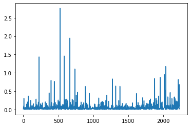

# Final Project Report(Milestone 1 to 5) 


### Milestone 1 : Data Source
#### https://www.kaggle.com/c/zillow-prize-1

#### Description
There are two data sets with over 1 million records each and 58 columns. properties_2016 and properties_2017 datasets contain data for each year. The data we will use for this project will be a small sample of the master data. 

The two datasets are linked by parcleid.

I transactions dataset, the trabsaction date shows the date the property was sold and logerror is the log10( estimated price - price sold).

Properties dataset has the physical information about the properities. The columns on the properties dataset will have to be renamed. Subsets of data can be used to group by region, and other features such as number of bedrooms, square footage, etc.


```python
# Load Libraries
import pandas as pd
import matplotlib.pyplot as plt
import xlrd
import numpy as np
# Load Data
transactions_2016 = "Data/transactions_2016.json"
transactions_2017 = "Data/transactions_2017.json"

properties_2016  =  "Data/properties_2016.csv"
properties_2017  =  "Data/properties_2017.csv"
data_dictionary = "Data/data_dictionary.xlsx"

transactions_2016 = pd.read_json(transactions_2016)
transactions_2017 = pd.read_json(transactions_2017)
properties_2016 = pd.read_csv(properties_2016)
properties_2017 = pd.read_csv(properties_2017)
data_dictionary = pd.read_excel(data_dictionary)
```

    C:\Users\safar\AppData\Local\Temp\ipykernel_31408\2544282703.py:16: DtypeWarning: Columns (50) have mixed types. Specify dtype option on import or set low_memory=False.
      properties_2016 = pd.read_csv(properties_2016)
    C:\Users\safar\AppData\Local\Temp\ipykernel_31408\2544282703.py:17: DtypeWarning: Columns (23,50) have mixed types. Specify dtype option on import or set low_memory=False.
      properties_2017 = pd.read_csv(properties_2017)
    


```python
transactions_2016.head()
```


<div>
<style scoped>
    .dataframe tbody tr th:only-of-type {
        vertical-align: middle;
    }

    .dataframe tbody tr th {
        vertical-align: top;
    }

    .dataframe thead th {
        text-align: right;
    }
</style>
<table border="1" class="dataframe">
  <thead>
    <tr style="text-align: right;">
      <th></th>
      <th>parcelid</th>
      <th>logerror</th>
      <th>transactiondate</th>
    </tr>
  </thead>
  <tbody>
    <tr>
      <th>0</th>
      <td>11016594</td>
      <td>0.0276</td>
      <td>2016-01-01</td>
    </tr>
    <tr>
      <th>1</th>
      <td>14366692</td>
      <td>-0.1684</td>
      <td>2016-01-01</td>
    </tr>
    <tr>
      <th>2</th>
      <td>12098116</td>
      <td>-0.0040</td>
      <td>2016-01-01</td>
    </tr>
    <tr>
      <th>3</th>
      <td>12643413</td>
      <td>0.0218</td>
      <td>2016-01-02</td>
    </tr>
    <tr>
      <th>4</th>
      <td>14432541</td>
      <td>-0.0050</td>
      <td>2016-01-02</td>
    </tr>
  </tbody>
</table>
</div>


```python
properties_2016.head()
```


<div>
<style scoped>
    .dataframe tbody tr th:only-of-type {
        vertical-align: middle;
    }

    .dataframe tbody tr th {
        vertical-align: top;
    }

    .dataframe thead th {
        text-align: right;
    }
</style>
<table border="1" class="dataframe">
  <thead>
    <tr style="text-align: right;">
      <th></th>
      <th>Unnamed: 0</th>
      <th>parcelid</th>
      <th>airconditioningtypeid</th>
      <th>architecturalstyletypeid</th>
      <th>basementsqft</th>
      <th>bathroomcnt</th>
      <th>bedroomcnt</th>
      <th>buildingclasstypeid</th>
      <th>buildingqualitytypeid</th>
      <th>calculatedbathnbr</th>
      <th>...</th>
      <th>numberofstories</th>
      <th>fireplaceflag</th>
      <th>structuretaxvaluedollarcnt</th>
      <th>taxvaluedollarcnt</th>
      <th>assessmentyear</th>
      <th>landtaxvaluedollarcnt</th>
      <th>taxamount</th>
      <th>taxdelinquencyflag</th>
      <th>taxdelinquencyyear</th>
      <th>censustractandblock</th>
    </tr>
  </thead>
  <tbody>
    <tr>
      <th>0</th>
      <td>0</td>
      <td>10754147</td>
      <td>NaN</td>
      <td>NaN</td>
      <td>NaN</td>
      <td>0.0</td>
      <td>0.0</td>
      <td>NaN</td>
      <td>NaN</td>
      <td>NaN</td>
      <td>...</td>
      <td>NaN</td>
      <td>NaN</td>
      <td>NaN</td>
      <td>9.0</td>
      <td>2015</td>
      <td>9.0</td>
      <td>NaN</td>
      <td>NaN</td>
      <td>NaN</td>
      <td>NaN</td>
    </tr>
    <tr>
      <th>1</th>
      <td>1</td>
      <td>10759547</td>
      <td>NaN</td>
      <td>NaN</td>
      <td>NaN</td>
      <td>0.0</td>
      <td>0.0</td>
      <td>NaN</td>
      <td>NaN</td>
      <td>NaN</td>
      <td>...</td>
      <td>NaN</td>
      <td>NaN</td>
      <td>NaN</td>
      <td>27516.0</td>
      <td>2015</td>
      <td>27516.0</td>
      <td>NaN</td>
      <td>NaN</td>
      <td>NaN</td>
      <td>NaN</td>
    </tr>
    <tr>
      <th>2</th>
      <td>2</td>
      <td>10843547</td>
      <td>NaN</td>
      <td>NaN</td>
      <td>NaN</td>
      <td>0.0</td>
      <td>0.0</td>
      <td>NaN</td>
      <td>NaN</td>
      <td>NaN</td>
      <td>...</td>
      <td>NaN</td>
      <td>NaN</td>
      <td>650756.0</td>
      <td>1413387.0</td>
      <td>2015</td>
      <td>762631.0</td>
      <td>20800.37</td>
      <td>NaN</td>
      <td>NaN</td>
      <td>NaN</td>
    </tr>
    <tr>
      <th>3</th>
      <td>3</td>
      <td>10859147</td>
      <td>NaN</td>
      <td>NaN</td>
      <td>NaN</td>
      <td>0.0</td>
      <td>0.0</td>
      <td>3.0</td>
      <td>7.0</td>
      <td>NaN</td>
      <td>...</td>
      <td>1.0</td>
      <td>NaN</td>
      <td>571346.0</td>
      <td>1156834.0</td>
      <td>2015</td>
      <td>585488.0</td>
      <td>14557.57</td>
      <td>NaN</td>
      <td>NaN</td>
      <td>NaN</td>
    </tr>
    <tr>
      <th>4</th>
      <td>4</td>
      <td>10879947</td>
      <td>NaN</td>
      <td>NaN</td>
      <td>NaN</td>
      <td>0.0</td>
      <td>0.0</td>
      <td>4.0</td>
      <td>NaN</td>
      <td>NaN</td>
      <td>...</td>
      <td>NaN</td>
      <td>NaN</td>
      <td>193796.0</td>
      <td>433491.0</td>
      <td>2015</td>
      <td>239695.0</td>
      <td>5725.17</td>
      <td>NaN</td>
      <td>NaN</td>
      <td>NaN</td>
    </tr>
  </tbody>
</table>
<p>5 rows × 59 columns</p>
</div>


```python
print(len(properties_2016.columns))
print(properties_2016.columns)
```

    59
    Index(['Unnamed: 0', 'parcelid', 'airconditioningtypeid',
           'architecturalstyletypeid', 'basementsqft', 'bathroomcnt', 'bedroomcnt',
           'buildingclasstypeid', 'buildingqualitytypeid', 'calculatedbathnbr',
           'decktypeid', 'finishedfloor1squarefeet',
           'calculatedfinishedsquarefeet', 'finishedsquarefeet12',
           'finishedsquarefeet13', 'finishedsquarefeet15', 'finishedsquarefeet50',
           'finishedsquarefeet6', 'fips', 'fireplacecnt', 'fullbathcnt',
           'garagecarcnt', 'garagetotalsqft', 'hashottuborspa',
           'heatingorsystemtypeid', 'latitude', 'longitude', 'lotsizesquarefeet',
           'poolcnt', 'poolsizesum', 'pooltypeid10', 'pooltypeid2', 'pooltypeid7',
           'propertycountylandusecode', 'propertylandusetypeid',
           'propertyzoningdesc', 'rawcensustractandblock', 'regionidcity',
           'regionidcounty', 'regionidneighborhood', 'regionidzip', 'roomcnt',
           'storytypeid', 'threequarterbathnbr', 'typeconstructiontypeid',
           'unitcnt', 'yardbuildingsqft17', 'yardbuildingsqft26', 'yearbuilt',
           'numberofstories', 'fireplaceflag', 'structuretaxvaluedollarcnt',
           'taxvaluedollarcnt', 'assessmentyear', 'landtaxvaluedollarcnt',
           'taxamount', 'taxdelinquencyflag', 'taxdelinquencyyear',
           'censustractandblock'],
          dtype='object')
    


```python
print(len(properties_2017.columns))
print(properties_2017.columns)
```

    59
    Index(['Unnamed: 0', 'parcelid', 'airconditioningtypeid',
           'architecturalstyletypeid', 'basementsqft', 'bathroomcnt', 'bedroomcnt',
           'buildingclasstypeid', 'buildingqualitytypeid', 'calculatedbathnbr',
           'decktypeid', 'finishedfloor1squarefeet',
           'calculatedfinishedsquarefeet', 'finishedsquarefeet12',
           'finishedsquarefeet13', 'finishedsquarefeet15', 'finishedsquarefeet50',
           'finishedsquarefeet6', 'fips', 'fireplacecnt', 'fullbathcnt',
           'garagecarcnt', 'garagetotalsqft', 'hashottuborspa',
           'heatingorsystemtypeid', 'latitude', 'longitude', 'lotsizesquarefeet',
           'poolcnt', 'poolsizesum', 'pooltypeid10', 'pooltypeid2', 'pooltypeid7',
           'propertycountylandusecode', 'propertylandusetypeid',
           'propertyzoningdesc', 'rawcensustractandblock', 'regionidcity',
           'regionidcounty', 'regionidneighborhood', 'regionidzip', 'roomcnt',
           'storytypeid', 'threequarterbathnbr', 'typeconstructiontypeid',
           'unitcnt', 'yardbuildingsqft17', 'yardbuildingsqft26', 'yearbuilt',
           'numberofstories', 'fireplaceflag', 'structuretaxvaluedollarcnt',
           'taxvaluedollarcnt', 'assessmentyear', 'landtaxvaluedollarcnt',
           'taxamount', 'taxdelinquencyflag', 'taxdelinquencyyear',
           'censustractandblock'],
          dtype='object')
    


```python
print(len(transactions_2016.columns))
print(transactions_2016.columns)
```

    3
    Index(['parcelid', 'logerror', 'transactiondate'], dtype='object')
    


```python
print(len(transactions_2017.columns))
print(transactions_2017.columns)
```

    3
    Index(['parcelid', 'logerror', 'transactiondate'], dtype='object')
    


```python
data_dictionary.head()
```


<div>
<style scoped>
    .dataframe tbody tr th:only-of-type {
        vertical-align: middle;
    }

    .dataframe tbody tr th {
        vertical-align: top;
    }

    .dataframe thead th {
        text-align: right;
    }
</style>
<table border="1" class="dataframe">
  <thead>
    <tr style="text-align: right;">
      <th></th>
      <th>Feature</th>
      <th>Description</th>
    </tr>
  </thead>
  <tbody>
    <tr>
      <th>0</th>
      <td>'airconditioningtypeid'</td>
      <td>Type of cooling system present in the home (i...</td>
    </tr>
    <tr>
      <th>1</th>
      <td>'architecturalstyletypeid'</td>
      <td>Architectural style of the home (i.e. ranch, ...</td>
    </tr>
    <tr>
      <th>2</th>
      <td>'basementsqft'</td>
      <td>Finished living area below or partially below...</td>
    </tr>
    <tr>
      <th>3</th>
      <td>'bathroomcnt'</td>
      <td>Number of bathrooms in home including fractio...</td>
    </tr>
    <tr>
      <th>4</th>
      <td>'bedroomcnt'</td>
      <td>Number of bedrooms in home</td>
    </tr>
  </tbody>
</table>
</div>


## Milestone 2 : Cleaning/formatting flat file sources


We will first combine the properties_2016 and properties_2017 and calle the result properties. We will also combine the two transactions datasets.


```python
properties = pd.concat([properties_2016,properties_2017],axis=0)
print(properties_2016.shape)
print(properties_2017.shape)
print(properties.shape)
```

    (20000, 59)
    (20000, 59)
    (40000, 59)
    


```python
transactions = pd.concat([transactions_2016,transactions_2017],axis=0)
print(properties_2016.shape)
print(properties_2017.shape)
print(properties.shape)
```

    (20000, 59)
    (20000, 59)
    (40000, 59)
    


```python
properties.columns
```


    Index(['Unnamed: 0', 'parcelid', 'airconditioningtypeid',
           'architecturalstyletypeid', 'basementsqft', 'bathroomcnt', 'bedroomcnt',
           'buildingclasstypeid', 'buildingqualitytypeid', 'calculatedbathnbr',
           'decktypeid', 'finishedfloor1squarefeet',
           'calculatedfinishedsquarefeet', 'finishedsquarefeet12',
           'finishedsquarefeet13', 'finishedsquarefeet15', 'finishedsquarefeet50',
           'finishedsquarefeet6', 'fips', 'fireplacecnt', 'fullbathcnt',
           'garagecarcnt', 'garagetotalsqft', 'hashottuborspa',
           'heatingorsystemtypeid', 'latitude', 'longitude', 'lotsizesquarefeet',
           'poolcnt', 'poolsizesum', 'pooltypeid10', 'pooltypeid2', 'pooltypeid7',
           'propertycountylandusecode', 'propertylandusetypeid',
           'propertyzoningdesc', 'rawcensustractandblock', 'regionidcity',
           'regionidcounty', 'regionidneighborhood', 'regionidzip', 'roomcnt',
           'storytypeid', 'threequarterbathnbr', 'typeconstructiontypeid',
           'unitcnt', 'yardbuildingsqft17', 'yardbuildingsqft26', 'yearbuilt',
           'numberofstories', 'fireplaceflag', 'structuretaxvaluedollarcnt',
           'taxvaluedollarcnt', 'assessmentyear', 'landtaxvaluedollarcnt',
           'taxamount', 'taxdelinquencyflag', 'taxdelinquencyyear',
           'censustractandblock'],
          dtype='object')


Get rid of the Unamed column.


```python
properties = properties.loc[:, ~properties.columns.str.contains('^Unnamed')]
properties.columns
```


    Index(['parcelid', 'airconditioningtypeid', 'architecturalstyletypeid',
           'basementsqft', 'bathroomcnt', 'bedroomcnt', 'buildingclasstypeid',
           'buildingqualitytypeid', 'calculatedbathnbr', 'decktypeid',
           'finishedfloor1squarefeet', 'calculatedfinishedsquarefeet',
           'finishedsquarefeet12', 'finishedsquarefeet13', 'finishedsquarefeet15',
           'finishedsquarefeet50', 'finishedsquarefeet6', 'fips', 'fireplacecnt',
           'fullbathcnt', 'garagecarcnt', 'garagetotalsqft', 'hashottuborspa',
           'heatingorsystemtypeid', 'latitude', 'longitude', 'lotsizesquarefeet',
           'poolcnt', 'poolsizesum', 'pooltypeid10', 'pooltypeid2', 'pooltypeid7',
           'propertycountylandusecode', 'propertylandusetypeid',
           'propertyzoningdesc', 'rawcensustractandblock', 'regionidcity',
           'regionidcounty', 'regionidneighborhood', 'regionidzip', 'roomcnt',
           'storytypeid', 'threequarterbathnbr', 'typeconstructiontypeid',
           'unitcnt', 'yardbuildingsqft17', 'yardbuildingsqft26', 'yearbuilt',
           'numberofstories', 'fireplaceflag', 'structuretaxvaluedollarcnt',
           'taxvaluedollarcnt', 'assessmentyear', 'landtaxvaluedollarcnt',
           'taxamount', 'taxdelinquencyflag', 'taxdelinquencyyear',
           'censustractandblock'],
          dtype='object')


Rename column names in properties dataset.


```python
properties = properties.rename(columns=
                        {
  'parcelid':'parcelid', 
  'yearbuilt':'build_year', 
  'basementsqft':'area_basement', 
  'yardbuildingsqft17':'area_patio', 
  'yardbuildingsqft26':'area_shed',  
  'poolsizesum':'area_pool', 
  'lotsizesquarefeet':'area_lot', 
  'garagetotalsqft':'area_garage', 
  'finishedfloor1squarefeet':'area_firstfloor_finished', 
  'calculatedfinishedsquarefeet':'area_total_calc', 
  'finishedsquarefeet6':'area_base', 
  'finishedsquarefeet12':'area_live_finished', 
  'finishedsquarefeet13':'area_liveperi_finished', 
  'finishedsquarefeet15':'area_total_finished',  
  'finishedsquarefeet50':'area_unknown', 
  'unitcnt': 'num_unit', 
  'numberofstories': 'num_story',  
  'roomcnt':'num_room', 
  'bathroomcnt':'num_bathroom', 
  'bedroomcnt':'num_bedroom', 
  'calculatedbathnbr':'num_bathroom_calc', 
  'fullbathcnt':'num_bath', 
  'threequarterbathnbr':'num_75_bath',  
  'fireplacecnt':'num_fireplace', 
  'poolcnt': 'num_pool',  
  'garagecarcnt':'num_garage', 
  'regionidcounty':'region_county', 
  'regionidcity':'region_city', 
  'regionidzip':'region_zip', 
  'regionidneighborhood':'region_neighbor', 
  'taxvaluedollarcnt':'tax_total', 
  'structuretaxvaluedollarcnt':'tax_building', 
  'landtaxvaluedollarcnt':'tax_land', 
  'taxamount':'tax_property', 
  'assessmentyear':'tax_year', 
  'taxdelinquencyflag':'tax_delinquency', 
  'taxdelinquencyyear':'tax_delinquency_year', 
  'propertyzoningdesc':'zoning_property', 
  'propertylandusetypeid':'zoning_landuse', 
  'propertycountylandusecode':'zoning_landuse_county', 
  'fireplaceflag':'flag_fireplace', 
  'hashottuborspa':'flag_tub', 
  'buildingqualitytypeid':'quality', 
  'buildingclasstypeid':'framing', 
  'typeconstructiontypeid':'material', 
  'decktypeid':'deck', 
  'storytypeid':'story', 
  'heatingorsystemtypeid':'heating', 
  'airconditioningtypeid':'aircon', 
  'architecturalstyletypeid':'architectural_style' 
})
```


```python
properties.columns
```


    Index(['parcelid', 'aircon', 'architectural_style', 'area_basement',
           'num_bathroom', 'num_bedroom', 'framing', 'quality',
           'num_bathroom_calc', 'deck', 'area_firstfloor_finished',
           'area_total_calc', 'area_live_finished', 'area_liveperi_finished',
           'area_total_finished', 'area_unknown', 'area_base', 'fips',
           'num_fireplace', 'num_bath', 'num_garage', 'area_garage', 'flag_tub',
           'heating', 'latitude', 'longitude', 'area_lot', 'num_pool', 'area_pool',
           'pooltypeid10', 'pooltypeid2', 'pooltypeid7', 'zoning_landuse_county',
           'zoning_landuse', 'zoning_property', 'rawcensustractandblock',
           'region_city', 'region_county', 'region_neighbor', 'region_zip',
           'num_room', 'story', 'num_75_bath', 'material', 'num_unit',
           'area_patio', 'area_shed', 'build_year', 'num_story', 'flag_fireplace',
           'tax_building', 'tax_total', 'tax_year', 'tax_land', 'tax_property',
           'tax_delinquency', 'tax_delinquency_year', 'censustractandblock'],
          dtype='object')


```python
# Check new column names
properties[['num_bedroom','num_bathroom']]
```


<div>
<style scoped>
    .dataframe tbody tr th:only-of-type {
        vertical-align: middle;
    }

    .dataframe tbody tr th {
        vertical-align: top;
    }

    .dataframe thead th {
        text-align: right;
    }
</style>
<table border="1" class="dataframe">
  <thead>
    <tr style="text-align: right;">
      <th></th>
      <th>num_bedroom</th>
      <th>num_bathroom</th>
    </tr>
  </thead>
  <tbody>
    <tr>
      <th>0</th>
      <td>0.0</td>
      <td>0.0</td>
    </tr>
    <tr>
      <th>1</th>
      <td>0.0</td>
      <td>0.0</td>
    </tr>
    <tr>
      <th>2</th>
      <td>0.0</td>
      <td>0.0</td>
    </tr>
    <tr>
      <th>3</th>
      <td>0.0</td>
      <td>0.0</td>
    </tr>
    <tr>
      <th>4</th>
      <td>0.0</td>
      <td>0.0</td>
    </tr>
    <tr>
      <th>...</th>
      <td>...</td>
      <td>...</td>
    </tr>
    <tr>
      <th>19995</th>
      <td>2.0</td>
      <td>1.0</td>
    </tr>
    <tr>
      <th>19996</th>
      <td>5.0</td>
      <td>3.0</td>
    </tr>
    <tr>
      <th>19997</th>
      <td>8.0</td>
      <td>5.0</td>
    </tr>
    <tr>
      <th>19998</th>
      <td>4.0</td>
      <td>2.0</td>
    </tr>
    <tr>
      <th>19999</th>
      <td>2.0</td>
      <td>1.0</td>
    </tr>
  </tbody>
</table>
<p>40000 rows × 2 columns</p>
</div>


Rename column names in transactions dataset.


```python
transactions = transactions.rename(columns={'parcelid':'parcelid','date':'transactiondate'})
```


```python
transactions.columns
```


    Index(['parcelid', 'logerror', 'transactiondate'], dtype='object')


Check out the new columns


```python
transactions[['parcelid','transactiondate']]
```


<div>
<style scoped>
    .dataframe tbody tr th:only-of-type {
        vertical-align: middle;
    }

    .dataframe tbody tr th {
        vertical-align: top;
    }

    .dataframe thead th {
        text-align: right;
    }
</style>
<table border="1" class="dataframe">
  <thead>
    <tr style="text-align: right;">
      <th></th>
      <th>parcelid</th>
      <th>transactiondate</th>
    </tr>
  </thead>
  <tbody>
    <tr>
      <th>0</th>
      <td>11016594</td>
      <td>2016-01-01</td>
    </tr>
    <tr>
      <th>1</th>
      <td>14366692</td>
      <td>2016-01-01</td>
    </tr>
    <tr>
      <th>2</th>
      <td>12098116</td>
      <td>2016-01-01</td>
    </tr>
    <tr>
      <th>3</th>
      <td>12643413</td>
      <td>2016-01-02</td>
    </tr>
    <tr>
      <th>4</th>
      <td>14432541</td>
      <td>2016-01-02</td>
    </tr>
    <tr>
      <th>...</th>
      <td>...</td>
      <td>...</td>
    </tr>
    <tr>
      <th>77608</th>
      <td>10833991</td>
      <td>2017-09-20</td>
    </tr>
    <tr>
      <th>77609</th>
      <td>11000655</td>
      <td>2017-09-20</td>
    </tr>
    <tr>
      <th>77610</th>
      <td>17239384</td>
      <td>2017-09-21</td>
    </tr>
    <tr>
      <th>77611</th>
      <td>12773139</td>
      <td>2017-09-21</td>
    </tr>
    <tr>
      <th>77612</th>
      <td>12826780</td>
      <td>2017-09-25</td>
    </tr>
  </tbody>
</table>
<p>167888 rows × 2 columns</p>
</div>


```python
propertiesAndTransactions = pd.merge(properties,transactions,on='parcelid')

```

check out the merge


```python
propertiesAndTransactions[['parcelid','num_bedroom','transactiondate','logerror']].head()
```


<div>
<style scoped>
    .dataframe tbody tr th:only-of-type {
        vertical-align: middle;
    }

    .dataframe tbody tr th {
        vertical-align: top;
    }

    .dataframe thead th {
        text-align: right;
    }
</style>
<table border="1" class="dataframe">
  <thead>
    <tr style="text-align: right;">
      <th></th>
      <th>parcelid</th>
      <th>num_bedroom</th>
      <th>transactiondate</th>
      <th>logerror</th>
    </tr>
  </thead>
  <tbody>
    <tr>
      <th>0</th>
      <td>17054981</td>
      <td>4.0</td>
      <td>2017-06-15</td>
      <td>-0.013099</td>
    </tr>
    <tr>
      <th>1</th>
      <td>17054981</td>
      <td>4.0</td>
      <td>2017-06-15</td>
      <td>-0.013099</td>
    </tr>
    <tr>
      <th>2</th>
      <td>17055743</td>
      <td>3.0</td>
      <td>2017-07-26</td>
      <td>0.073985</td>
    </tr>
    <tr>
      <th>3</th>
      <td>17055743</td>
      <td>3.0</td>
      <td>2017-07-26</td>
      <td>0.073985</td>
    </tr>
    <tr>
      <th>4</th>
      <td>17068109</td>
      <td>3.0</td>
      <td>2017-07-28</td>
      <td>0.071886</td>
    </tr>
  </tbody>
</table>
</div>


let's take of missings


```python
column_names = propertiesAndTransactions.columns
print('sum\n', propertiesAndTransactions.isnull()[column_names].sum())
```

    sum
     parcelid                       0
    aircon                      1485
    architectural_style         2234
    area_basement               2234
    num_bathroom                   0
    num_bedroom                    0
    framing                     2234
    quality                      705
    num_bathroom_calc             26
    deck                        2214
    area_firstfloor_finished    2000
    area_total_calc                9
    area_live_finished           102
    area_liveperi_finished      2234
    area_total_finished         2145
    area_unknown                2000
    area_base                   2230
    fips                           0
    num_fireplace               1982
    num_bath                      26
    num_garage                  1593
    area_garage                 1593
    flag_tub                    2192
    heating                      752
    latitude                       0
    longitude                      0
    area_lot                     216
    num_pool                    1708
    area_pool                   2206
    pooltypeid10                2216
    pooltypeid2                 2210
    pooltypeid7                 1732
    zoning_landuse_county          0
    zoning_landuse                 0
    zoning_property              678
    rawcensustractandblock         0
    region_city                   42
    region_county                  0
    region_neighbor             1186
    region_zip                     2
    num_room                       0
    story                       2234
    num_75_bath                 1984
    material                    2234
    num_unit                     679
    area_patio                  2137
    area_shed                   2234
    build_year                    11
    num_story                   1792
    flag_fireplace              2234
    tax_building                   6
    tax_total                      0
    tax_year                       0
    tax_land                       0
    tax_property                   0
    tax_delinquency             2166
    tax_delinquency_year        2166
    censustractandblock            8
    logerror                       0
    transactiondate                0
    dtype: int64
    


```python
print('mean\n', propertiesAndTransactions.isnull()[column_names].mean())
```

    mean
     parcelid                    0.000000
    aircon                      0.664727
    architectural_style         1.000000
    area_basement               1.000000
    num_bathroom                0.000000
    num_bedroom                 0.000000
    framing                     1.000000
    quality                     0.315577
    num_bathroom_calc           0.011638
    deck                        0.991047
    area_firstfloor_finished    0.895255
    area_total_calc             0.004029
    area_live_finished          0.045658
    area_liveperi_finished      1.000000
    area_total_finished         0.960161
    area_unknown                0.895255
    area_base                   0.998209
    fips                        0.000000
    num_fireplace               0.887198
    num_bath                    0.011638
    num_garage                  0.713071
    area_garage                 0.713071
    flag_tub                    0.981200
    heating                     0.336616
    latitude                    0.000000
    longitude                   0.000000
    area_lot                    0.096688
    num_pool                    0.764548
    area_pool                   0.987466
    pooltypeid10                0.991943
    pooltypeid2                 0.989257
    pooltypeid7                 0.775291
    zoning_landuse_county       0.000000
    zoning_landuse              0.000000
    zoning_property             0.303491
    rawcensustractandblock      0.000000
    region_city                 0.018800
    region_county               0.000000
    region_neighbor             0.530886
    region_zip                  0.000895
    num_room                    0.000000
    story                       1.000000
    num_75_bath                 0.888093
    material                    1.000000
    num_unit                    0.303939
    area_patio                  0.956580
    area_shed                   1.000000
    build_year                  0.004924
    num_story                   0.802149
    flag_fireplace              1.000000
    tax_building                0.002686
    tax_total                   0.000000
    tax_year                    0.000000
    tax_land                    0.000000
    tax_property                0.000000
    tax_delinquency             0.969561
    tax_delinquency_year        0.969561
    censustractandblock         0.003581
    logerror                    0.000000
    transactiondate             0.000000
    dtype: float64
    

Let's look at columns woth more than 80% missing values


```python
propertiesAndTransactions.isnull()[column_names].sum()
# this shows columns and the number of NaN's.Note parcelID has no missing values.
```


    parcelid                       0
    aircon                      1485
    architectural_style         2234
    area_basement               2234
    num_bathroom                   0
    num_bedroom                    0
    framing                     2234
    quality                      705
    num_bathroom_calc             26
    deck                        2214
    area_firstfloor_finished    2000
    area_total_calc                9
    area_live_finished           102
    area_liveperi_finished      2234
    area_total_finished         2145
    area_unknown                2000
    area_base                   2230
    fips                           0
    num_fireplace               1982
    num_bath                      26
    num_garage                  1593
    area_garage                 1593
    flag_tub                    2192
    heating                      752
    latitude                       0
    longitude                      0
    area_lot                     216
    num_pool                    1708
    area_pool                   2206
    pooltypeid10                2216
    pooltypeid2                 2210
    pooltypeid7                 1732
    zoning_landuse_county          0
    zoning_landuse                 0
    zoning_property              678
    rawcensustractandblock         0
    region_city                   42
    region_county                  0
    region_neighbor             1186
    region_zip                     2
    num_room                       0
    story                       2234
    num_75_bath                 1984
    material                    2234
    num_unit                     679
    area_patio                  2137
    area_shed                   2234
    build_year                    11
    num_story                   1792
    flag_fireplace              2234
    tax_building                   6
    tax_total                      0
    tax_year                       0
    tax_land                       0
    tax_property                   0
    tax_delinquency             2166
    tax_delinquency_year        2166
    censustractandblock            8
    logerror                       0
    transactiondate                0
    dtype: int64


Make a list of columns with moe than 80% missing data


```python
remove_columns = propertiesAndTransactions.columns[propertiesAndTransactions.isnull().mean() > .8]
print(remove_columns)
```

    Index(['architectural_style', 'area_basement', 'framing', 'deck',
           'area_firstfloor_finished', 'area_liveperi_finished',
           'area_total_finished', 'area_unknown', 'area_base', 'num_fireplace',
           'flag_tub', 'area_pool', 'pooltypeid10', 'pooltypeid2', 'story',
           'num_75_bath', 'material', 'area_patio', 'area_shed', 'num_story',
           'flag_fireplace', 'tax_delinquency', 'tax_delinquency_year'],
          dtype='object')
    

Drop the columns


```python
propertiesAndTransactions = propertiesAndTransactions.drop(columns = remove_columns)
```

Check results


```python
print(len(propertiesAndTransactions.columns))
print(propertiesAndTransactions.columns)
```

    37
    Index(['parcelid', 'aircon', 'num_bathroom', 'num_bedroom', 'quality',
           'num_bathroom_calc', 'area_total_calc', 'area_live_finished', 'fips',
           'num_bath', 'num_garage', 'area_garage', 'heating', 'latitude',
           'longitude', 'area_lot', 'num_pool', 'pooltypeid7',
           'zoning_landuse_county', 'zoning_landuse', 'zoning_property',
           'rawcensustractandblock', 'region_city', 'region_county',
           'region_neighbor', 'region_zip', 'num_room', 'num_unit', 'build_year',
           'tax_building', 'tax_total', 'tax_year', 'tax_land', 'tax_property',
           'censustractandblock', 'logerror', 'transactiondate'],
          dtype='object')
    

Check results


```python
print(len(propertiesAndTransactions.columns))
print(propertiesAndTransactions.columns)
```

    37
    Index(['parcelid', 'aircon', 'num_bathroom', 'num_bedroom', 'quality',
           'num_bathroom_calc', 'area_total_calc', 'area_live_finished', 'fips',
           'num_bath', 'num_garage', 'area_garage', 'heating', 'latitude',
           'longitude', 'area_lot', 'num_pool', 'pooltypeid7',
           'zoning_landuse_county', 'zoning_landuse', 'zoning_property',
           'rawcensustractandblock', 'region_city', 'region_county',
           'region_neighbor', 'region_zip', 'num_room', 'num_unit', 'build_year',
           'tax_building', 'tax_total', 'tax_year', 'tax_land', 'tax_property',
           'censustractandblock', 'logerror', 'transactiondate'],
          dtype='object')
    

Let's check the missing values mean


```python
print('mean\n', propertiesAndTransactions.isnull()[propertiesAndTransactions.columns].mean())
# we see the means to all be below 80%.
```

    mean
     parcelid                  0.000000
    aircon                    0.664727
    num_bathroom              0.000000
    num_bedroom               0.000000
    quality                   0.315577
    num_bathroom_calc         0.011638
    area_total_calc           0.004029
    area_live_finished        0.045658
    fips                      0.000000
    num_bath                  0.011638
    num_garage                0.713071
    area_garage               0.713071
    heating                   0.336616
    latitude                  0.000000
    longitude                 0.000000
    area_lot                  0.096688
    num_pool                  0.764548
    pooltypeid7               0.775291
    zoning_landuse_county     0.000000
    zoning_landuse            0.000000
    zoning_property           0.303491
    rawcensustractandblock    0.000000
    region_city               0.018800
    region_county             0.000000
    region_neighbor           0.530886
    region_zip                0.000895
    num_room                  0.000000
    num_unit                  0.303939
    build_year                0.004924
    tax_building              0.002686
    tax_total                 0.000000
    tax_year                  0.000000
    tax_land                  0.000000
    tax_property              0.000000
    censustractandblock       0.003581
    logerror                  0.000000
    transactiondate           0.000000
    dtype: float64
    

Are there any duplicate?


```python
propertiesAndTransactions[propertiesAndTransactions.duplicated(keep=False)]
# There are no duplocate rows; however, there are duplicate parcelIDs and corresponding latitude and Longitude.
```


<div>
<style scoped>
    .dataframe tbody tr th:only-of-type {
        vertical-align: middle;
    }

    .dataframe tbody tr th {
        vertical-align: top;
    }

    .dataframe thead th {
        text-align: right;
    }
</style>
<table border="1" class="dataframe">
  <thead>
    <tr style="text-align: right;">
      <th></th>
      <th>parcelid</th>
      <th>aircon</th>
      <th>num_bathroom</th>
      <th>num_bedroom</th>
      <th>quality</th>
      <th>num_bathroom_calc</th>
      <th>area_total_calc</th>
      <th>area_live_finished</th>
      <th>fips</th>
      <th>num_bath</th>
      <th>...</th>
      <th>num_unit</th>
      <th>build_year</th>
      <th>tax_building</th>
      <th>tax_total</th>
      <th>tax_year</th>
      <th>tax_land</th>
      <th>tax_property</th>
      <th>censustractandblock</th>
      <th>logerror</th>
      <th>transactiondate</th>
    </tr>
  </thead>
  <tbody>
  </tbody>
</table>
<p>0 rows × 37 columns</p>
</div>


```python
propertiesAndTransactions
```


<div>
<style scoped>
    .dataframe tbody tr th:only-of-type {
        vertical-align: middle;
    }

    .dataframe tbody tr th {
        vertical-align: top;
    }

    .dataframe thead th {
        text-align: right;
    }
</style>
<table border="1" class="dataframe">
  <thead>
    <tr style="text-align: right;">
      <th></th>
      <th>parcelid</th>
      <th>aircon</th>
      <th>num_bathroom</th>
      <th>num_bedroom</th>
      <th>quality</th>
      <th>num_bathroom_calc</th>
      <th>area_total_calc</th>
      <th>area_live_finished</th>
      <th>fips</th>
      <th>num_bath</th>
      <th>...</th>
      <th>num_unit</th>
      <th>build_year</th>
      <th>tax_building</th>
      <th>tax_total</th>
      <th>tax_year</th>
      <th>tax_land</th>
      <th>tax_property</th>
      <th>censustractandblock</th>
      <th>logerror</th>
      <th>transactiondate</th>
    </tr>
  </thead>
  <tbody>
    <tr>
      <th>0</th>
      <td>17054981</td>
      <td>NaN</td>
      <td>5.0</td>
      <td>4.0</td>
      <td>NaN</td>
      <td>5.0</td>
      <td>3760.0</td>
      <td>3760.0</td>
      <td>6111</td>
      <td>5.0</td>
      <td>...</td>
      <td>NaN</td>
      <td>1982.0</td>
      <td>494390.0</td>
      <td>859741.0</td>
      <td>2015</td>
      <td>365351.0</td>
      <td>9608.74</td>
      <td>6.111001e+13</td>
      <td>-0.013099</td>
      <td>2017-06-15</td>
    </tr>
    <tr>
      <th>1</th>
      <td>17054981</td>
      <td>NaN</td>
      <td>5.0</td>
      <td>4.0</td>
      <td>NaN</td>
      <td>5.0</td>
      <td>3760.0</td>
      <td>3760.0</td>
      <td>6111</td>
      <td>5.0</td>
      <td>...</td>
      <td>NaN</td>
      <td>1982.0</td>
      <td>501928.0</td>
      <td>872850.0</td>
      <td>2016</td>
      <td>370922.0</td>
      <td>9673.46</td>
      <td>6.111000e+13</td>
      <td>-0.013099</td>
      <td>2017-06-15</td>
    </tr>
    <tr>
      <th>2</th>
      <td>17055743</td>
      <td>NaN</td>
      <td>2.0</td>
      <td>3.0</td>
      <td>NaN</td>
      <td>2.0</td>
      <td>1444.0</td>
      <td>1444.0</td>
      <td>6111</td>
      <td>2.0</td>
      <td>...</td>
      <td>NaN</td>
      <td>1951.0</td>
      <td>128881.0</td>
      <td>429608.0</td>
      <td>2015</td>
      <td>300727.0</td>
      <td>5494.04</td>
      <td>6.111001e+13</td>
      <td>0.073985</td>
      <td>2017-07-26</td>
    </tr>
    <tr>
      <th>3</th>
      <td>17055743</td>
      <td>NaN</td>
      <td>2.0</td>
      <td>3.0</td>
      <td>NaN</td>
      <td>2.0</td>
      <td>1444.0</td>
      <td>1444.0</td>
      <td>6111</td>
      <td>2.0</td>
      <td>...</td>
      <td>NaN</td>
      <td>1951.0</td>
      <td>130845.0</td>
      <td>436157.0</td>
      <td>2016</td>
      <td>305312.0</td>
      <td>5538.80</td>
      <td>6.111000e+13</td>
      <td>0.073985</td>
      <td>2017-07-26</td>
    </tr>
    <tr>
      <th>4</th>
      <td>17068109</td>
      <td>NaN</td>
      <td>1.5</td>
      <td>3.0</td>
      <td>NaN</td>
      <td>1.5</td>
      <td>1698.0</td>
      <td>1698.0</td>
      <td>6111</td>
      <td>1.0</td>
      <td>...</td>
      <td>NaN</td>
      <td>1979.0</td>
      <td>190508.0</td>
      <td>282303.0</td>
      <td>2015</td>
      <td>91795.0</td>
      <td>2954.74</td>
      <td>6.111001e+13</td>
      <td>0.071886</td>
      <td>2017-07-28</td>
    </tr>
    <tr>
      <th>...</th>
      <td>...</td>
      <td>...</td>
      <td>...</td>
      <td>...</td>
      <td>...</td>
      <td>...</td>
      <td>...</td>
      <td>...</td>
      <td>...</td>
      <td>...</td>
      <td>...</td>
      <td>...</td>
      <td>...</td>
      <td>...</td>
      <td>...</td>
      <td>...</td>
      <td>...</td>
      <td>...</td>
      <td>...</td>
      <td>...</td>
      <td>...</td>
    </tr>
    <tr>
      <th>2229</th>
      <td>11769554</td>
      <td>NaN</td>
      <td>3.0</td>
      <td>4.0</td>
      <td>4.0</td>
      <td>3.0</td>
      <td>1482.0</td>
      <td>1482.0</td>
      <td>6037</td>
      <td>3.0</td>
      <td>...</td>
      <td>1.0</td>
      <td>1999.0</td>
      <td>161596.0</td>
      <td>234433.0</td>
      <td>2016</td>
      <td>72837.0</td>
      <td>2991.31</td>
      <td>6.037230e+13</td>
      <td>0.682100</td>
      <td>2016-06-14</td>
    </tr>
    <tr>
      <th>2230</th>
      <td>11778756</td>
      <td>NaN</td>
      <td>2.0</td>
      <td>7.0</td>
      <td>7.0</td>
      <td>2.0</td>
      <td>2693.0</td>
      <td>NaN</td>
      <td>6037</td>
      <td>2.0</td>
      <td>...</td>
      <td>2.0</td>
      <td>1905.0</td>
      <td>18962.0</td>
      <td>60552.0</td>
      <td>2015</td>
      <td>41590.0</td>
      <td>908.73</td>
      <td>6.037210e+13</td>
      <td>0.090780</td>
      <td>2017-03-07</td>
    </tr>
    <tr>
      <th>2231</th>
      <td>11778756</td>
      <td>NaN</td>
      <td>2.0</td>
      <td>7.0</td>
      <td>4.0</td>
      <td>2.0</td>
      <td>2693.0</td>
      <td>NaN</td>
      <td>6037</td>
      <td>2.0</td>
      <td>...</td>
      <td>2.0</td>
      <td>1905.0</td>
      <td>19251.0</td>
      <td>61475.0</td>
      <td>2016</td>
      <td>42224.0</td>
      <td>908.73</td>
      <td>6.037210e+13</td>
      <td>0.090780</td>
      <td>2017-03-07</td>
    </tr>
    <tr>
      <th>2232</th>
      <td>11779780</td>
      <td>1.0</td>
      <td>2.0</td>
      <td>2.0</td>
      <td>10.0</td>
      <td>2.0</td>
      <td>1621.0</td>
      <td>1621.0</td>
      <td>6037</td>
      <td>2.0</td>
      <td>...</td>
      <td>1.0</td>
      <td>1983.0</td>
      <td>456300.0</td>
      <td>774900.0</td>
      <td>2015</td>
      <td>318600.0</td>
      <td>10454.87</td>
      <td>6.037208e+13</td>
      <td>-0.122200</td>
      <td>2016-07-15</td>
    </tr>
    <tr>
      <th>2233</th>
      <td>11779780</td>
      <td>1.0</td>
      <td>2.0</td>
      <td>2.0</td>
      <td>11.0</td>
      <td>2.0</td>
      <td>1621.0</td>
      <td>1621.0</td>
      <td>6037</td>
      <td>2.0</td>
      <td>...</td>
      <td>1.0</td>
      <td>1983.0</td>
      <td>502000.0</td>
      <td>852000.0</td>
      <td>2016</td>
      <td>350000.0</td>
      <td>10454.87</td>
      <td>6.037210e+13</td>
      <td>-0.122200</td>
      <td>2016-07-15</td>
    </tr>
  </tbody>
</table>
<p>2234 rows × 37 columns</p>
</div>


```python
# Write scraped data to a file for safe keeps and also to avoid rescraping during development
propertiesAndTransactions.to_csv("data/propertiesAndTransactions.csv")
```

The two datasets have been merged, columns with more than 80% missing values were removed. The final dataset 'propertiesAndTransactions' will be used in the next milestone.

## Milestone 3. Webscaraping Data Source
#### Description
Using webscraping techniques, we will use 'latitude', 'longitude' from properties dataset to access properties and get current data for those locations. The property description of homes in given region will be stored into a dataset with as many features as in properties dataset we can grab. This dataset can then be used to do some price comparision between properties in 2016 and 2017. Getting data from years prior(say 10 years), we will be able to create trend charts and see market fluctuations.


```python
# Build a table consisiting of the parcelID, latitude and longitude of the properties.
# This table will be used to get data from www.trulia.com by web scraping

LonLat = pd.DataFrame(propertiesAndTransactions[['parcelid','latitude','longitude']])
LonLat

```


<div>
<style scoped>
    .dataframe tbody tr th:only-of-type {
        vertical-align: middle;
    }

    .dataframe tbody tr th {
        vertical-align: top;
    }

    .dataframe thead th {
        text-align: right;
    }
</style>
<table border="1" class="dataframe">
  <thead>
    <tr style="text-align: right;">
      <th></th>
      <th>parcelid</th>
      <th>latitude</th>
      <th>longitude</th>
    </tr>
  </thead>
  <tbody>
    <tr>
      <th>0</th>
      <td>17054981</td>
      <td>34449407</td>
      <td>-119254052</td>
    </tr>
    <tr>
      <th>1</th>
      <td>17054981</td>
      <td>34449407</td>
      <td>-119254052</td>
    </tr>
    <tr>
      <th>2</th>
      <td>17055743</td>
      <td>34454169</td>
      <td>-119237898</td>
    </tr>
    <tr>
      <th>3</th>
      <td>17055743</td>
      <td>34454169</td>
      <td>-119237898</td>
    </tr>
    <tr>
      <th>4</th>
      <td>17068109</td>
      <td>34365693</td>
      <td>-119448392</td>
    </tr>
    <tr>
      <th>...</th>
      <td>...</td>
      <td>...</td>
      <td>...</td>
    </tr>
    <tr>
      <th>2229</th>
      <td>11769554</td>
      <td>34006415</td>
      <td>-118246669</td>
    </tr>
    <tr>
      <th>2230</th>
      <td>11778756</td>
      <td>34050678</td>
      <td>-118282732</td>
    </tr>
    <tr>
      <th>2231</th>
      <td>11778756</td>
      <td>34050678</td>
      <td>-118282732</td>
    </tr>
    <tr>
      <th>2232</th>
      <td>11779780</td>
      <td>34045100</td>
      <td>-118261000</td>
    </tr>
    <tr>
      <th>2233</th>
      <td>11779780</td>
      <td>34045100</td>
      <td>-118261000</td>
    </tr>
  </tbody>
</table>
<p>2234 rows × 3 columns</p>
</div>


```python
# We will remove duplicate parcelIDs here since we are only interested in comparable values near each parcelID.
LonLat = LonLat.sort_values('parcelid', ascending=False)
LonLat = LonLat.drop_duplicates() 
LonLat.reset_index(drop=True)
LonLat
```


<div>
<style scoped>
    .dataframe tbody tr th:only-of-type {
        vertical-align: middle;
    }

    .dataframe tbody tr th {
        vertical-align: top;
    }

    .dataframe thead th {
        text-align: right;
    }
</style>
<table border="1" class="dataframe">
  <thead>
    <tr style="text-align: right;">
      <th></th>
      <th>parcelid</th>
      <th>latitude</th>
      <th>longitude</th>
    </tr>
  </thead>
  <tbody>
    <tr>
      <th>1761</th>
      <td>17299670</td>
      <td>34186100</td>
      <td>-118767000</td>
    </tr>
    <tr>
      <th>107</th>
      <td>17296734</td>
      <td>34174051</td>
      <td>-118757031</td>
    </tr>
    <tr>
      <th>1758</th>
      <td>17294231</td>
      <td>34153879</td>
      <td>-118839561</td>
    </tr>
    <tr>
      <th>1756</th>
      <td>17293716</td>
      <td>34152179</td>
      <td>-118851454</td>
    </tr>
    <tr>
      <th>1427</th>
      <td>17292856</td>
      <td>34125457</td>
      <td>-118891074</td>
    </tr>
    <tr>
      <th>...</th>
      <td>...</td>
      <td>...</td>
      <td>...</td>
    </tr>
    <tr>
      <th>112</th>
      <td>10726315</td>
      <td>34184300</td>
      <td>-118657000</td>
    </tr>
    <tr>
      <th>110</th>
      <td>10725532</td>
      <td>34196000</td>
      <td>-118658000</td>
    </tr>
    <tr>
      <th>1767</th>
      <td>10722858</td>
      <td>34195746</td>
      <td>-118624097</td>
    </tr>
    <tr>
      <th>108</th>
      <td>10722336</td>
      <td>34199100</td>
      <td>-118633000</td>
    </tr>
    <tr>
      <th>1763</th>
      <td>10719731</td>
      <td>34206094</td>
      <td>-118620655</td>
    </tr>
  </tbody>
</table>
<p>1096 rows × 3 columns</p>
</div>


```python
print('sum\n', LonLat.isnull()[['parcelid','latitude','longitude']].sum())
```

    sum
     parcelid     0
    latitude     0
    longitude    0
    dtype: int64
    


```python
# This dictionary is used to return state code. trulia requires the state code rather than state name
us_state_abbrev = {
    'Alabama': 'AL',
    'Alaska': 'AK',
    'American Samoa': 'AS',
    'Arizona': 'AZ',
    'Arkansas': 'AR',
    'California': 'CA',
    'Colorado': 'CO',
    'Connecticut': 'CT',
    'Delaware': 'DE',
    'District of Columbia': 'DC',
    'Florida': 'FL',
    'Georgia': 'GA',
    'Guam': 'GU',
    'Hawaii': 'HI',
    'Idaho': 'ID',
    'Illinois': 'IL',
    'Indiana': 'IN',
    'Iowa': 'IA',
    'Kansas': 'KS',
    'Kentucky': 'KY',
    'Louisiana': 'LA',
    'Maine': 'ME',
    'Maryland': 'MD',
    'Massachusetts': 'MA',
    'Michigan': 'MI',
    'Minnesota': 'MN',
    'Mississippi': 'MS',
    'Missouri': 'MO',
    'Montana': 'MT',
    'Nebraska': 'NE',
    'Nevada': 'NV',
    'New Hampshire': 'NH',
    'New Jersey': 'NJ',
    'New Mexico': 'NM',
    'New York': 'NY',
    'North Carolina': 'NC',
    'North Dakota': 'ND',
    'Northern Mariana Islands':'MP',
    'Ohio': 'OH',
    'Oklahoma': 'OK',
    'Oregon': 'OR',
    'Pennsylvania': 'PA',
    'Puerto Rico': 'PR',
    'Rhode Island': 'RI',
    'South Carolina': 'SC',
    'South Dakota': 'SD',
    'Tennessee': 'TN',
    'Texas': 'TX',
    'Utah': 'UT',
    'Vermont': 'VT',
    'Virgin Islands': 'VI',
    'Virginia': 'VA',
    'Washington': 'WA',
    'West Virginia': 'WV',
    'Wisconsin': 'WI',
    'Wyoming': 'WY'
}

abbrev_us_state = dict(map(reversed, us_state_abbrev.items()))
```


```python
import urllib.request
import urllib.parse
import urllib.error
import json
from bs4 import BeautifulSoup
from urllib.request import Request, urlopen
import geopy
from geopy.geocoders import Nominatim    

def create_url(city,state,zipcode):
    # Creating trulia URL based on the filter.

    url = "https://www.trulia.com/" + state + "/" + city + "/" + zipcode
    return url

def get_response(url):
    ret = None
    try:
        for i in range(5):
            response = requests.get(url, headers={'User-Agent': 'Mozilla/5.0'})
            print("status code received:", response.status_code)
            if (response.status_code != 200):
                return None
            else:
                return response
    except:
        print('exception in get_response')
        return None

def GetCityStateZip(lat,lon):
    lat = lat/10**6
    lon = lon/10**6
    #geolocator = Nominatim(timeout=5)
    geolocator = Nominatim(user_agent='safarie1103@gmail.com')
    #print(location.raw)
    try:
        location = geolocator.reverse((lat, lon))
        city = location.raw['address']['city']
        state = us_state_abbrev[location.raw['address']['state']]
        zipcode = location.raw['address']['postcode'].split('-')[0]
    except:
        city = ""
        state = ""    
        zipcode = ""
    
    return city,state,zipcode
```


```python

def GetComp(parcelId,latitude,longitude):
    city,state,zipcode = GetCityStateZip(latitude,longitude)
    #print(parcelId,latitude,longitude)
    #print("city=", city)
    #print("state=", state)
    #print("zipcode=",zipcode)
    
    emptylistings_json = {}
    emptylistings_json['parcelId'] = {0:parcelId}
    emptylistings_json['price'] = {0:np.nan}
    emptylistings_json['bedrooms'] = {0:np.nan}
    emptylistings_json['bathrooms'] = {0:np.nan}
    emptylistings_json['floorSpace'] = {0:np.nan}
    emptylistings_json['region'] = {0:np.nan}
    
    if (city == "" or state == "" or state == ""):
        return(pd.DataFrame(emptylistings_json))
    
    url = create_url(city,state,zipcode)
    
    #req = Requests(url, headers={'User-Agent': 'Mozilla/5.0'})
    #webpage = urlopen(req).read()
    #soup = BeautifulSoup(webpage, 'html.parser')

    response = get_response(url)
    #print(response.text)
    if not response:
        print("Failed to fetch the page, please check `response.html` to see the response received from zillow.com.")
        return(pd.DataFrame(emptylistings_json))
    
    soup = BeautifulSoup(response.text, 'html.parser')
    
    html = soup.prettify('utf-8')
    
    details = {}
    parcels = {}
    listings_json = {}
    index = 0
    
    for price in  soup.findAll('div',attrs={'data-testid': 'property-price'}):
        details.update({index:price.text.strip()})
        parcels.update({index:parcelId})
        index = index + 1
        
    listings_json['parcelId'] = {}
    listings_json['parcelId']  = parcels
    listings_json['price'] = {}
    listings_json['price']  = details
    #print(listings_json['price'])
    
    
    
    details = {}
    index = 0
    for bedroom  in  soup.findAll('div',attrs={'data-testid': 'property-beds'}):
        details.update({index:bedroom.text.strip()}) 
        index = index + 1
    
    listings_json['bedrooms'] = {}
    listings_json['bedrooms']  = details
    #print(listings_json)
    
    
    
    details = {}
    index = 0
    for bathroom  in  soup.findAll('div',attrs={'data-testid': 'property-baths'}):
        details.update({index:bathroom.text.strip()}) 
        index = index + 1

    listings_json['bathrooms'] = {}
    listings_json['bathrooms']  = details
    #print(listings_json)
    
    
    
    details = {}
    index = 0
    for floorSpace  in  soup.findAll('div',attrs={'data-testid': 'property-floorSpace'}):
        details.update({index:floorSpace.text.strip()}) 
        index = index + 1
    
    listings_json['floorSpace'] = {}
    listings_json['floorSpace']  = details
    #print(listings_json)
    
    
    
    details = {}
    index = 0
    for region  in  soup.findAll('div',attrs={'data-testid': 'property-region'}):
        details.update({index:region.text.strip()}) 
        index = index + 1
    
    listings_json['region'] = {}
    listings_json['region']  = details
    #print(listings_json)

    #listings_table = pd.DataFrame()

    #with open('house_details.json', 'w') as outfile:
    #    json.dump(listings_json, outfile, indent=4)
    #listings_table = pd.read_json("house_details.json")
    return pd.DataFrame(listings_json)
    


```


```python
LonLat[:5]
```


<div>
<style scoped>
    .dataframe tbody tr th:only-of-type {
        vertical-align: middle;
    }

    .dataframe tbody tr th {
        vertical-align: top;
    }

    .dataframe thead th {
        text-align: right;
    }
</style>
<table border="1" class="dataframe">
  <thead>
    <tr style="text-align: right;">
      <th></th>
      <th>parcelid</th>
      <th>latitude</th>
      <th>longitude</th>
    </tr>
  </thead>
  <tbody>
    <tr>
      <th>1761</th>
      <td>17299670</td>
      <td>34186100</td>
      <td>-118767000</td>
    </tr>
    <tr>
      <th>107</th>
      <td>17296734</td>
      <td>34174051</td>
      <td>-118757031</td>
    </tr>
    <tr>
      <th>1758</th>
      <td>17294231</td>
      <td>34153879</td>
      <td>-118839561</td>
    </tr>
    <tr>
      <th>1756</th>
      <td>17293716</td>
      <td>34152179</td>
      <td>-118851454</td>
    </tr>
    <tr>
      <th>1427</th>
      <td>17292856</td>
      <td>34125457</td>
      <td>-118891074</td>
    </tr>
  </tbody>
</table>
</div>


## Here we get 20 compare properties for the parcelIDs. Note that a parcelID from propertiesAndTransactions table may have one ore more comps near it's latitude and longitude. This process sometime times out. We have taken care to continue collecting even after such exceptions.


```python
comp_listing_table = pd.DataFrame(columns={'parcelid','price','bedrooms','bathrooms','floorSpace','region'})

dfs = []
for index, row in LonLat[:20].iterrows():
    parcelId = row['parcelid']
    latitude = row['latitude']
    longitude = row['longitude']
    #print(parcelId,latitude,longitude)
    Temp_listing_table = GetComp(parcelId,latitude,longitude) 
    #print(Temp_listing_table.shape)
    dfs.append(Temp_listing_table)
    #print(Temp_listing_table)
       

comp_listing_table = pd.concat(dfs, ignore_index=True)      

      
```

    exception in get_response
    Failed to fetch the page, please check `response.html` to see the response received from zillow.com.
    exception in get_response
    Failed to fetch the page, please check `response.html` to see the response received from zillow.com.
    exception in get_response
    Failed to fetch the page, please check `response.html` to see the response received from zillow.com.
    exception in get_response
    Failed to fetch the page, please check `response.html` to see the response received from zillow.com.
    exception in get_response
    Failed to fetch the page, please check `response.html` to see the response received from zillow.com.
    exception in get_response
    Failed to fetch the page, please check `response.html` to see the response received from zillow.com.
    exception in get_response
    Failed to fetch the page, please check `response.html` to see the response received from zillow.com.
    exception in get_response
    Failed to fetch the page, please check `response.html` to see the response received from zillow.com.
    exception in get_response
    Failed to fetch the page, please check `response.html` to see the response received from zillow.com.
    exception in get_response
    Failed to fetch the page, please check `response.html` to see the response received from zillow.com.
    exception in get_response
    Failed to fetch the page, please check `response.html` to see the response received from zillow.com.
    exception in get_response
    Failed to fetch the page, please check `response.html` to see the response received from zillow.com.
    exception in get_response
    Failed to fetch the page, please check `response.html` to see the response received from zillow.com.
    exception in get_response
    Failed to fetch the page, please check `response.html` to see the response received from zillow.com.
    exception in get_response
    Failed to fetch the page, please check `response.html` to see the response received from zillow.com.
    


```python
print(comp_listing_table)
```

        parcelId  price  bedrooms  bathrooms  floorSpace  region
    0   17299670    NaN       NaN        NaN         NaN     NaN
    1   17296734    NaN       NaN        NaN         NaN     NaN
    2   17294231    NaN       NaN        NaN         NaN     NaN
    3   17293716    NaN       NaN        NaN         NaN     NaN
    4   17292856    NaN       NaN        NaN         NaN     NaN
    5   17291231    NaN       NaN        NaN         NaN     NaN
    6   17290419    NaN       NaN        NaN         NaN     NaN
    7   17290104    NaN       NaN        NaN         NaN     NaN
    8   17289398    NaN       NaN        NaN         NaN     NaN
    9   17287986    NaN       NaN        NaN         NaN     NaN
    10  17285909    NaN       NaN        NaN         NaN     NaN
    11  17283891    NaN       NaN        NaN         NaN     NaN
    12  17283162    NaN       NaN        NaN         NaN     NaN
    13  17280385    NaN       NaN        NaN         NaN     NaN
    14  17276736    NaN       NaN        NaN         NaN     NaN
    15  17276290    NaN       NaN        NaN         NaN     NaN
    16  17275763    NaN       NaN        NaN         NaN     NaN
    17  17275640    NaN       NaN        NaN         NaN     NaN
    18  17274552    NaN       NaN        NaN         NaN     NaN
    19  17273670    NaN       NaN        NaN         NaN     NaN
    


```python
comp_listing_table.isnull()[comp_listing_table.columns].sum()
```


    parcelId       0
    price         20
    bedrooms      20
    bathrooms     20
    floorSpace    20
    region        20
    dtype: int64


```python
comp_listing_table = comp_listing_table.dropna()
```


```python
comp_listing_table.isnull()[comp_listing_table.columns].sum()
```


    parcelId      0.0
    price         0.0
    bedrooms      0.0
    bathrooms     0.0
    floorSpace    0.0
    region        0.0
    dtype: float64


```python
comp_listing_table.shape
```


    (0, 6)


```python
comp_listing_table
```


<div>
<style scoped>
    .dataframe tbody tr th:only-of-type {
        vertical-align: middle;
    }

    .dataframe tbody tr th {
        vertical-align: top;
    }

    .dataframe thead th {
        text-align: right;
    }
</style>
<table border="1" class="dataframe">
  <thead>
    <tr style="text-align: right;">
      <th></th>
      <th>parcelId</th>
      <th>price</th>
      <th>bedrooms</th>
      <th>bathrooms</th>
      <th>floorSpace</th>
      <th>region</th>
    </tr>
  </thead>
  <tbody>
  </tbody>
</table>
</div>


#### prepare the dataset


```python
comp_listing_table = comp_listing_table.loc[:, ~comp_listing_table.columns.str.contains('^Unnamed')]
```


```python
comp_listing_table['price']= comp_listing_table['price'].replace('[\$,]', '', regex=True).astype(float)
comp_listing_table
```


<div>
<style scoped>
    .dataframe tbody tr th:only-of-type {
        vertical-align: middle;
    }

    .dataframe tbody tr th {
        vertical-align: top;
    }

    .dataframe thead th {
        text-align: right;
    }
</style>
<table border="1" class="dataframe">
  <thead>
    <tr style="text-align: right;">
      <th></th>
      <th>parcelId</th>
      <th>price</th>
      <th>bedrooms</th>
      <th>bathrooms</th>
      <th>floorSpace</th>
      <th>region</th>
    </tr>
  </thead>
  <tbody>
  </tbody>
</table>
</div>


```python
comp_listing_table['bedrooms']= comp_listing_table['bedrooms'].replace('bd', '', regex=True).astype(int)
comp_listing_table
```


<div>
<style scoped>
    .dataframe tbody tr th:only-of-type {
        vertical-align: middle;
    }

    .dataframe tbody tr th {
        vertical-align: top;
    }

    .dataframe thead th {
        text-align: right;
    }
</style>
<table border="1" class="dataframe">
  <thead>
    <tr style="text-align: right;">
      <th></th>
      <th>parcelId</th>
      <th>price</th>
      <th>bedrooms</th>
      <th>bathrooms</th>
      <th>floorSpace</th>
      <th>region</th>
    </tr>
  </thead>
  <tbody>
  </tbody>
</table>
</div>


```python
comp_listing_table['bathrooms']= comp_listing_table['bathrooms'].replace('ba', '', regex=True).astype(float)
```


```python
comp_listing_table['floorSpace'] = comp_listing_table['floorSpace'].replace('sqft', '', regex=True).replace(',','',regex=True).astype(np.int64)
comp_listing_table.columns
```


    Index(['parcelId', 'price', 'bedrooms', 'bathrooms', 'floorSpace', 'region'], dtype='object')


```python
# Write scraped data to a file for safe keeps and also to avoid rescraping during development
comp_listing_table.to_csv("data/comp_listing_table.csv")
```


```python
# Read
comp_listing_table = pd.read_csv("data/comp_listing_table.csv")
```


```python
comp_listing_table
```


<div>
<style scoped>
    .dataframe tbody tr th:only-of-type {
        vertical-align: middle;
    }

    .dataframe tbody tr th {
        vertical-align: top;
    }

    .dataframe thead th {
        text-align: right;
    }
</style>
<table border="1" class="dataframe">
  <thead>
    <tr style="text-align: right;">
      <th></th>
      <th>Unnamed: 0</th>
      <th>parcelId</th>
      <th>price</th>
      <th>bedrooms</th>
      <th>bathrooms</th>
      <th>floorSpace</th>
      <th>region</th>
    </tr>
  </thead>
  <tbody>
  </tbody>
</table>
</div>


# now that we have our comp table built let's do some comparisons
## We'll grab a property from propertiesAndTransactions and query the comp table. 


```python
# THis table has duplicates and NaNs removed so it is a subset of the propertiesAndTransactions table.
LonLat
```


<div>
<style scoped>
    .dataframe tbody tr th:only-of-type {
        vertical-align: middle;
    }

    .dataframe tbody tr th {
        vertical-align: top;
    }

    .dataframe thead th {
        text-align: right;
    }
</style>
<table border="1" class="dataframe">
  <thead>
    <tr style="text-align: right;">
      <th></th>
      <th>parcelid</th>
      <th>latitude</th>
      <th>longitude</th>
    </tr>
  </thead>
  <tbody>
    <tr>
      <th>1761</th>
      <td>17299670</td>
      <td>34186100</td>
      <td>-118767000</td>
    </tr>
    <tr>
      <th>107</th>
      <td>17296734</td>
      <td>34174051</td>
      <td>-118757031</td>
    </tr>
    <tr>
      <th>1758</th>
      <td>17294231</td>
      <td>34153879</td>
      <td>-118839561</td>
    </tr>
    <tr>
      <th>1756</th>
      <td>17293716</td>
      <td>34152179</td>
      <td>-118851454</td>
    </tr>
    <tr>
      <th>1427</th>
      <td>17292856</td>
      <td>34125457</td>
      <td>-118891074</td>
    </tr>
    <tr>
      <th>...</th>
      <td>...</td>
      <td>...</td>
      <td>...</td>
    </tr>
    <tr>
      <th>112</th>
      <td>10726315</td>
      <td>34184300</td>
      <td>-118657000</td>
    </tr>
    <tr>
      <th>110</th>
      <td>10725532</td>
      <td>34196000</td>
      <td>-118658000</td>
    </tr>
    <tr>
      <th>1767</th>
      <td>10722858</td>
      <td>34195746</td>
      <td>-118624097</td>
    </tr>
    <tr>
      <th>108</th>
      <td>10722336</td>
      <td>34199100</td>
      <td>-118633000</td>
    </tr>
    <tr>
      <th>1763</th>
      <td>10719731</td>
      <td>34206094</td>
      <td>-118620655</td>
    </tr>
  </tbody>
</table>
<p>1096 rows × 3 columns</p>
</div>


```python
propertiesAndTransactions
```


<div>
<style scoped>
    .dataframe tbody tr th:only-of-type {
        vertical-align: middle;
    }

    .dataframe tbody tr th {
        vertical-align: top;
    }

    .dataframe thead th {
        text-align: right;
    }
</style>
<table border="1" class="dataframe">
  <thead>
    <tr style="text-align: right;">
      <th></th>
      <th>parcelid</th>
      <th>aircon</th>
      <th>num_bathroom</th>
      <th>num_bedroom</th>
      <th>quality</th>
      <th>num_bathroom_calc</th>
      <th>area_total_calc</th>
      <th>area_live_finished</th>
      <th>fips</th>
      <th>num_bath</th>
      <th>...</th>
      <th>num_unit</th>
      <th>build_year</th>
      <th>tax_building</th>
      <th>tax_total</th>
      <th>tax_year</th>
      <th>tax_land</th>
      <th>tax_property</th>
      <th>censustractandblock</th>
      <th>logerror</th>
      <th>transactiondate</th>
    </tr>
  </thead>
  <tbody>
    <tr>
      <th>0</th>
      <td>17054981</td>
      <td>NaN</td>
      <td>5.0</td>
      <td>4.0</td>
      <td>NaN</td>
      <td>5.0</td>
      <td>3760.0</td>
      <td>3760.0</td>
      <td>6111</td>
      <td>5.0</td>
      <td>...</td>
      <td>NaN</td>
      <td>1982.0</td>
      <td>494390.0</td>
      <td>859741.0</td>
      <td>2015</td>
      <td>365351.0</td>
      <td>9608.74</td>
      <td>6.111001e+13</td>
      <td>-0.013099</td>
      <td>2017-06-15</td>
    </tr>
    <tr>
      <th>1</th>
      <td>17054981</td>
      <td>NaN</td>
      <td>5.0</td>
      <td>4.0</td>
      <td>NaN</td>
      <td>5.0</td>
      <td>3760.0</td>
      <td>3760.0</td>
      <td>6111</td>
      <td>5.0</td>
      <td>...</td>
      <td>NaN</td>
      <td>1982.0</td>
      <td>501928.0</td>
      <td>872850.0</td>
      <td>2016</td>
      <td>370922.0</td>
      <td>9673.46</td>
      <td>6.111000e+13</td>
      <td>-0.013099</td>
      <td>2017-06-15</td>
    </tr>
    <tr>
      <th>2</th>
      <td>17055743</td>
      <td>NaN</td>
      <td>2.0</td>
      <td>3.0</td>
      <td>NaN</td>
      <td>2.0</td>
      <td>1444.0</td>
      <td>1444.0</td>
      <td>6111</td>
      <td>2.0</td>
      <td>...</td>
      <td>NaN</td>
      <td>1951.0</td>
      <td>128881.0</td>
      <td>429608.0</td>
      <td>2015</td>
      <td>300727.0</td>
      <td>5494.04</td>
      <td>6.111001e+13</td>
      <td>0.073985</td>
      <td>2017-07-26</td>
    </tr>
    <tr>
      <th>3</th>
      <td>17055743</td>
      <td>NaN</td>
      <td>2.0</td>
      <td>3.0</td>
      <td>NaN</td>
      <td>2.0</td>
      <td>1444.0</td>
      <td>1444.0</td>
      <td>6111</td>
      <td>2.0</td>
      <td>...</td>
      <td>NaN</td>
      <td>1951.0</td>
      <td>130845.0</td>
      <td>436157.0</td>
      <td>2016</td>
      <td>305312.0</td>
      <td>5538.80</td>
      <td>6.111000e+13</td>
      <td>0.073985</td>
      <td>2017-07-26</td>
    </tr>
    <tr>
      <th>4</th>
      <td>17068109</td>
      <td>NaN</td>
      <td>1.5</td>
      <td>3.0</td>
      <td>NaN</td>
      <td>1.5</td>
      <td>1698.0</td>
      <td>1698.0</td>
      <td>6111</td>
      <td>1.0</td>
      <td>...</td>
      <td>NaN</td>
      <td>1979.0</td>
      <td>190508.0</td>
      <td>282303.0</td>
      <td>2015</td>
      <td>91795.0</td>
      <td>2954.74</td>
      <td>6.111001e+13</td>
      <td>0.071886</td>
      <td>2017-07-28</td>
    </tr>
    <tr>
      <th>...</th>
      <td>...</td>
      <td>...</td>
      <td>...</td>
      <td>...</td>
      <td>...</td>
      <td>...</td>
      <td>...</td>
      <td>...</td>
      <td>...</td>
      <td>...</td>
      <td>...</td>
      <td>...</td>
      <td>...</td>
      <td>...</td>
      <td>...</td>
      <td>...</td>
      <td>...</td>
      <td>...</td>
      <td>...</td>
      <td>...</td>
      <td>...</td>
    </tr>
    <tr>
      <th>2229</th>
      <td>11769554</td>
      <td>NaN</td>
      <td>3.0</td>
      <td>4.0</td>
      <td>4.0</td>
      <td>3.0</td>
      <td>1482.0</td>
      <td>1482.0</td>
      <td>6037</td>
      <td>3.0</td>
      <td>...</td>
      <td>1.0</td>
      <td>1999.0</td>
      <td>161596.0</td>
      <td>234433.0</td>
      <td>2016</td>
      <td>72837.0</td>
      <td>2991.31</td>
      <td>6.037230e+13</td>
      <td>0.682100</td>
      <td>2016-06-14</td>
    </tr>
    <tr>
      <th>2230</th>
      <td>11778756</td>
      <td>NaN</td>
      <td>2.0</td>
      <td>7.0</td>
      <td>7.0</td>
      <td>2.0</td>
      <td>2693.0</td>
      <td>NaN</td>
      <td>6037</td>
      <td>2.0</td>
      <td>...</td>
      <td>2.0</td>
      <td>1905.0</td>
      <td>18962.0</td>
      <td>60552.0</td>
      <td>2015</td>
      <td>41590.0</td>
      <td>908.73</td>
      <td>6.037210e+13</td>
      <td>0.090780</td>
      <td>2017-03-07</td>
    </tr>
    <tr>
      <th>2231</th>
      <td>11778756</td>
      <td>NaN</td>
      <td>2.0</td>
      <td>7.0</td>
      <td>4.0</td>
      <td>2.0</td>
      <td>2693.0</td>
      <td>NaN</td>
      <td>6037</td>
      <td>2.0</td>
      <td>...</td>
      <td>2.0</td>
      <td>1905.0</td>
      <td>19251.0</td>
      <td>61475.0</td>
      <td>2016</td>
      <td>42224.0</td>
      <td>908.73</td>
      <td>6.037210e+13</td>
      <td>0.090780</td>
      <td>2017-03-07</td>
    </tr>
    <tr>
      <th>2232</th>
      <td>11779780</td>
      <td>1.0</td>
      <td>2.0</td>
      <td>2.0</td>
      <td>10.0</td>
      <td>2.0</td>
      <td>1621.0</td>
      <td>1621.0</td>
      <td>6037</td>
      <td>2.0</td>
      <td>...</td>
      <td>1.0</td>
      <td>1983.0</td>
      <td>456300.0</td>
      <td>774900.0</td>
      <td>2015</td>
      <td>318600.0</td>
      <td>10454.87</td>
      <td>6.037208e+13</td>
      <td>-0.122200</td>
      <td>2016-07-15</td>
    </tr>
    <tr>
      <th>2233</th>
      <td>11779780</td>
      <td>1.0</td>
      <td>2.0</td>
      <td>2.0</td>
      <td>11.0</td>
      <td>2.0</td>
      <td>1621.0</td>
      <td>1621.0</td>
      <td>6037</td>
      <td>2.0</td>
      <td>...</td>
      <td>1.0</td>
      <td>1983.0</td>
      <td>502000.0</td>
      <td>852000.0</td>
      <td>2016</td>
      <td>350000.0</td>
      <td>10454.87</td>
      <td>6.037210e+13</td>
      <td>-0.122200</td>
      <td>2016-07-15</td>
    </tr>
  </tbody>
</table>
<p>2234 rows × 37 columns</p>
</div>


```python
# Notice the duplicates
selected_parcelid = propertiesAndTransactions['parcelid'] == 17294231
propertiesAndTransactions[selected_parcelid]
```


<div>
<style scoped>
    .dataframe tbody tr th:only-of-type {
        vertical-align: middle;
    }

    .dataframe tbody tr th {
        vertical-align: top;
    }

    .dataframe thead th {
        text-align: right;
    }
</style>
<table border="1" class="dataframe">
  <thead>
    <tr style="text-align: right;">
      <th></th>
      <th>parcelid</th>
      <th>aircon</th>
      <th>num_bathroom</th>
      <th>num_bedroom</th>
      <th>quality</th>
      <th>num_bathroom_calc</th>
      <th>area_total_calc</th>
      <th>area_live_finished</th>
      <th>fips</th>
      <th>num_bath</th>
      <th>...</th>
      <th>num_unit</th>
      <th>build_year</th>
      <th>tax_building</th>
      <th>tax_total</th>
      <th>tax_year</th>
      <th>tax_land</th>
      <th>tax_property</th>
      <th>censustractandblock</th>
      <th>logerror</th>
      <th>transactiondate</th>
    </tr>
  </thead>
  <tbody>
    <tr>
      <th>1758</th>
      <td>17294231</td>
      <td>NaN</td>
      <td>2.0</td>
      <td>3.0</td>
      <td>NaN</td>
      <td>2.0</td>
      <td>1262.0</td>
      <td>1262.0</td>
      <td>6111</td>
      <td>2.0</td>
      <td>...</td>
      <td>NaN</td>
      <td>1973.0</td>
      <td>261170.0</td>
      <td>522340.0</td>
      <td>2015</td>
      <td>261170.0</td>
      <td>6158.54</td>
      <td>6.111006e+13</td>
      <td>-0.013219</td>
      <td>2017-04-12</td>
    </tr>
    <tr>
      <th>1759</th>
      <td>17294231</td>
      <td>NaN</td>
      <td>2.0</td>
      <td>3.0</td>
      <td>NaN</td>
      <td>2.0</td>
      <td>1262.0</td>
      <td>1262.0</td>
      <td>6111</td>
      <td>2.0</td>
      <td>...</td>
      <td>NaN</td>
      <td>1973.0</td>
      <td>265152.0</td>
      <td>530304.0</td>
      <td>2016</td>
      <td>265152.0</td>
      <td>6296.48</td>
      <td>6.111010e+13</td>
      <td>-0.013219</td>
      <td>2017-04-12</td>
    </tr>
  </tbody>
</table>
<p>2 rows × 37 columns</p>
</div>


```python
selected_parcelid = comp_listing_table['parcelId'] == 17294231
comp_listing_table[selected_parcelid]
```


<div>
<style scoped>
    .dataframe tbody tr th:only-of-type {
        vertical-align: middle;
    }

    .dataframe tbody tr th {
        vertical-align: top;
    }

    .dataframe thead th {
        text-align: right;
    }
</style>
<table border="1" class="dataframe">
  <thead>
    <tr style="text-align: right;">
      <th></th>
      <th>Unnamed: 0</th>
      <th>parcelId</th>
      <th>price</th>
      <th>bedrooms</th>
      <th>bathrooms</th>
      <th>floorSpace</th>
      <th>region</th>
    </tr>
  </thead>
  <tbody>
  </tbody>
</table>
</div>


## data from API
#### Description

Googlemap API and matplotlib or equivalant will be used to locate properties by zipcode and display them on the map of the Unites States. We will convert 'longitude' and 'latitude' columns in properties dataset to zip code and use the zipcode in the API call.We will show the density of homes sold in various regions in the dataset. We will also show the properties we extracted using webscraping techniques.


```python
propertiesAndTransactions
```


<div>
<style scoped>
    .dataframe tbody tr th:only-of-type {
        vertical-align: middle;
    }

    .dataframe tbody tr th {
        vertical-align: top;
    }

    .dataframe thead th {
        text-align: right;
    }
</style>
<table border="1" class="dataframe">
  <thead>
    <tr style="text-align: right;">
      <th></th>
      <th>parcelid</th>
      <th>aircon</th>
      <th>num_bathroom</th>
      <th>num_bedroom</th>
      <th>quality</th>
      <th>num_bathroom_calc</th>
      <th>area_total_calc</th>
      <th>area_live_finished</th>
      <th>fips</th>
      <th>num_bath</th>
      <th>...</th>
      <th>num_unit</th>
      <th>build_year</th>
      <th>tax_building</th>
      <th>tax_total</th>
      <th>tax_year</th>
      <th>tax_land</th>
      <th>tax_property</th>
      <th>censustractandblock</th>
      <th>logerror</th>
      <th>transactiondate</th>
    </tr>
  </thead>
  <tbody>
    <tr>
      <th>0</th>
      <td>17054981</td>
      <td>NaN</td>
      <td>5.0</td>
      <td>4.0</td>
      <td>NaN</td>
      <td>5.0</td>
      <td>3760.0</td>
      <td>3760.0</td>
      <td>6111</td>
      <td>5.0</td>
      <td>...</td>
      <td>NaN</td>
      <td>1982.0</td>
      <td>494390.0</td>
      <td>859741.0</td>
      <td>2015</td>
      <td>365351.0</td>
      <td>9608.74</td>
      <td>6.111001e+13</td>
      <td>-0.013099</td>
      <td>2017-06-15</td>
    </tr>
    <tr>
      <th>1</th>
      <td>17054981</td>
      <td>NaN</td>
      <td>5.0</td>
      <td>4.0</td>
      <td>NaN</td>
      <td>5.0</td>
      <td>3760.0</td>
      <td>3760.0</td>
      <td>6111</td>
      <td>5.0</td>
      <td>...</td>
      <td>NaN</td>
      <td>1982.0</td>
      <td>501928.0</td>
      <td>872850.0</td>
      <td>2016</td>
      <td>370922.0</td>
      <td>9673.46</td>
      <td>6.111000e+13</td>
      <td>-0.013099</td>
      <td>2017-06-15</td>
    </tr>
    <tr>
      <th>2</th>
      <td>17055743</td>
      <td>NaN</td>
      <td>2.0</td>
      <td>3.0</td>
      <td>NaN</td>
      <td>2.0</td>
      <td>1444.0</td>
      <td>1444.0</td>
      <td>6111</td>
      <td>2.0</td>
      <td>...</td>
      <td>NaN</td>
      <td>1951.0</td>
      <td>128881.0</td>
      <td>429608.0</td>
      <td>2015</td>
      <td>300727.0</td>
      <td>5494.04</td>
      <td>6.111001e+13</td>
      <td>0.073985</td>
      <td>2017-07-26</td>
    </tr>
    <tr>
      <th>3</th>
      <td>17055743</td>
      <td>NaN</td>
      <td>2.0</td>
      <td>3.0</td>
      <td>NaN</td>
      <td>2.0</td>
      <td>1444.0</td>
      <td>1444.0</td>
      <td>6111</td>
      <td>2.0</td>
      <td>...</td>
      <td>NaN</td>
      <td>1951.0</td>
      <td>130845.0</td>
      <td>436157.0</td>
      <td>2016</td>
      <td>305312.0</td>
      <td>5538.80</td>
      <td>6.111000e+13</td>
      <td>0.073985</td>
      <td>2017-07-26</td>
    </tr>
    <tr>
      <th>4</th>
      <td>17068109</td>
      <td>NaN</td>
      <td>1.5</td>
      <td>3.0</td>
      <td>NaN</td>
      <td>1.5</td>
      <td>1698.0</td>
      <td>1698.0</td>
      <td>6111</td>
      <td>1.0</td>
      <td>...</td>
      <td>NaN</td>
      <td>1979.0</td>
      <td>190508.0</td>
      <td>282303.0</td>
      <td>2015</td>
      <td>91795.0</td>
      <td>2954.74</td>
      <td>6.111001e+13</td>
      <td>0.071886</td>
      <td>2017-07-28</td>
    </tr>
    <tr>
      <th>...</th>
      <td>...</td>
      <td>...</td>
      <td>...</td>
      <td>...</td>
      <td>...</td>
      <td>...</td>
      <td>...</td>
      <td>...</td>
      <td>...</td>
      <td>...</td>
      <td>...</td>
      <td>...</td>
      <td>...</td>
      <td>...</td>
      <td>...</td>
      <td>...</td>
      <td>...</td>
      <td>...</td>
      <td>...</td>
      <td>...</td>
      <td>...</td>
    </tr>
    <tr>
      <th>2229</th>
      <td>11769554</td>
      <td>NaN</td>
      <td>3.0</td>
      <td>4.0</td>
      <td>4.0</td>
      <td>3.0</td>
      <td>1482.0</td>
      <td>1482.0</td>
      <td>6037</td>
      <td>3.0</td>
      <td>...</td>
      <td>1.0</td>
      <td>1999.0</td>
      <td>161596.0</td>
      <td>234433.0</td>
      <td>2016</td>
      <td>72837.0</td>
      <td>2991.31</td>
      <td>6.037230e+13</td>
      <td>0.682100</td>
      <td>2016-06-14</td>
    </tr>
    <tr>
      <th>2230</th>
      <td>11778756</td>
      <td>NaN</td>
      <td>2.0</td>
      <td>7.0</td>
      <td>7.0</td>
      <td>2.0</td>
      <td>2693.0</td>
      <td>NaN</td>
      <td>6037</td>
      <td>2.0</td>
      <td>...</td>
      <td>2.0</td>
      <td>1905.0</td>
      <td>18962.0</td>
      <td>60552.0</td>
      <td>2015</td>
      <td>41590.0</td>
      <td>908.73</td>
      <td>6.037210e+13</td>
      <td>0.090780</td>
      <td>2017-03-07</td>
    </tr>
    <tr>
      <th>2231</th>
      <td>11778756</td>
      <td>NaN</td>
      <td>2.0</td>
      <td>7.0</td>
      <td>4.0</td>
      <td>2.0</td>
      <td>2693.0</td>
      <td>NaN</td>
      <td>6037</td>
      <td>2.0</td>
      <td>...</td>
      <td>2.0</td>
      <td>1905.0</td>
      <td>19251.0</td>
      <td>61475.0</td>
      <td>2016</td>
      <td>42224.0</td>
      <td>908.73</td>
      <td>6.037210e+13</td>
      <td>0.090780</td>
      <td>2017-03-07</td>
    </tr>
    <tr>
      <th>2232</th>
      <td>11779780</td>
      <td>1.0</td>
      <td>2.0</td>
      <td>2.0</td>
      <td>10.0</td>
      <td>2.0</td>
      <td>1621.0</td>
      <td>1621.0</td>
      <td>6037</td>
      <td>2.0</td>
      <td>...</td>
      <td>1.0</td>
      <td>1983.0</td>
      <td>456300.0</td>
      <td>774900.0</td>
      <td>2015</td>
      <td>318600.0</td>
      <td>10454.87</td>
      <td>6.037208e+13</td>
      <td>-0.122200</td>
      <td>2016-07-15</td>
    </tr>
    <tr>
      <th>2233</th>
      <td>11779780</td>
      <td>1.0</td>
      <td>2.0</td>
      <td>2.0</td>
      <td>11.0</td>
      <td>2.0</td>
      <td>1621.0</td>
      <td>1621.0</td>
      <td>6037</td>
      <td>2.0</td>
      <td>...</td>
      <td>1.0</td>
      <td>1983.0</td>
      <td>502000.0</td>
      <td>852000.0</td>
      <td>2016</td>
      <td>350000.0</td>
      <td>10454.87</td>
      <td>6.037210e+13</td>
      <td>-0.122200</td>
      <td>2016-07-15</td>
    </tr>
  </tbody>
</table>
<p>2234 rows × 37 columns</p>
</div>


```python
# Notice the duplicates
selected_parcelid = propertiesAndTransactions['parcelid'] == 17294231
propertiesAndTransactions[selected_parcelid]
```


<div>
<style scoped>
    .dataframe tbody tr th:only-of-type {
        vertical-align: middle;
    }

    .dataframe tbody tr th {
        vertical-align: top;
    }

    .dataframe thead th {
        text-align: right;
    }
</style>
<table border="1" class="dataframe">
  <thead>
    <tr style="text-align: right;">
      <th></th>
      <th>parcelid</th>
      <th>aircon</th>
      <th>num_bathroom</th>
      <th>num_bedroom</th>
      <th>quality</th>
      <th>num_bathroom_calc</th>
      <th>area_total_calc</th>
      <th>area_live_finished</th>
      <th>fips</th>
      <th>num_bath</th>
      <th>...</th>
      <th>num_unit</th>
      <th>build_year</th>
      <th>tax_building</th>
      <th>tax_total</th>
      <th>tax_year</th>
      <th>tax_land</th>
      <th>tax_property</th>
      <th>censustractandblock</th>
      <th>logerror</th>
      <th>transactiondate</th>
    </tr>
  </thead>
  <tbody>
    <tr>
      <th>1758</th>
      <td>17294231</td>
      <td>NaN</td>
      <td>2.0</td>
      <td>3.0</td>
      <td>NaN</td>
      <td>2.0</td>
      <td>1262.0</td>
      <td>1262.0</td>
      <td>6111</td>
      <td>2.0</td>
      <td>...</td>
      <td>NaN</td>
      <td>1973.0</td>
      <td>261170.0</td>
      <td>522340.0</td>
      <td>2015</td>
      <td>261170.0</td>
      <td>6158.54</td>
      <td>6.111006e+13</td>
      <td>-0.013219</td>
      <td>2017-04-12</td>
    </tr>
    <tr>
      <th>1759</th>
      <td>17294231</td>
      <td>NaN</td>
      <td>2.0</td>
      <td>3.0</td>
      <td>NaN</td>
      <td>2.0</td>
      <td>1262.0</td>
      <td>1262.0</td>
      <td>6111</td>
      <td>2.0</td>
      <td>...</td>
      <td>NaN</td>
      <td>1973.0</td>
      <td>265152.0</td>
      <td>530304.0</td>
      <td>2016</td>
      <td>265152.0</td>
      <td>6296.48</td>
      <td>6.111010e+13</td>
      <td>-0.013219</td>
      <td>2017-04-12</td>
    </tr>
  </tbody>
</table>
<p>2 rows × 37 columns</p>
</div>


```python
selected_parcelid = comp_listing_table['parcelId'] == 17294231
comp_listing_table[selected_parcelid]
```


<div>
<style scoped>
    .dataframe tbody tr th:only-of-type {
        vertical-align: middle;
    }

    .dataframe tbody tr th {
        vertical-align: top;
    }

    .dataframe thead th {
        text-align: right;
    }
</style>
<table border="1" class="dataframe">
  <thead>
    <tr style="text-align: right;">
      <th></th>
      <th>Unnamed: 0</th>
      <th>parcelId</th>
      <th>price</th>
      <th>bedrooms</th>
      <th>bathrooms</th>
      <th>floorSpace</th>
      <th>region</th>
    </tr>
  </thead>
  <tbody>
  </tbody>
</table>
</div>


## Milestone 4. Data from API
#### Description

Googlemaps API is used to get additional information for parcelIDs in LonLat table built in Milestone 3. We will get the geometric coordinates for a given parcel, latitude and longitude of that parcel. Googlemaps returns various corrdinates sorrounding the given coordinates such as nw/sw view coordinates.


```python
# This is a sample code and does not pertain to this project. We will try to implement a function s
import googlemaps
from datetime import datetime

with open('../APIkeys/APIkeys.json') as f:
    keys = json.load(f)
    key = keys['googlemaps']['key']
    
gmaps = googlemaps.Client(key=key)


```

Some testing and exploration of the interface


```python
# Geocoding an address
geocode_result = gmaps.geocode('1600 Amphitheatre Parkway, Mountain View, CA')

print(geocode_result[0]['geometry'])

```

    {'bounds': {'northeast': {'lat': 37.4226618, 'lng': -122.0829302}, 'southwest': {'lat': 37.4220699, 'lng': -122.084958}}, 'location': {'lat': 37.4223878, 'lng': -122.0841877}, 'location_type': 'ROOFTOP', 'viewport': {'northeast': {'lat': 37.42368353029149, 'lng': -122.0825951197085}, 'southwest': {'lat': 37.42098556970849, 'lng': -122.0852930802915}}}
    


```python
print(geocode_result[0]['geometry']['viewport']['northeast']['lat'])
```

    37.42365958029151
    


```python
# Get a sample
reverse_geocode_result = gmaps.reverse_geocode((40.714224, -73.961452))
```


```python
# print result
print(reverse_geocode_result)
```

    [{'access_points': [], 'address_components': [{'long_name': '279', 'short_name': '279', 'types': ['street_number']}, {'long_name': 'Bedford Avenue', 'short_name': 'Bedford Ave', 'types': ['route']}, {'long_name': 'Williamsburg', 'short_name': 'Williamsburg', 'types': ['neighborhood', 'political']}, {'long_name': 'Brooklyn', 'short_name': 'Brooklyn', 'types': ['political', 'sublocality', 'sublocality_level_1']}, {'long_name': 'Kings County', 'short_name': 'Kings County', 'types': ['administrative_area_level_2', 'political']}, {'long_name': 'New York', 'short_name': 'NY', 'types': ['administrative_area_level_1', 'political']}, {'long_name': 'United States', 'short_name': 'US', 'types': ['country', 'political']}, {'long_name': '11211', 'short_name': '11211', 'types': ['postal_code']}], 'formatted_address': '279 Bedford Ave, Brooklyn, NY 11211, USA', 'geometry': {'location': {'lat': 40.71423350000001, 'lng': -73.9613686}, 'location_type': 'ROOFTOP', 'viewport': {'northeast': {'lat': 40.71558248029151, 'lng': -73.9600196197085}, 'southwest': {'lat': 40.71288451970851, 'lng': -73.96271758029151}}}, 'place_id': 'ChIJT2x8Q2BZwokRpBu2jUzX3dE', 'plus_code': {'compound_code': 'P27Q+MF Brooklyn, New York, United States', 'global_code': '87G8P27Q+MF'}, 'types': ['bakery', 'cafe', 'establishment', 'food', 'point_of_interest', 'store']}, {'access_points': [], 'address_components': [{'long_name': '277', 'short_name': '277', 'types': ['street_number']}, {'long_name': 'Bedford Avenue', 'short_name': 'Bedford Ave', 'types': ['route']}, {'long_name': 'Williamsburg', 'short_name': 'Williamsburg', 'types': ['neighborhood', 'political']}, {'long_name': 'Brooklyn', 'short_name': 'Brooklyn', 'types': ['political', 'sublocality', 'sublocality_level_1']}, {'long_name': 'Kings County', 'short_name': 'Kings County', 'types': ['administrative_area_level_2', 'political']}, {'long_name': 'New York', 'short_name': 'NY', 'types': ['administrative_area_level_1', 'political']}, {'long_name': 'United States', 'short_name': 'US', 'types': ['country', 'political']}, {'long_name': '11211', 'short_name': '11211', 'types': ['postal_code']}], 'formatted_address': '277 Bedford Ave, Brooklyn, NY 11211, USA', 'geometry': {'location': {'lat': 40.7142205, 'lng': -73.9612903}, 'location_type': 'ROOFTOP', 'viewport': {'northeast': {'lat': 40.71556948029149, 'lng': -73.95994131970849}, 'southwest': {'lat': 40.7128715197085, 'lng': -73.9626392802915}}}, 'place_id': 'ChIJd8BlQ2BZwokRAFUEcm_qrcA', 'plus_code': {'compound_code': 'P27Q+MF Brooklyn, New York, United States', 'global_code': '87G8P27Q+MF'}, 'types': ['street_address']}, {'access_points': [], 'address_components': [{'long_name': '279', 'short_name': '279', 'types': ['street_number']}, {'long_name': 'Bedford Avenue', 'short_name': 'Bedford Ave', 'types': ['route']}, {'long_name': 'Williamsburg', 'short_name': 'Williamsburg', 'types': ['neighborhood', 'political']}, {'long_name': 'Brooklyn', 'short_name': 'Brooklyn', 'types': ['political', 'sublocality', 'sublocality_level_1']}, {'long_name': 'Kings County', 'short_name': 'Kings County', 'types': ['administrative_area_level_2', 'political']}, {'long_name': 'New York', 'short_name': 'NY', 'types': ['administrative_area_level_1', 'political']}, {'long_name': 'United States', 'short_name': 'US', 'types': ['country', 'political']}, {'long_name': '11211', 'short_name': '11211', 'types': ['postal_code']}, {'long_name': '4203', 'short_name': '4203', 'types': ['postal_code_suffix']}], 'formatted_address': '279 Bedford Ave, Brooklyn, NY 11211, USA', 'geometry': {'bounds': {'northeast': {'lat': 40.7142628, 'lng': -73.9612131}, 'southwest': {'lat': 40.7141534, 'lng': -73.9613792}}, 'location': {'lat': 40.7142015, 'lng': -73.96130769999999}, 'location_type': 'ROOFTOP', 'viewport': {'northeast': {'lat': 40.7155570802915, 'lng': -73.95994716970849}, 'southwest': {'lat': 40.7128591197085, 'lng': -73.96264513029149}}}, 'place_id': 'ChIJRYYERGBZwokRAM4n1GlcYX4', 'types': ['premise']}, {'access_points': [], 'address_components': [{'long_name': '279', 'short_name': '279', 'types': ['street_number']}, {'long_name': 'Bedford Avenue', 'short_name': 'Bedford Ave', 'types': ['route']}, {'long_name': 'Williamsburg', 'short_name': 'Williamsburg', 'types': ['neighborhood', 'political']}, {'long_name': 'Brooklyn', 'short_name': 'Brooklyn', 'types': ['political', 'sublocality', 'sublocality_level_1']}, {'long_name': 'Kings County', 'short_name': 'Kings County', 'types': ['administrative_area_level_2', 'political']}, {'long_name': 'New York', 'short_name': 'NY', 'types': ['administrative_area_level_1', 'political']}, {'long_name': 'United States', 'short_name': 'US', 'types': ['country', 'political']}, {'long_name': '11211', 'short_name': '11211', 'types': ['postal_code']}], 'formatted_address': '279 Bedford Ave, Brooklyn, NY 11211, USA', 'geometry': {'location': {'lat': 40.7142545, 'lng': -73.9614527}, 'location_type': 'RANGE_INTERPOLATED', 'viewport': {'northeast': {'lat': 40.7156034802915, 'lng': -73.96010371970848}, 'southwest': {'lat': 40.7129055197085, 'lng': -73.9628016802915}}}, 'place_id': 'EigyNzkgQmVkZm9yZCBBdmUsIEJyb29rbHluLCBOWSAxMTIxMSwgVVNBIhsSGQoUChIJ8ThWRGBZwokR3E1zUisk3LUQlwI', 'types': ['street_address']}, {'access_points': [], 'address_components': [{'long_name': '291-275', 'short_name': '291-275', 'types': ['street_number']}, {'long_name': 'Bedford Avenue', 'short_name': 'Bedford Ave', 'types': ['route']}, {'long_name': 'Williamsburg', 'short_name': 'Williamsburg', 'types': ['neighborhood', 'political']}, {'long_name': 'Brooklyn', 'short_name': 'Brooklyn', 'types': ['political', 'sublocality', 'sublocality_level_1']}, {'long_name': 'Kings County', 'short_name': 'Kings County', 'types': ['administrative_area_level_2', 'political']}, {'long_name': 'New York', 'short_name': 'NY', 'types': ['administrative_area_level_1', 'political']}, {'long_name': 'United States', 'short_name': 'US', 'types': ['country', 'political']}, {'long_name': '11211', 'short_name': '11211', 'types': ['postal_code']}], 'formatted_address': '291-275 Bedford Ave, Brooklyn, NY 11211, USA', 'geometry': {'bounds': {'northeast': {'lat': 40.7145065, 'lng': -73.9612923}, 'southwest': {'lat': 40.7139055, 'lng': -73.96168349999999}}, 'location': {'lat': 40.7142045, 'lng': -73.9614845}, 'location_type': 'GEOMETRIC_CENTER', 'viewport': {'northeast': {'lat': 40.7155549802915, 'lng': -73.96013891970848}, 'southwest': {'lat': 40.7128570197085, 'lng': -73.96283688029149}}}, 'place_id': 'ChIJ8ThWRGBZwokR3E1zUisk3LU', 'types': ['route']}, {'access_points': [], 'address_components': [{'long_name': '11211', 'short_name': '11211', 'types': ['postal_code']}, {'long_name': 'Brooklyn', 'short_name': 'Brooklyn', 'types': ['political', 'sublocality', 'sublocality_level_1']}, {'long_name': 'New York', 'short_name': 'New York', 'types': ['locality', 'political']}, {'long_name': 'New York', 'short_name': 'NY', 'types': ['administrative_area_level_1', 'political']}, {'long_name': 'United States', 'short_name': 'US', 'types': ['country', 'political']}], 'formatted_address': 'Brooklyn, NY 11211, USA', 'geometry': {'bounds': {'northeast': {'lat': 40.7280089, 'lng': -73.9207299}, 'southwest': {'lat': 40.7008331, 'lng': -73.9644697}}, 'location': {'lat': 40.7093358, 'lng': -73.9565551}, 'location_type': 'APPROXIMATE', 'viewport': {'northeast': {'lat': 40.7280089, 'lng': -73.9207299}, 'southwest': {'lat': 40.7008331, 'lng': -73.9644697}}}, 'place_id': 'ChIJvbEjlVdZwokR4KapM3WCFRw', 'types': ['postal_code']}, {'access_points': [], 'address_components': [{'long_name': 'Williamsburg', 'short_name': 'Williamsburg', 'types': ['neighborhood', 'political']}, {'long_name': 'Brooklyn', 'short_name': 'Brooklyn', 'types': ['political', 'sublocality', 'sublocality_level_1']}, {'long_name': 'Kings County', 'short_name': 'Kings County', 'types': ['administrative_area_level_2', 'political']}, {'long_name': 'New York', 'short_name': 'NY', 'types': ['administrative_area_level_1', 'political']}, {'long_name': 'United States', 'short_name': 'US', 'types': ['country', 'political']}], 'formatted_address': 'Williamsburg, Brooklyn, NY, USA', 'geometry': {'bounds': {'northeast': {'lat': 40.7251773, 'lng': -73.936498}, 'southwest': {'lat': 40.6979329, 'lng': -73.96984499999999}}, 'location': {'lat': 40.7081156, 'lng': -73.9570696}, 'location_type': 'APPROXIMATE', 'viewport': {'northeast': {'lat': 40.7251773, 'lng': -73.936498}, 'southwest': {'lat': 40.6979329, 'lng': -73.96984499999999}}}, 'place_id': 'ChIJQSrBBv1bwokRbNfFHCnyeYI', 'types': ['neighborhood', 'political']}, {'access_points': [], 'address_components': [{'long_name': 'Brooklyn', 'short_name': 'Brooklyn', 'types': ['political', 'sublocality', 'sublocality_level_1']}, {'long_name': 'Kings County', 'short_name': 'Kings County', 'types': ['administrative_area_level_2', 'political']}, {'long_name': 'New York', 'short_name': 'NY', 'types': ['administrative_area_level_1', 'political']}, {'long_name': 'United States', 'short_name': 'US', 'types': ['country', 'political']}], 'formatted_address': 'Brooklyn, NY, USA', 'geometry': {'bounds': {'northeast': {'lat': 40.739446, 'lng': -73.8333651}, 'southwest': {'lat': 40.551042, 'lng': -74.05663}}, 'location': {'lat': 40.6781784, 'lng': -73.9441579}, 'location_type': 'APPROXIMATE', 'viewport': {'northeast': {'lat': 40.739446, 'lng': -73.8333651}, 'southwest': {'lat': 40.551042, 'lng': -74.05663}}}, 'place_id': 'ChIJCSF8lBZEwokRhngABHRcdoI', 'types': ['political', 'sublocality', 'sublocality_level_1']}, {'access_points': [], 'address_components': [{'long_name': 'Kings County', 'short_name': 'Kings County', 'types': ['administrative_area_level_2', 'political']}, {'long_name': 'Brooklyn', 'short_name': 'Brooklyn', 'types': ['political', 'sublocality', 'sublocality_level_1']}, {'long_name': 'New York', 'short_name': 'NY', 'types': ['administrative_area_level_1', 'political']}, {'long_name': 'United States', 'short_name': 'US', 'types': ['country', 'political']}], 'formatted_address': 'Kings County, Brooklyn, NY, USA', 'geometry': {'bounds': {'northeast': {'lat': 40.739446, 'lng': -73.8333651}, 'southwest': {'lat': 40.551042, 'lng': -74.05663}}, 'location': {'lat': 40.6528762, 'lng': -73.95949399999999}, 'location_type': 'APPROXIMATE', 'viewport': {'northeast': {'lat': 40.739446, 'lng': -73.8333651}, 'southwest': {'lat': 40.551042, 'lng': -74.05663}}}, 'place_id': 'ChIJOwE7_GTtwokRs75rhW4_I6M', 'types': ['administrative_area_level_2', 'political']}, {'access_points': [], 'address_components': [{'long_name': 'New York', 'short_name': 'New York', 'types': ['locality', 'political']}, {'long_name': 'New York', 'short_name': 'NY', 'types': ['administrative_area_level_1', 'political']}, {'long_name': 'United States', 'short_name': 'US', 'types': ['country', 'political']}], 'formatted_address': 'New York, NY, USA', 'geometry': {'bounds': {'northeast': {'lat': 40.9175771, 'lng': -73.70027209999999}, 'southwest': {'lat': 40.4773991, 'lng': -74.25908989999999}}, 'location': {'lat': 40.7127753, 'lng': -74.0059728}, 'location_type': 'APPROXIMATE', 'viewport': {'northeast': {'lat': 40.9175771, 'lng': -73.70027209999999}, 'southwest': {'lat': 40.4773991, 'lng': -74.25908989999999}}}, 'place_id': 'ChIJOwg_06VPwokRYv534QaPC8g', 'types': ['locality', 'political']}, {'access_points': [], 'address_components': [{'long_name': 'Long Island', 'short_name': 'Long Island', 'types': ['establishment', 'natural_feature']}, {'long_name': 'New York', 'short_name': 'NY', 'types': ['administrative_area_level_1', 'political']}, {'long_name': 'United States', 'short_name': 'US', 'types': ['country', 'political']}], 'formatted_address': 'Long Island, New York, USA', 'geometry': {'bounds': {'northeast': {'lat': 41.1612401, 'lng': -71.85620109999999}, 'southwest': {'lat': 40.5429789, 'lng': -74.0419497}}, 'location': {'lat': 40.789142, 'lng': -73.13496099999999}, 'location_type': 'APPROXIMATE', 'viewport': {'northeast': {'lat': 41.1612401, 'lng': -71.85620109999999}, 'southwest': {'lat': 40.5429789, 'lng': -74.0419497}}}, 'place_id': 'ChIJy6Xu4VRE6IkRGA2UhmH59x0', 'types': ['establishment', 'natural_feature']}, {'access_points': [], 'address_components': [{'long_name': 'New York', 'short_name': 'NY', 'types': ['administrative_area_level_1', 'political']}, {'long_name': 'United States', 'short_name': 'US', 'types': ['country', 'political']}], 'formatted_address': 'New York, USA', 'geometry': {'bounds': {'northeast': {'lat': 45.015861, 'lng': -71.777491}, 'southwest': {'lat': 40.4773991, 'lng': -79.7625901}}, 'location': {'lat': 43.2994285, 'lng': -74.21793260000001}, 'location_type': 'APPROXIMATE', 'viewport': {'northeast': {'lat': 45.015861, 'lng': -71.777491}, 'southwest': {'lat': 40.4773991, 'lng': -79.7625901}}}, 'place_id': 'ChIJqaUj8fBLzEwRZ5UY3sHGz90', 'types': ['administrative_area_level_1', 'political']}, {'access_points': [], 'address_components': [{'long_name': 'United States', 'short_name': 'US', 'types': ['country', 'political']}], 'formatted_address': 'United States', 'geometry': {'bounds': {'northeast': {'lat': 71.5388001, 'lng': -66.885417}, 'southwest': {'lat': 18.7763, 'lng': 170.5957}}, 'location': {'lat': 37.09024, 'lng': -95.712891}, 'location_type': 'APPROXIMATE', 'viewport': {'northeast': {'lat': 71.5388001, 'lng': -66.885417}, 'southwest': {'lat': 18.7763, 'lng': 170.5957}}}, 'place_id': 'ChIJCzYy5IS16lQRQrfeQ5K5Oxw', 'types': ['country', 'political']}]
    


```python
# Explore reply
print(reverse_geocode_result[0]['geometry'])
```

    {'location': {'lat': 40.71423350000001, 'lng': -73.9613686}, 'location_type': 'ROOFTOP', 'viewport': {'northeast': {'lat': 40.71558248029151, 'lng': -73.9600196197085}, 'southwest': {'lat': 40.71288451970851, 'lng': -73.96271758029151}}}
    


```python
# We will parse the geometry part
```

Now, we will implement on 20 records of the lonlat table. Notice that googlemap return error code 400 for invalid lon/lat values. Care has been taken to avoid recording NaN's in the table in such circumstance.


```python
Geographic_Location_Coordinates = pd.DataFrame(columns={'parcelID','lat','lng','loc_type','view_NW_lat','view_NW_lng','view_NW_lat','view_NW_lng'})

dfs = []
for index, row in LonLat[:20].iterrows():
    parcelId = row['parcelid']
    latitude = row['latitude']/10**6
    longitude = row['longitude']/10**6
    #print(parcelId,latitude,longitude)
    try:
        reverse_geocode_result = gmaps.reverse_geocode((latitude, longitude))
        #print(reverse_geocode_result[0]['geometry'])
        for item in reverse_geocode_result:
            lat = item['geometry']['location']['lat']
            lng = item['geometry']['location']['lng']
            loc_type = item['geometry']['location_type']
            view_NW_lat = item['geometry']['viewport']['northeast']['lat']
            view_NW_lng = item['geometry']['viewport']['northeast']['lng']
            view_NW_lat = item['geometry']['viewport']['southwest']['lat']
            view_NW_lng = item['geometry']['viewport']['southwest']['lng']
            dfs.append(
                {
                    'parcelID' : parcelId,
                    'lat': lat ,
                    'lng' : lng,
                    'loc_type': loc_type,
                    'view_NW_lat' : view_NW_lat,
                    'view_NW_lng' : view_NW_lng,
                    'view_NW_lat' : view_NW_lat,
                    'view_NW_lng' : view_NW_lng                
                })        
    except:
        continue
    

Geographic_Location_Coordinates = pd.DataFrame(dfs)      
print(Geographic_Location_Coordinates)
```

         parcelID        lat         lng            loc_type  view_NW_lat  \
    0    17299670  34.186396 -118.766827             ROOFTOP    34.185047   
    1    17299670  34.186270 -118.766494  RANGE_INTERPOLATED    34.184921   
    2    17299670  34.186411 -118.766587    GEOMETRIC_CENTER    34.185062   
    3    17299670  34.188033 -118.760611         APPROXIMATE    34.167911   
    4    17299670  34.370488 -119.139064         APPROXIMATE    33.163493   
    ..        ...        ...         ...                 ...          ...   
    160  17273670  34.183616 -118.943432         APPROXIMATE    34.178342   
    161  17273670  34.181067 -118.947042         APPROXIMATE    34.135933   
    162  17273670  34.370488 -119.139064         APPROXIMATE    33.163493   
    163  17273670  36.778261 -119.417932         APPROXIMATE    32.528832   
    164  17273670  37.090240  -95.712891         APPROXIMATE    18.776300   
    
         view_NW_lng  
    0    -118.768176  
    1    -118.767843  
    2    -118.767936  
    3    -118.789393  
    4    -119.636302  
    ..           ...  
    160  -118.950291  
    161  -119.007712  
    162  -119.636302  
    163  -124.482003  
    164   170.595700  
    
    [165 rows x 6 columns]
    

### Milestone Conclusion

We now have three tables from their respective sources. All three tables are linked by parcelID. The relationship betwen propertiesandtransactions table, comp_listing_table, and the new table  Geographic_Location_Coordinates is one-to-many. 

## Milestone 5. Merging the data and storing in a database/visualizing data
#### Description

We will store tables fron previous milestones in sqlite and make queries from them using parcelID as index. We will also provide visulization of the stored data. 


```python
import sqlite3
```


```python
## conn.close()
sqlite_file = 'Data/DSC540_EdrisSafari_FinalProject.sqlite'
conn = sqlite3.connect(sqlite_file)
```


```python
propertiesAndTransactions[['latitude','longitude']].head()
```


<div>
<style scoped>
    .dataframe tbody tr th:only-of-type {
        vertical-align: middle;
    }

    .dataframe tbody tr th {
        vertical-align: top;
    }

    .dataframe thead th {
        text-align: right;
    }
</style>
<table border="1" class="dataframe">
  <thead>
    <tr style="text-align: right;">
      <th></th>
      <th>latitude</th>
      <th>longitude</th>
    </tr>
  </thead>
  <tbody>
    <tr>
      <th>0</th>
      <td>34449407</td>
      <td>-119254052</td>
    </tr>
    <tr>
      <th>1</th>
      <td>34449407</td>
      <td>-119254052</td>
    </tr>
    <tr>
      <th>2</th>
      <td>34454169</td>
      <td>-119237898</td>
    </tr>
    <tr>
      <th>3</th>
      <td>34454169</td>
      <td>-119237898</td>
    </tr>
    <tr>
      <th>4</th>
      <td>34365693</td>
      <td>-119448392</td>
    </tr>
  </tbody>
</table>
</div>


```python
propertiesAndTransactions['latitude'] = propertiesAndTransactions['latitude']/10**6
propertiesAndTransactions['longitude'] = propertiesAndTransactions['longitude']/10**6
propertiesAndTransactions['abs_logerror'] = propertiesAndTransactions['logerror'].abs()

propertiesAndTransactions.to_sql('propertiesAndTransactions', conn, if_exists='replace', index=False)

propertiesAndTransactions = pd.read_sql_query("SELECT * from propertiesAndTransactions", conn)

propertiesAndTransactions[['latitude','longitude','abs_logerror']].head()
```


<div>
<style scoped>
    .dataframe tbody tr th:only-of-type {
        vertical-align: middle;
    }

    .dataframe tbody tr th {
        vertical-align: top;
    }

    .dataframe thead th {
        text-align: right;
    }
</style>
<table border="1" class="dataframe">
  <thead>
    <tr style="text-align: right;">
      <th></th>
      <th>latitude</th>
      <th>longitude</th>
      <th>abs_logerror</th>
    </tr>
  </thead>
  <tbody>
    <tr>
      <th>0</th>
      <td>34.449407</td>
      <td>-119.254052</td>
      <td>0.013099</td>
    </tr>
    <tr>
      <th>1</th>
      <td>34.449407</td>
      <td>-119.254052</td>
      <td>0.013099</td>
    </tr>
    <tr>
      <th>2</th>
      <td>34.454169</td>
      <td>-119.237898</td>
      <td>0.073985</td>
    </tr>
    <tr>
      <th>3</th>
      <td>34.454169</td>
      <td>-119.237898</td>
      <td>0.073985</td>
    </tr>
    <tr>
      <th>4</th>
      <td>34.365693</td>
      <td>-119.448392</td>
      <td>0.071886</td>
    </tr>
  </tbody>
</table>
</div>


```python
comp_listing_table.to_sql('comp_listing_table', conn, if_exists='replace', index=False)
comp_listing_table.head()
```


<div>
<style scoped>
    .dataframe tbody tr th:only-of-type {
        vertical-align: middle;
    }

    .dataframe tbody tr th {
        vertical-align: top;
    }

    .dataframe thead th {
        text-align: right;
    }
</style>
<table border="1" class="dataframe">
  <thead>
    <tr style="text-align: right;">
      <th></th>
      <th>price</th>
      <th>parcelid</th>
      <th>region</th>
      <th>floorSpace</th>
      <th>bedrooms</th>
      <th>bathrooms</th>
    </tr>
  </thead>
  <tbody>
  </tbody>
</table>
</div>


```python
Geographic_Location_Coordinates.to_sql('Geographic_Location_Coordinates', conn, if_exists='replace', index=False)
Geographic_Location_Coordinates.head()
```


    ---------------------------------------------------------------------------

    NameError                                 Traceback (most recent call last)

    Input In [49], in <cell line: 1>()
    ----> 1 Geographic_Location_Coordinates.to_sql('Geographic_Location_Coordinates', conn, if_exists='replace', index=False)
          2 Geographic_Location_Coordinates.head()
    

    NameError: name 'Geographic_Location_Coordinates' is not defined


```python
!jupyter nbextension enable --py --sys-prefix widgetsnbextension
```

    Enabling notebook extension jupyter-js-widgets/extension...
          - Validating: ok
    


```python
!jupyter nbextension enable --py --sys-prefix gmaps
```

    Enabling notebook extension jupyter-gmaps/extension...
          - Validating: ok
    


```python
from ipywidgets.embed import embed_minimal_html
```


```python
import gmaps

with open('../APIkeys/APIkeys.json') as f:
    keys = json.load(f)
    key = keys['googlemaps']['key']
    
gmaps.configure(api_key=key) # Fill in with your API key
```

#### Heatmap shows absolute log error in regions in the properties and transactions table


```python
locations = propertiesAndTransactions[['latitude', 'longitude']]
weights = propertiesAndTransactions['abs_logerror']
fig1 = gmaps.figure(map_type="HYBRID")
fig1.add_layer(gmaps.heatmap_layer(locations, weights=weights))
fig1
```


    Figure(layout=FigureLayout(height='420px'))


```python

ParcelID_17294231 =  pd.read_sql_query("SELECT * from propertiesandtransactions where parcelID = '17294231' LIMIT 1", conn)
ParcelID_17294231[['parcelid','latitude','longitude','abs_logerror']]
```


<div>
<style scoped>
    .dataframe tbody tr th:only-of-type {
        vertical-align: middle;
    }

    .dataframe tbody tr th {
        vertical-align: top;
    }

    .dataframe thead th {
        text-align: right;
    }
</style>
<table border="1" class="dataframe">
  <thead>
    <tr style="text-align: right;">
      <th></th>
      <th>parcelid</th>
      <th>latitude</th>
      <th>longitude</th>
      <th>abs_logerror</th>
    </tr>
  </thead>
  <tbody>
    <tr>
      <th>0</th>
      <td>17294231</td>
      <td>34.153879</td>
      <td>-118.839561</td>
      <td>0.013219</td>
    </tr>
  </tbody>
</table>
</div>


```python
lat = ParcelID_17294231['latitude'][0]
lon = ParcelID_17294231['longitude'][0]
cen = (pd.to_numeric(lat),pd.to_numeric(lon))
print(cen)
```

    (34.153879, -118.839561)
    


```python

fig2 = gmaps.figure(center=cen,zoom_level=18)
fig2
```


    Figure(layout=FigureLayout(height='420px'))


```python
ParcelID_17294231 =  pd.read_sql_query("SELECT * from Geographic_Location_Coordinates where Geographic_Location_Coordinates.parcelid = '17294231'", conn)
ParcelID_17294231.head()
```


<div>
<style scoped>
    .dataframe tbody tr th:only-of-type {
        vertical-align: middle;
    }

    .dataframe tbody tr th {
        vertical-align: top;
    }

    .dataframe thead th {
        text-align: right;
    }
</style>
<table border="1" class="dataframe">
  <thead>
    <tr style="text-align: right;">
      <th></th>
      <th>parcelID</th>
      <th>lat</th>
      <th>lng</th>
      <th>loc_type</th>
      <th>view_NW_lat</th>
      <th>view_NW_lng</th>
    </tr>
  </thead>
  <tbody>
    <tr>
      <th>0</th>
      <td>17294231</td>
      <td>34.154077</td>
      <td>-118.839494</td>
      <td>ROOFTOP</td>
      <td>34.152716</td>
      <td>-118.840843</td>
    </tr>
    <tr>
      <th>1</th>
      <td>17294231</td>
      <td>34.154298</td>
      <td>-118.839583</td>
      <td>ROOFTOP</td>
      <td>34.152949</td>
      <td>-118.840932</td>
    </tr>
    <tr>
      <th>2</th>
      <td>17294231</td>
      <td>34.153681</td>
      <td>-118.839965</td>
      <td>RANGE_INTERPOLATED</td>
      <td>34.152332</td>
      <td>-118.841314</td>
    </tr>
    <tr>
      <th>3</th>
      <td>17294231</td>
      <td>34.153147</td>
      <td>-118.840481</td>
      <td>GEOMETRIC_CENTER</td>
      <td>34.151801</td>
      <td>-118.841835</td>
    </tr>
    <tr>
      <th>4</th>
      <td>17294231</td>
      <td>34.138463</td>
      <td>-118.894631</td>
      <td>APPROXIMATE</td>
      <td>34.104268</td>
      <td>-118.994587</td>
    </tr>
  </tbody>
</table>
</div>


```python
ParcelID_17294231 =  pd.read_sql_query("SELECT * from comp_listing_table where comp_listing_table.parcelid = '17294231'", conn)
ParcelID_17294231.head()

```


<div>
<style scoped>
    .dataframe tbody tr th:only-of-type {
        vertical-align: middle;
    }

    .dataframe tbody tr th {
        vertical-align: top;
    }

    .dataframe thead th {
        text-align: right;
    }
</style>
<table border="1" class="dataframe">
  <thead>
    <tr style="text-align: right;">
      <th></th>
      <th>parcelId</th>
      <th>price</th>
      <th>bedrooms</th>
      <th>bathrooms</th>
      <th>floorSpace</th>
      <th>region</th>
    </tr>
  </thead>
  <tbody>
    <tr>
      <th>0</th>
      <td>17294231</td>
      <td>14999000</td>
      <td>7</td>
      <td>13.0</td>
      <td>14073</td>
      <td>Newbury Park, Thousand Oaks, CA</td>
    </tr>
    <tr>
      <th>1</th>
      <td>17294231</td>
      <td>1450000</td>
      <td>4</td>
      <td>3.0</td>
      <td>2568</td>
      <td>Westlake Village, CA</td>
    </tr>
    <tr>
      <th>2</th>
      <td>17294231</td>
      <td>1225000</td>
      <td>4</td>
      <td>3.0</td>
      <td>2745</td>
      <td>Westlake Village, CA</td>
    </tr>
    <tr>
      <th>3</th>
      <td>17294231</td>
      <td>9990000</td>
      <td>7</td>
      <td>10.0</td>
      <td>12656</td>
      <td>Newbury Park, Thousand Oaks, CA</td>
    </tr>
    <tr>
      <th>4</th>
      <td>17294231</td>
      <td>1150000</td>
      <td>5</td>
      <td>4.0</td>
      <td>2393</td>
      <td>Westlake Village, CA</td>
    </tr>
  </tbody>
</table>
</div>


```python
comp_and_geo_table =  pd.read_sql_query("SELECT * from comp_listing_table,Geographic_Location_Coordinates where Geographic_Location_Coordinates.parcelID = comp_listing_table.parcelid", conn)
comp_and_geo_table.head()
```


<div>
<style scoped>
    .dataframe tbody tr th:only-of-type {
        vertical-align: middle;
    }

    .dataframe tbody tr th {
        vertical-align: top;
    }

    .dataframe thead th {
        text-align: right;
    }
</style>
<table border="1" class="dataframe">
  <thead>
    <tr style="text-align: right;">
      <th></th>
      <th>parcelId</th>
      <th>price</th>
      <th>bedrooms</th>
      <th>bathrooms</th>
      <th>floorSpace</th>
      <th>region</th>
      <th>parcelID</th>
      <th>lat</th>
      <th>lng</th>
      <th>loc_type</th>
      <th>view_NW_lat</th>
      <th>view_NW_lng</th>
    </tr>
  </thead>
  <tbody>
    <tr>
      <th>0</th>
      <td>17294231</td>
      <td>14999000</td>
      <td>7</td>
      <td>13.0</td>
      <td>14073</td>
      <td>Newbury Park, Thousand Oaks, CA</td>
      <td>17294231</td>
      <td>34.138463</td>
      <td>-118.894631</td>
      <td>APPROXIMATE</td>
      <td>34.104268</td>
      <td>-118.994587</td>
    </tr>
    <tr>
      <th>1</th>
      <td>17294231</td>
      <td>14999000</td>
      <td>7</td>
      <td>13.0</td>
      <td>14073</td>
      <td>Newbury Park, Thousand Oaks, CA</td>
      <td>17294231</td>
      <td>34.153147</td>
      <td>-118.840481</td>
      <td>GEOMETRIC_CENTER</td>
      <td>34.151801</td>
      <td>-118.841835</td>
    </tr>
    <tr>
      <th>2</th>
      <td>17294231</td>
      <td>14999000</td>
      <td>7</td>
      <td>13.0</td>
      <td>14073</td>
      <td>Newbury Park, Thousand Oaks, CA</td>
      <td>17294231</td>
      <td>34.153681</td>
      <td>-118.839965</td>
      <td>RANGE_INTERPOLATED</td>
      <td>34.152332</td>
      <td>-118.841314</td>
    </tr>
    <tr>
      <th>3</th>
      <td>17294231</td>
      <td>14999000</td>
      <td>7</td>
      <td>13.0</td>
      <td>14073</td>
      <td>Newbury Park, Thousand Oaks, CA</td>
      <td>17294231</td>
      <td>34.154077</td>
      <td>-118.839494</td>
      <td>ROOFTOP</td>
      <td>34.152716</td>
      <td>-118.840843</td>
    </tr>
    <tr>
      <th>4</th>
      <td>17294231</td>
      <td>14999000</td>
      <td>7</td>
      <td>13.0</td>
      <td>14073</td>
      <td>Newbury Park, Thousand Oaks, CA</td>
      <td>17294231</td>
      <td>34.154298</td>
      <td>-118.839583</td>
      <td>ROOFTOP</td>
      <td>34.152949</td>
      <td>-118.840932</td>
    </tr>
  </tbody>
</table>
</div>


#### Heatmap of home prices


```python
locations = comp_and_geo_table[['lat', 'lng']]
weights = comp_and_geo_table['price']
fig3 = gmaps.figure()
fig3.add_layer(gmaps.heatmap_layer(locations, weights=weights))
fig3
```


    Figure(layout=FigureLayout(height='420px'))


```python
embed_minimal_html('data/export.html', views=[fig1,fig2,fig3])
```

#### this table shows comparable prices, number of bed and bathrooms., etc. while properties and transactions table does not have a sale or sold price(only estimate error), we can decipher from tax rate.


```python
comp_and_propandtrans_table =  pd.read_sql_query("SELECT * from comp_listing_table,propertiesAndTransactions where propertiesAndTransactions.parcelID = comp_listing_table.parcelid", conn)
comp_and_propandtrans_table.head()
```


```python
comp_and_propandtrans_table['comp_diff'] =  comp_and_propandtrans_table['price'] - comp_and_propandtrans_table['tax_building']
print(comp_and_propandtrans_table[['price','tax_building','comp_diff']])
```


```python
# Scatter plot of comp_diff
plt.plot(comp_and_propandtrans_table.comp_diff)
```


```python
# Scatter plot of logerror
plt.plot(propertiesAndTransactions.logerror)
```


```python
# Scatter plot of abs_logerror
plt.plot(propertiesAndTransactions.abs_logerror)
```


```python
plt.hist(propertiesAndTransactions.abs_logerror)
```


```python
plt.hist(propertiesAndTransactions.abs_logerror,bins=40)
```


```python
propertiesAndTransactions['year_month'] = pd.to_datetime(propertiesAndTransactions.transactiondate)
propertiesAndTransactions.to_sql('propertiesAndTransactions', conn, if_exists='replace', index=False)
```


```python
prop_and_trans_groupby_month = propertiesAndTransactions[['year_month','abs_logerror']].groupby(['year_month']).mean()

prop_and_trans_groupby_month
```


```python
print(prop_and_trans_groupby_month.groupby(pd.Grouper(freq='D')).mean())
```


```python
prop_and_trans_groupby_month = prop_and_trans_groupby_month.reset_index()
```

#### This graph shows the mean error between estimated value and actual sale value per month. It shows spikes in January and March of 2017.


```python
plt.figure(figsize=(10, 10))
plt.plot(prop_and_trans_groupby_month['year_month'],prop_and_trans_groupby_month.abs_logerror,linewidth=1.0)
```


```python
conn.close()
```

### Milestone Conclusion

In this milestone, we stored the three datasets in the sqlite database. Using some queries and also usingdataframe's groupby function, we were able to produce some graphs and tables. We also used gmaps package from google to locate some properties on the map using longitude and latitude. The heat maps showed the intensoty of absoloute log erros and also the price.

### Project Conclusion

This project involved collecting data related to the properties that were listed and sold in souther california in 2016 and 2017. We also has a corresponding dataset that stored the sale transaction date and error between estimated price and actual sale proce. The intent is to miimize this error.  We took a sampling of these two data sets and used longitude and latitude of the properties to find compariable properities in the same zip code. We achived this by  web scraping the web site https://www.trulia.com/. We also used obtained Geographic Location Coordinates of 20 properties(due to response time limitation cosnstraint) using google maps API. Given the longitue and latitude, this API privided a host of information, but we decided to collect location type along with longitude and latitude and the view from the property(not so useful!).


```python
### Project Conclusion

This project involved collecting data related to the properties that were listed and sold in souther california in 2016 and 2017. We also has a corresponding dataset that stored the sale transaction date and error between estimated price and actual sale proce. The intent is to miimize this error.  We took a sampling of these two data sets and used longitude and latitude of the properties to find compariable properities in the same zip code. We achived this by  web scraping the web site https://www.trulia.com/. We also used obtained Geographic Location Coordinates of 20 properties(due to response time limitation cosnstraint) using google maps API. Given the longitue and latitude, this API privided a host of information, but we decided to collect location type along with longitude and latitude and the view from the property(not so useful!).


```

#### this table shows comparable prices, number of bed and bathrooms., etc. while properties and transactions table does not have a sale or sold price(only estimate error), we can decipher from tax rate.


```python
comp_and_propandtrans_table =  pd.read_sql_query("SELECT * from comp_listing_table,propertiesAndTransactions where propertiesAndTransactions.parcelID = comp_listing_table.parcelid", conn)
comp_and_propandtrans_table.head()
```


<div>
<style scoped>
    .dataframe tbody tr th:only-of-type {
        vertical-align: middle;
    }

    .dataframe tbody tr th {
        vertical-align: top;
    }

    .dataframe thead th {
        text-align: right;
    }
</style>
<table border="1" class="dataframe">
  <thead>
    <tr style="text-align: right;">
      <th></th>
      <th>parcelId</th>
      <th>price</th>
      <th>bedrooms</th>
      <th>bathrooms</th>
      <th>floorSpace</th>
      <th>region</th>
      <th>parcelid</th>
      <th>aircon</th>
      <th>num_bathroom</th>
      <th>num_bedroom</th>
      <th>...</th>
      <th>build_year</th>
      <th>tax_building</th>
      <th>tax_total</th>
      <th>tax_year</th>
      <th>tax_land</th>
      <th>tax_property</th>
      <th>censustractandblock</th>
      <th>logerror</th>
      <th>transactiondate</th>
      <th>abs_logerror</th>
    </tr>
  </thead>
  <tbody>
    <tr>
      <th>0</th>
      <td>17294231</td>
      <td>14999000</td>
      <td>7</td>
      <td>13.0</td>
      <td>14073</td>
      <td>Newbury Park, Thousand Oaks, CA</td>
      <td>17294231</td>
      <td>None</td>
      <td>2.0</td>
      <td>3.0</td>
      <td>...</td>
      <td>1973.0</td>
      <td>265152.0</td>
      <td>530304.0</td>
      <td>2016</td>
      <td>265152.0</td>
      <td>6296.48</td>
      <td>6.111010e+13</td>
      <td>-0.013219</td>
      <td>2017-04-12</td>
      <td>0.013219</td>
    </tr>
    <tr>
      <th>1</th>
      <td>17294231</td>
      <td>14999000</td>
      <td>7</td>
      <td>13.0</td>
      <td>14073</td>
      <td>Newbury Park, Thousand Oaks, CA</td>
      <td>17294231</td>
      <td>None</td>
      <td>2.0</td>
      <td>3.0</td>
      <td>...</td>
      <td>1973.0</td>
      <td>261170.0</td>
      <td>522340.0</td>
      <td>2015</td>
      <td>261170.0</td>
      <td>6158.54</td>
      <td>6.111006e+13</td>
      <td>-0.013219</td>
      <td>2017-04-12</td>
      <td>0.013219</td>
    </tr>
    <tr>
      <th>2</th>
      <td>17294231</td>
      <td>1450000</td>
      <td>4</td>
      <td>3.0</td>
      <td>2568</td>
      <td>Westlake Village, CA</td>
      <td>17294231</td>
      <td>None</td>
      <td>2.0</td>
      <td>3.0</td>
      <td>...</td>
      <td>1973.0</td>
      <td>265152.0</td>
      <td>530304.0</td>
      <td>2016</td>
      <td>265152.0</td>
      <td>6296.48</td>
      <td>6.111010e+13</td>
      <td>-0.013219</td>
      <td>2017-04-12</td>
      <td>0.013219</td>
    </tr>
    <tr>
      <th>3</th>
      <td>17294231</td>
      <td>1450000</td>
      <td>4</td>
      <td>3.0</td>
      <td>2568</td>
      <td>Westlake Village, CA</td>
      <td>17294231</td>
      <td>None</td>
      <td>2.0</td>
      <td>3.0</td>
      <td>...</td>
      <td>1973.0</td>
      <td>261170.0</td>
      <td>522340.0</td>
      <td>2015</td>
      <td>261170.0</td>
      <td>6158.54</td>
      <td>6.111006e+13</td>
      <td>-0.013219</td>
      <td>2017-04-12</td>
      <td>0.013219</td>
    </tr>
    <tr>
      <th>4</th>
      <td>17294231</td>
      <td>1225000</td>
      <td>4</td>
      <td>3.0</td>
      <td>2745</td>
      <td>Westlake Village, CA</td>
      <td>17294231</td>
      <td>None</td>
      <td>2.0</td>
      <td>3.0</td>
      <td>...</td>
      <td>1973.0</td>
      <td>265152.0</td>
      <td>530304.0</td>
      <td>2016</td>
      <td>265152.0</td>
      <td>6296.48</td>
      <td>6.111010e+13</td>
      <td>-0.013219</td>
      <td>2017-04-12</td>
      <td>0.013219</td>
    </tr>
  </tbody>
</table>
<p>5 rows × 44 columns</p>
</div>


```python
comp_and_propandtrans_table['comp_diff'] =  comp_and_propandtrans_table['price'] - comp_and_propandtrans_table['tax_building']
print(comp_and_propandtrans_table[['price','tax_building','comp_diff']])
```

            price  tax_building   comp_diff
    0    14999000      265152.0  14733848.0
    1    14999000      261170.0  14737830.0
    2     1450000      265152.0   1184848.0
    3     1450000      261170.0   1188830.0
    4     1225000      265152.0    959848.0
    ..        ...           ...         ...
    929    569000      170000.0    399000.0
    930    830000      172592.0    657408.0
    931    830000      170000.0    660000.0
    932    999900      172592.0    827308.0
    933    999900      170000.0    829900.0
    
    [934 rows x 3 columns]
    


```python
# Scatter plot of comp_diff
plt.plot(comp_and_propandtrans_table.comp_diff)
```


    [<matplotlib.lines.Line2D at 0x182411f0>]


    

    


```python
# Scatter plot of logerror
plt.plot(propertiesAndTransactions.logerror)
```


    [<matplotlib.lines.Line2D at 0x10c90630>]


    

    


```python
# Scatter plot of abs_logerror
plt.plot(propertiesAndTransactions.abs_logerror)
```


    [<matplotlib.lines.Line2D at 0x16ebbed0>]


    

    


```python
plt.hist(propertiesAndTransactions.abs_logerror)
```


    (array([2.152e+03, 4.800e+01, 1.400e+01, 8.000e+00, 4.000e+00, 4.000e+00,
            0.000e+00, 2.000e+00, 0.000e+00, 2.000e+00]),
     array([0.    , 0.2758, 0.5516, 0.8274, 1.1032, 1.379 , 1.6548, 1.9306,
            2.2064, 2.4822, 2.758 ]),
     <a list of 10 Patch objects>)


    

    


```python
plt.hist(propertiesAndTransactions.abs_logerror,bins=40)
```


    (array([1654.,  352.,   98.,   48.,   24.,   10.,   12.,    2.,    0.,
               8.,    0.,    6.,    6.,    2.,    0.,    0.,    2.,    2.,
               0.,    0.,    2.,    2.,    0.,    0.,    0.,    0.,    0.,
               0.,    2.,    0.,    0.,    0.,    0.,    0.,    0.,    0.,
               0.,    0.,    0.,    2.]),
     array([0.     , 0.06895, 0.1379 , 0.20685, 0.2758 , 0.34475, 0.4137 ,
            0.48265, 0.5516 , 0.62055, 0.6895 , 0.75845, 0.8274 , 0.89635,
            0.9653 , 1.03425, 1.1032 , 1.17215, 1.2411 , 1.31005, 1.379  ,
            1.44795, 1.5169 , 1.58585, 1.6548 , 1.72375, 1.7927 , 1.86165,
            1.9306 , 1.99955, 2.0685 , 2.13745, 2.2064 , 2.27535, 2.3443 ,
            2.41325, 2.4822 , 2.55115, 2.6201 , 2.68905, 2.758  ]),
     <a list of 40 Patch objects>)


    

    


```python
propertiesAndTransactions['year_month'] = pd.to_datetime(propertiesAndTransactions.transactiondate)
propertiesAndTransactions.to_sql('propertiesAndTransactions', conn, if_exists='replace', index=False)
```


```python
prop_and_trans_groupby_month = propertiesAndTransactions[['year_month','abs_logerror']].groupby(['year_month']).mean()

prop_and_trans_groupby_month
```


<div>
<style scoped>
    .dataframe tbody tr th:only-of-type {
        vertical-align: middle;
    }

    .dataframe tbody tr th {
        vertical-align: top;
    }

    .dataframe thead th {
        text-align: right;
    }
</style>
<table border="1" class="dataframe">
  <thead>
    <tr style="text-align: right;">
      <th></th>
      <th>abs_logerror</th>
    </tr>
    <tr>
      <th>year_month</th>
      <th></th>
    </tr>
  </thead>
  <tbody>
    <tr>
      <th>2016-01-04</th>
      <td>0.011100</td>
    </tr>
    <tr>
      <th>2016-01-05</th>
      <td>0.071750</td>
    </tr>
    <tr>
      <th>2016-01-06</th>
      <td>0.023700</td>
    </tr>
    <tr>
      <th>2016-01-07</th>
      <td>0.065100</td>
    </tr>
    <tr>
      <th>2016-01-08</th>
      <td>0.064150</td>
    </tr>
    <tr>
      <th>...</th>
      <td>...</td>
    </tr>
    <tr>
      <th>2017-09-13</th>
      <td>0.065672</td>
    </tr>
    <tr>
      <th>2017-09-14</th>
      <td>0.012129</td>
    </tr>
    <tr>
      <th>2017-09-15</th>
      <td>0.049597</td>
    </tr>
    <tr>
      <th>2017-09-18</th>
      <td>0.069977</td>
    </tr>
    <tr>
      <th>2017-09-19</th>
      <td>0.016698</td>
    </tr>
  </tbody>
</table>
<p>378 rows × 1 columns</p>
</div>


```python
print(prop_and_trans_groupby_month.groupby(pd.Grouper(freq='D')).mean())
```

                abs_logerror
    year_month              
    2016-01-04      0.011100
    2016-01-05      0.071750
    2016-01-06      0.023700
    2016-01-07      0.065100
    2016-01-08      0.064150
    ...                  ...
    2017-09-15      0.049597
    2017-09-16           NaN
    2017-09-17           NaN
    2017-09-18      0.069977
    2017-09-19      0.016698
    
    [625 rows x 1 columns]
    


```python
prop_and_trans_groupby_month = prop_and_trans_groupby_month.reset_index()
```

#### This graph shows the mean error between estimated value and actual sale value per month. It shows spikes in January and March of 2017.


```python
plt.figure(figsize=(10, 10))
plt.plot(prop_and_trans_groupby_month['year_month'],prop_and_trans_groupby_month.abs_logerror,linewidth=1.0)
```


    [<matplotlib.lines.Line2D at 0x1de45e90>]


    

    


```python
conn.close()
```

### Milestone Conclusion

In this milestone, we stored the three datasets in the sqlite database. Using some queries and also usingdataframe's groupby function, we were able to produce some graphs and tables. We also used gmaps package from google to locate some properties on the map using longitude and latitude. The heat maps showed the intensoty of absoloute log erros and also the price.

### Project Conclusion

This project involved collecting data related to the properties that were listed and sold in souther california in 2016 and 2017. We also has a corresponding dataset that stored the sale transaction date and error between estimated price and actual sale proce. The intent is to miimize this error.  We took a sampling of these two data sets and used longitude and latitude of the properties to find compariable properities in the same zip code. We achived this by  web scraping the web site https://www.trulia.com/. We also used obtained Geographic Location Coordinates of 20 properties(due to response time limitation cosnstraint) using google maps API. Given the longitue and latitude, this API privided a host of information, but we decided to collect location type along with longitude and latitude and the view from the property(not so useful!).


