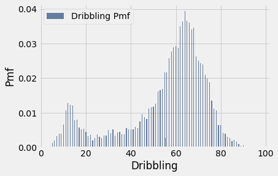
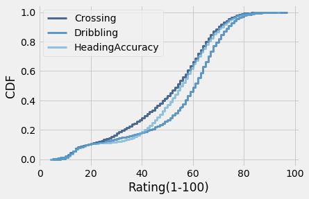

Fédération Internationale de Football Association(FIFA ) publishes Player rating data set which contains over 85 features about 18000 players. The feaures and players are updated annually and players are rated from 1(worst) to 100(best) . The data set can be used for various purposes, one of which is in the gaming industry.

The goal of this study is to explore the 2019 publication of this dataset using statistical and programatic techniques.


```python
from __future__ import print_function, division


import matplotlib.pyplot as plt
# Seaborn is a Python data visualization library based on matplotlib. 
# It provides a high-level interface for drawing attractive and informative statistical graphics.
import seaborn as sns

import numpy as np

import pandas as pd
import thinkstats2
import thinkplot
import os
```


    ---------------------------------------------------------------------------

    ModuleNotFoundError                       Traceback (most recent call last)

    Input In [1], in <cell line: 12>()
          9 import numpy as np
         11 import pandas as pd
    ---> 12 import thinkstats2
         13 import thinkplot
         14 import os
    

    ModuleNotFoundError: No module named 'thinkstats2'


```python
Data Preparation
```


```python
# Use style sheet from matplotlib
plt.style.use('fivethirtyeight')
```


```python
data = pd.read_csv("Data/fifa19_data.csv")
#data = df_main.sample(frac=.25)

data.shape
```


    (18207, 89)


```python
data.columns
```


    Index(['Unnamed: 0', 'ID', 'Name', 'Age', 'Photo', 'Nationality', 'Flag',
           'Overall', 'Potential', 'Club', 'Club Logo', 'Value', 'Wage', 'Special',
           'Preferred Foot', 'International Reputation', 'Weak Foot',
           'Skill Moves', 'Work Rate', 'Body Type', 'Real Face', 'Position',
           'Jersey Number', 'Joined', 'Loaned From', 'Contract Valid Until',
           'Height', 'Weight', 'LS', 'ST', 'RS', 'LW', 'LF', 'CF', 'RF', 'RW',
           'LAM', 'CAM', 'RAM', 'LM', 'LCM', 'CM', 'RCM', 'RM', 'LWB', 'LDM',
           'CDM', 'RDM', 'RWB', 'LB', 'LCB', 'CB', 'RCB', 'RB', 'Crossing',
           'Finishing', 'HeadingAccuracy', 'ShortPassing', 'Volleys', 'Dribbling',
           'Curve', 'FKAccuracy', 'LongPassing', 'BallControl', 'Acceleration',
           'SprintSpeed', 'Agility', 'Reactions', 'Balance', 'ShotPower',
           'Jumping', 'Stamina', 'Strength', 'LongShots', 'Aggression',
           'Interceptions', 'Positioning', 'Vision', 'Penalties', 'Composure',
           'Marking', 'StandingTackle', 'SlidingTackle', 'GKDiving', 'GKHandling',
           'GKKicking', 'GKPositioning', 'GKReflexes', 'Release Clause'],
          dtype='object')


```python
data.head()
```


<div>
<style scoped>
    .dataframe tbody tr th:only-of-type {
        vertical-align: middle;
    }

    .dataframe tbody tr th {
        vertical-align: top;
    }

    .dataframe thead th {
        text-align: right;
    }
</style>
<table border="1" class="dataframe">
  <thead>
    <tr style="text-align: right;">
      <th></th>
      <th>Unnamed: 0</th>
      <th>ID</th>
      <th>Name</th>
      <th>Age</th>
      <th>Photo</th>
      <th>Nationality</th>
      <th>Flag</th>
      <th>Overall</th>
      <th>Potential</th>
      <th>Club</th>
      <th>...</th>
      <th>Composure</th>
      <th>Marking</th>
      <th>StandingTackle</th>
      <th>SlidingTackle</th>
      <th>GKDiving</th>
      <th>GKHandling</th>
      <th>GKKicking</th>
      <th>GKPositioning</th>
      <th>GKReflexes</th>
      <th>Release Clause</th>
    </tr>
  </thead>
  <tbody>
    <tr>
      <th>0</th>
      <td>0</td>
      <td>158023</td>
      <td>L. Messi</td>
      <td>31</td>
      <td>https://cdn.sofifa.org/players/4/19/158023.png</td>
      <td>Argentina</td>
      <td>https://cdn.sofifa.org/flags/52.png</td>
      <td>94</td>
      <td>94</td>
      <td>FC Barcelona</td>
      <td>...</td>
      <td>96.0</td>
      <td>33.0</td>
      <td>28.0</td>
      <td>26.0</td>
      <td>6.0</td>
      <td>11.0</td>
      <td>15.0</td>
      <td>14.0</td>
      <td>8.0</td>
      <td>€226.5M</td>
    </tr>
    <tr>
      <th>1</th>
      <td>1</td>
      <td>20801</td>
      <td>Cristiano Ronaldo</td>
      <td>33</td>
      <td>https://cdn.sofifa.org/players/4/19/20801.png</td>
      <td>Portugal</td>
      <td>https://cdn.sofifa.org/flags/38.png</td>
      <td>94</td>
      <td>94</td>
      <td>Juventus</td>
      <td>...</td>
      <td>95.0</td>
      <td>28.0</td>
      <td>31.0</td>
      <td>23.0</td>
      <td>7.0</td>
      <td>11.0</td>
      <td>15.0</td>
      <td>14.0</td>
      <td>11.0</td>
      <td>€127.1M</td>
    </tr>
    <tr>
      <th>2</th>
      <td>2</td>
      <td>190871</td>
      <td>Neymar Jr</td>
      <td>26</td>
      <td>https://cdn.sofifa.org/players/4/19/190871.png</td>
      <td>Brazil</td>
      <td>https://cdn.sofifa.org/flags/54.png</td>
      <td>92</td>
      <td>93</td>
      <td>Paris Saint-Germain</td>
      <td>...</td>
      <td>94.0</td>
      <td>27.0</td>
      <td>24.0</td>
      <td>33.0</td>
      <td>9.0</td>
      <td>9.0</td>
      <td>15.0</td>
      <td>15.0</td>
      <td>11.0</td>
      <td>€228.1M</td>
    </tr>
    <tr>
      <th>3</th>
      <td>3</td>
      <td>193080</td>
      <td>De Gea</td>
      <td>27</td>
      <td>https://cdn.sofifa.org/players/4/19/193080.png</td>
      <td>Spain</td>
      <td>https://cdn.sofifa.org/flags/45.png</td>
      <td>91</td>
      <td>93</td>
      <td>Manchester United</td>
      <td>...</td>
      <td>68.0</td>
      <td>15.0</td>
      <td>21.0</td>
      <td>13.0</td>
      <td>90.0</td>
      <td>85.0</td>
      <td>87.0</td>
      <td>88.0</td>
      <td>94.0</td>
      <td>€138.6M</td>
    </tr>
    <tr>
      <th>4</th>
      <td>4</td>
      <td>192985</td>
      <td>K. De Bruyne</td>
      <td>27</td>
      <td>https://cdn.sofifa.org/players/4/19/192985.png</td>
      <td>Belgium</td>
      <td>https://cdn.sofifa.org/flags/7.png</td>
      <td>91</td>
      <td>92</td>
      <td>Manchester City</td>
      <td>...</td>
      <td>88.0</td>
      <td>68.0</td>
      <td>58.0</td>
      <td>51.0</td>
      <td>15.0</td>
      <td>13.0</td>
      <td>5.0</td>
      <td>10.0</td>
      <td>13.0</td>
      <td>€196.4M</td>
    </tr>
  </tbody>
</table>
<p>5 rows × 89 columns</p>
</div>


```python
skills =["Crossing","Finishing","HeadingAccuracy","ShortPassing","Volleys","Dribbling","Curve","FKAccuracy","LongPassing","BallControl","Acceleration","SprintSpeed","Agility","Reactions","Balance","ShotPower","Jumping","Stamina","Strength","LongShots","Aggression","Interceptions","Positioning","Vision","Penalties","Composure","Marking","StandingTackle","SlidingTackle","GKDiving","GKHandling","GKKicking","GKPositioning","GKReflexes"]
data[skills]

```


<div>
<style scoped>
    .dataframe tbody tr th:only-of-type {
        vertical-align: middle;
    }

    .dataframe tbody tr th {
        vertical-align: top;
    }

    .dataframe thead th {
        text-align: right;
    }
</style>
<table border="1" class="dataframe">
  <thead>
    <tr style="text-align: right;">
      <th></th>
      <th>Crossing</th>
      <th>Finishing</th>
      <th>HeadingAccuracy</th>
      <th>ShortPassing</th>
      <th>Volleys</th>
      <th>Dribbling</th>
      <th>Curve</th>
      <th>FKAccuracy</th>
      <th>LongPassing</th>
      <th>BallControl</th>
      <th>...</th>
      <th>Penalties</th>
      <th>Composure</th>
      <th>Marking</th>
      <th>StandingTackle</th>
      <th>SlidingTackle</th>
      <th>GKDiving</th>
      <th>GKHandling</th>
      <th>GKKicking</th>
      <th>GKPositioning</th>
      <th>GKReflexes</th>
    </tr>
  </thead>
  <tbody>
    <tr>
      <th>0</th>
      <td>84.0</td>
      <td>95.0</td>
      <td>70.0</td>
      <td>90.0</td>
      <td>86.0</td>
      <td>97.0</td>
      <td>93.0</td>
      <td>94.0</td>
      <td>87.0</td>
      <td>96.0</td>
      <td>...</td>
      <td>75.0</td>
      <td>96.0</td>
      <td>33.0</td>
      <td>28.0</td>
      <td>26.0</td>
      <td>6.0</td>
      <td>11.0</td>
      <td>15.0</td>
      <td>14.0</td>
      <td>8.0</td>
    </tr>
    <tr>
      <th>1</th>
      <td>84.0</td>
      <td>94.0</td>
      <td>89.0</td>
      <td>81.0</td>
      <td>87.0</td>
      <td>88.0</td>
      <td>81.0</td>
      <td>76.0</td>
      <td>77.0</td>
      <td>94.0</td>
      <td>...</td>
      <td>85.0</td>
      <td>95.0</td>
      <td>28.0</td>
      <td>31.0</td>
      <td>23.0</td>
      <td>7.0</td>
      <td>11.0</td>
      <td>15.0</td>
      <td>14.0</td>
      <td>11.0</td>
    </tr>
    <tr>
      <th>2</th>
      <td>79.0</td>
      <td>87.0</td>
      <td>62.0</td>
      <td>84.0</td>
      <td>84.0</td>
      <td>96.0</td>
      <td>88.0</td>
      <td>87.0</td>
      <td>78.0</td>
      <td>95.0</td>
      <td>...</td>
      <td>81.0</td>
      <td>94.0</td>
      <td>27.0</td>
      <td>24.0</td>
      <td>33.0</td>
      <td>9.0</td>
      <td>9.0</td>
      <td>15.0</td>
      <td>15.0</td>
      <td>11.0</td>
    </tr>
    <tr>
      <th>3</th>
      <td>17.0</td>
      <td>13.0</td>
      <td>21.0</td>
      <td>50.0</td>
      <td>13.0</td>
      <td>18.0</td>
      <td>21.0</td>
      <td>19.0</td>
      <td>51.0</td>
      <td>42.0</td>
      <td>...</td>
      <td>40.0</td>
      <td>68.0</td>
      <td>15.0</td>
      <td>21.0</td>
      <td>13.0</td>
      <td>90.0</td>
      <td>85.0</td>
      <td>87.0</td>
      <td>88.0</td>
      <td>94.0</td>
    </tr>
    <tr>
      <th>4</th>
      <td>93.0</td>
      <td>82.0</td>
      <td>55.0</td>
      <td>92.0</td>
      <td>82.0</td>
      <td>86.0</td>
      <td>85.0</td>
      <td>83.0</td>
      <td>91.0</td>
      <td>91.0</td>
      <td>...</td>
      <td>79.0</td>
      <td>88.0</td>
      <td>68.0</td>
      <td>58.0</td>
      <td>51.0</td>
      <td>15.0</td>
      <td>13.0</td>
      <td>5.0</td>
      <td>10.0</td>
      <td>13.0</td>
    </tr>
    <tr>
      <th>...</th>
      <td>...</td>
      <td>...</td>
      <td>...</td>
      <td>...</td>
      <td>...</td>
      <td>...</td>
      <td>...</td>
      <td>...</td>
      <td>...</td>
      <td>...</td>
      <td>...</td>
      <td>...</td>
      <td>...</td>
      <td>...</td>
      <td>...</td>
      <td>...</td>
      <td>...</td>
      <td>...</td>
      <td>...</td>
      <td>...</td>
      <td>...</td>
    </tr>
    <tr>
      <th>18202</th>
      <td>34.0</td>
      <td>38.0</td>
      <td>40.0</td>
      <td>49.0</td>
      <td>25.0</td>
      <td>42.0</td>
      <td>30.0</td>
      <td>34.0</td>
      <td>45.0</td>
      <td>43.0</td>
      <td>...</td>
      <td>43.0</td>
      <td>45.0</td>
      <td>40.0</td>
      <td>48.0</td>
      <td>47.0</td>
      <td>10.0</td>
      <td>13.0</td>
      <td>7.0</td>
      <td>8.0</td>
      <td>9.0</td>
    </tr>
    <tr>
      <th>18203</th>
      <td>23.0</td>
      <td>52.0</td>
      <td>52.0</td>
      <td>43.0</td>
      <td>36.0</td>
      <td>39.0</td>
      <td>32.0</td>
      <td>20.0</td>
      <td>25.0</td>
      <td>40.0</td>
      <td>...</td>
      <td>43.0</td>
      <td>42.0</td>
      <td>22.0</td>
      <td>15.0</td>
      <td>19.0</td>
      <td>10.0</td>
      <td>9.0</td>
      <td>9.0</td>
      <td>5.0</td>
      <td>12.0</td>
    </tr>
    <tr>
      <th>18204</th>
      <td>25.0</td>
      <td>40.0</td>
      <td>46.0</td>
      <td>38.0</td>
      <td>38.0</td>
      <td>45.0</td>
      <td>38.0</td>
      <td>27.0</td>
      <td>28.0</td>
      <td>44.0</td>
      <td>...</td>
      <td>55.0</td>
      <td>41.0</td>
      <td>32.0</td>
      <td>13.0</td>
      <td>11.0</td>
      <td>6.0</td>
      <td>5.0</td>
      <td>10.0</td>
      <td>6.0</td>
      <td>13.0</td>
    </tr>
    <tr>
      <th>18205</th>
      <td>44.0</td>
      <td>50.0</td>
      <td>39.0</td>
      <td>42.0</td>
      <td>40.0</td>
      <td>51.0</td>
      <td>34.0</td>
      <td>32.0</td>
      <td>32.0</td>
      <td>52.0</td>
      <td>...</td>
      <td>50.0</td>
      <td>46.0</td>
      <td>20.0</td>
      <td>25.0</td>
      <td>27.0</td>
      <td>14.0</td>
      <td>6.0</td>
      <td>14.0</td>
      <td>8.0</td>
      <td>9.0</td>
    </tr>
    <tr>
      <th>18206</th>
      <td>41.0</td>
      <td>34.0</td>
      <td>46.0</td>
      <td>48.0</td>
      <td>30.0</td>
      <td>43.0</td>
      <td>40.0</td>
      <td>34.0</td>
      <td>44.0</td>
      <td>51.0</td>
      <td>...</td>
      <td>33.0</td>
      <td>43.0</td>
      <td>40.0</td>
      <td>43.0</td>
      <td>50.0</td>
      <td>10.0</td>
      <td>15.0</td>
      <td>9.0</td>
      <td>12.0</td>
      <td>9.0</td>
    </tr>
  </tbody>
</table>
<p>18207 rows × 34 columns</p>
</div>


```python
# checking if the data contains any NULL value

data.isnull()[skills].sum()
```


    Crossing           48
    Finishing          48
    HeadingAccuracy    48
    ShortPassing       48
    Volleys            48
    Dribbling          48
    Curve              48
    FKAccuracy         48
    LongPassing        48
    BallControl        48
    Acceleration       48
    SprintSpeed        48
    Agility            48
    Reactions          48
    Balance            48
    ShotPower          48
    Jumping            48
    Stamina            48
    Strength           48
    LongShots          48
    Aggression         48
    Interceptions      48
    Positioning        48
    Vision             48
    Penalties          48
    Composure          48
    Marking            48
    StandingTackle     48
    SlidingTackle      48
    GKDiving           48
    GKHandling         48
    GKKicking          48
    GKPositioning      48
    GKReflexes         48
    dtype: int64


```python
# replacing missing data in the skills features with the mean of those with valid values.
from sklearn.impute import SimpleImputer
imputer = SimpleImputer(missing_values = np.nan, strategy = 'mean')
imputer = imputer.fit(data[skills])
data[skills] = imputer.transform(data[skills])
```


```python
data.isnull()[skills].sum()
```


    Crossing           0
    Finishing          0
    HeadingAccuracy    0
    ShortPassing       0
    Volleys            0
    Dribbling          0
    Curve              0
    FKAccuracy         0
    LongPassing        0
    BallControl        0
    Acceleration       0
    SprintSpeed        0
    Agility            0
    Reactions          0
    Balance            0
    ShotPower          0
    Jumping            0
    Stamina            0
    Strength           0
    LongShots          0
    Aggression         0
    Interceptions      0
    Positioning        0
    Vision             0
    Penalties          0
    Composure          0
    Marking            0
    StandingTackle     0
    SlidingTackle      0
    GKDiving           0
    GKHandling         0
    GKKicking          0
    GKPositioning      0
    GKReflexes         0
    dtype: int64


```python
data.isnull()[['Weight','Height']].sum()
```


    Weight    48
    Height    48
    dtype: int64


```python
# Replace missing values for weight and height to 9999lbs and 833'3 respectively.
# Once converted in convert_height function below, the height value of 833'3 will convert to 9999
# The 9999's in both weight and height columns will then be replaced with the mean value of their respective columns
data['Weight'].fillna('9999lbs', inplace = True)
data['Height'].fillna("833'3", inplace = True)
```


```python
data[data['Height'] == "833'3"]['Height']
```


    13236    833'3
    13237    833'3
    13238    833'3
    13239    833'3
    13240    833'3
    13241    833'3
    13242    833'3
    13243    833'3
    13244    833'3
    13245    833'3
    13246    833'3
    13247    833'3
    13248    833'3
    13249    833'3
    13250    833'3
    13251    833'3
    13252    833'3
    13253    833'3
    13254    833'3
    13255    833'3
    13256    833'3
    13257    833'3
    13258    833'3
    13259    833'3
    13260    833'3
    13261    833'3
    13262    833'3
    13263    833'3
    13264    833'3
    13265    833'3
    13266    833'3
    13267    833'3
    13268    833'3
    13269    833'3
    13270    833'3
    13271    833'3
    13272    833'3
    13273    833'3
    13274    833'3
    13275    833'3
    13276    833'3
    13277    833'3
    13278    833'3
    13279    833'3
    13280    833'3
    13281    833'3
    13282    833'3
    13283    833'3
    Name: Height, dtype: object


```python
#remove 'lbs' from weight value
data[data['Weight'] == "9999lbs"]['Weight']
```


    13236    9999lbs
    13237    9999lbs
    13238    9999lbs
    13239    9999lbs
    13240    9999lbs
    13241    9999lbs
    13242    9999lbs
    13243    9999lbs
    13244    9999lbs
    13245    9999lbs
    13246    9999lbs
    13247    9999lbs
    13248    9999lbs
    13249    9999lbs
    13250    9999lbs
    13251    9999lbs
    13252    9999lbs
    13253    9999lbs
    13254    9999lbs
    13255    9999lbs
    13256    9999lbs
    13257    9999lbs
    13258    9999lbs
    13259    9999lbs
    13260    9999lbs
    13261    9999lbs
    13262    9999lbs
    13263    9999lbs
    13264    9999lbs
    13265    9999lbs
    13266    9999lbs
    13267    9999lbs
    13268    9999lbs
    13269    9999lbs
    13270    9999lbs
    13271    9999lbs
    13272    9999lbs
    13273    9999lbs
    13274    9999lbs
    13275    9999lbs
    13276    9999lbs
    13277    9999lbs
    13278    9999lbs
    13279    9999lbs
    13280    9999lbs
    13281    9999lbs
    13282    9999lbs
    13283    9999lbs
    Name: Weight, dtype: object


```python
def convert_weight(value):
    weight = value.replace('lbs', '')
    return int(weight)
```


```python
# remove 'lbs' from the weight value and convert to integer
data['Weight'] = data['Weight'].apply(lambda x : convert_weight(x))
```


```python
data[data['Weight'] == 9999]['Weight']
```


    13236    9999
    13237    9999
    13238    9999
    13239    9999
    13240    9999
    13241    9999
    13242    9999
    13243    9999
    13244    9999
    13245    9999
    13246    9999
    13247    9999
    13248    9999
    13249    9999
    13250    9999
    13251    9999
    13252    9999
    13253    9999
    13254    9999
    13255    9999
    13256    9999
    13257    9999
    13258    9999
    13259    9999
    13260    9999
    13261    9999
    13262    9999
    13263    9999
    13264    9999
    13265    9999
    13266    9999
    13267    9999
    13268    9999
    13269    9999
    13270    9999
    13271    9999
    13272    9999
    13273    9999
    13274    9999
    13275    9999
    13276    9999
    13277    9999
    13278    9999
    13279    9999
    13280    9999
    13281    9999
    13282    9999
    13283    9999
    Name: Weight, dtype: int64


```python
def convert_height(value):
    height = int(value.split("'")[0])*12 + int(value.split("'")[1])
    return int(height)

```


```python
# Convert Height from "ft'inch" string format to inches in integer(Note the 833'3 will convert to 999 
# which will then be replaced with mean height
data['Height_Inch'] = data['Height'].apply(lambda x : convert_height(x))
data[['Height_Inch','Height']].head(50)
```


<div>
<style scoped>
    .dataframe tbody tr th:only-of-type {
        vertical-align: middle;
    }

    .dataframe tbody tr th {
        vertical-align: top;
    }

    .dataframe thead th {
        text-align: right;
    }
</style>
<table border="1" class="dataframe">
  <thead>
    <tr style="text-align: right;">
      <th></th>
      <th>Height_Inch</th>
      <th>Height</th>
    </tr>
  </thead>
  <tbody>
    <tr>
      <th>0</th>
      <td>67</td>
      <td>5'7</td>
    </tr>
    <tr>
      <th>1</th>
      <td>74</td>
      <td>6'2</td>
    </tr>
    <tr>
      <th>2</th>
      <td>69</td>
      <td>5'9</td>
    </tr>
    <tr>
      <th>3</th>
      <td>76</td>
      <td>6'4</td>
    </tr>
    <tr>
      <th>4</th>
      <td>71</td>
      <td>5'11</td>
    </tr>
    <tr>
      <th>5</th>
      <td>68</td>
      <td>5'8</td>
    </tr>
    <tr>
      <th>6</th>
      <td>68</td>
      <td>5'8</td>
    </tr>
    <tr>
      <th>7</th>
      <td>72</td>
      <td>6'0</td>
    </tr>
    <tr>
      <th>8</th>
      <td>72</td>
      <td>6'0</td>
    </tr>
    <tr>
      <th>9</th>
      <td>74</td>
      <td>6'2</td>
    </tr>
    <tr>
      <th>10</th>
      <td>72</td>
      <td>6'0</td>
    </tr>
    <tr>
      <th>11</th>
      <td>72</td>
      <td>6'0</td>
    </tr>
    <tr>
      <th>12</th>
      <td>74</td>
      <td>6'2</td>
    </tr>
    <tr>
      <th>13</th>
      <td>68</td>
      <td>5'8</td>
    </tr>
    <tr>
      <th>14</th>
      <td>66</td>
      <td>5'6</td>
    </tr>
    <tr>
      <th>15</th>
      <td>70</td>
      <td>5'10</td>
    </tr>
    <tr>
      <th>16</th>
      <td>74</td>
      <td>6'2</td>
    </tr>
    <tr>
      <th>17</th>
      <td>69</td>
      <td>5'9</td>
    </tr>
    <tr>
      <th>18</th>
      <td>74</td>
      <td>6'2</td>
    </tr>
    <tr>
      <th>19</th>
      <td>78</td>
      <td>6'6</td>
    </tr>
    <tr>
      <th>20</th>
      <td>74</td>
      <td>6'2</td>
    </tr>
    <tr>
      <th>21</th>
      <td>73</td>
      <td>6'1</td>
    </tr>
    <tr>
      <th>22</th>
      <td>76</td>
      <td>6'4</td>
    </tr>
    <tr>
      <th>23</th>
      <td>68</td>
      <td>5'8</td>
    </tr>
    <tr>
      <th>24</th>
      <td>74</td>
      <td>6'2</td>
    </tr>
    <tr>
      <th>25</th>
      <td>70</td>
      <td>5'10</td>
    </tr>
    <tr>
      <th>26</th>
      <td>69</td>
      <td>5'9</td>
    </tr>
    <tr>
      <th>27</th>
      <td>73</td>
      <td>6'1</td>
    </tr>
    <tr>
      <th>28</th>
      <td>71</td>
      <td>5'11</td>
    </tr>
    <tr>
      <th>29</th>
      <td>64</td>
      <td>5'4</td>
    </tr>
    <tr>
      <th>30</th>
      <td>69</td>
      <td>5'9</td>
    </tr>
    <tr>
      <th>31</th>
      <td>71</td>
      <td>5'11</td>
    </tr>
    <tr>
      <th>32</th>
      <td>68</td>
      <td>5'8</td>
    </tr>
    <tr>
      <th>33</th>
      <td>74</td>
      <td>6'2</td>
    </tr>
    <tr>
      <th>34</th>
      <td>75</td>
      <td>6'3</td>
    </tr>
    <tr>
      <th>35</th>
      <td>69</td>
      <td>5'9</td>
    </tr>
    <tr>
      <th>36</th>
      <td>73</td>
      <td>6'1</td>
    </tr>
    <tr>
      <th>37</th>
      <td>74</td>
      <td>6'2</td>
    </tr>
    <tr>
      <th>38</th>
      <td>73</td>
      <td>6'1</td>
    </tr>
    <tr>
      <th>39</th>
      <td>72</td>
      <td>6'0</td>
    </tr>
    <tr>
      <th>40</th>
      <td>76</td>
      <td>6'4</td>
    </tr>
    <tr>
      <th>41</th>
      <td>76</td>
      <td>6'4</td>
    </tr>
    <tr>
      <th>42</th>
      <td>72</td>
      <td>6'0</td>
    </tr>
    <tr>
      <th>43</th>
      <td>71</td>
      <td>5'11</td>
    </tr>
    <tr>
      <th>44</th>
      <td>74</td>
      <td>6'2</td>
    </tr>
    <tr>
      <th>45</th>
      <td>76</td>
      <td>6'4</td>
    </tr>
    <tr>
      <th>46</th>
      <td>73</td>
      <td>6'1</td>
    </tr>
    <tr>
      <th>47</th>
      <td>75</td>
      <td>6'3</td>
    </tr>
    <tr>
      <th>48</th>
      <td>73</td>
      <td>6'1</td>
    </tr>
    <tr>
      <th>49</th>
      <td>67</td>
      <td>5'7</td>
    </tr>
  </tbody>
</table>
</div>


```python
# Replace missing data in the 'Weight'and'Height' features with the mean of those with valid values.
imputer = SimpleImputer(missing_values = 9999, strategy = 'mean')
imputer = imputer.fit(data[['Weight','Height_Inch']])
data[['Weight','Height_Inch']] = imputer.transform(data[['Weight','Height_Inch']])
```


```python
def convert_to_ft_in(value,param):
    ft = int(param//12)
    inch = int(param%12)
    ft_inch = str(ft) + "'" + str(inch)
    if value == "833'3":
        value = ft_inch
    return(value)
```


```python
# Replace 833'3 with mean value of height_Int in ft'inch format
import statistics 
mean_height = statistics.mean(data['Height_Inch'])
data['Height'] = data['Height'].apply(lambda x : convert_to_ft_in(x,mean_height))
```


```python
data[data['Height'] == "833'3"]['Height'] # 833'3 are gone
```


    Series([], Name: Height, dtype: object)


```python
data[data['Height_Inch'] == 9999]['Height_Inch'] # 9999's are gone
```


    Series([], Name: Height_Inch, dtype: float64)


```python
data[data['Weight'] == 9999]['Weight'] # 9999's are gone
```


    Series([], Name: Weight, dtype: float64)


```python
def convert_to_years(value):
    years = datetime(2019, 12, 31).year - value.year
    return(years)
```


```python
# Create years of experience from the time player joined
```


```python
from datetime import datetime
data['Joined']= pd.to_datetime(data['Joined']) 
data['Experience'] = data['Joined'].apply(lambda x : convert_to_years(x))
```


```python
# Replace missing data in Experience with the mean of those with valid values.
imputer = SimpleImputer(missing_values = np.nan, strategy = 'mean')
imputer = imputer.fit(data[['Experience']])
data[['Experience']] = imputer.transform(data[['Experience']])
```


```python
data["MeanSkills"] =data.loc[:,skills].mean(axis=1)
```


```python
data[['Name','Joined','Experience','MeanSkills']].head(50)
```


<div>
<style scoped>
    .dataframe tbody tr th:only-of-type {
        vertical-align: middle;
    }

    .dataframe tbody tr th {
        vertical-align: top;
    }

    .dataframe thead th {
        text-align: right;
    }
</style>
<table border="1" class="dataframe">
  <thead>
    <tr style="text-align: right;">
      <th></th>
      <th>Name</th>
      <th>Joined</th>
      <th>Experience</th>
      <th>MeanSkills</th>
    </tr>
  </thead>
  <tbody>
    <tr>
      <th>0</th>
      <td>L. Messi</td>
      <td>2004-07-01</td>
      <td>15.000000</td>
      <td>67.588235</td>
    </tr>
    <tr>
      <th>1</th>
      <td>Cristiano Ronaldo</td>
      <td>2018-07-10</td>
      <td>1.000000</td>
      <td>68.323529</td>
    </tr>
    <tr>
      <th>2</th>
      <td>Neymar Jr</td>
      <td>2017-08-03</td>
      <td>2.000000</td>
      <td>65.794118</td>
    </tr>
    <tr>
      <th>3</th>
      <td>De Gea</td>
      <td>2011-07-01</td>
      <td>8.000000</td>
      <td>45.264706</td>
    </tr>
    <tr>
      <th>4</th>
      <td>K. De Bruyne</td>
      <td>2015-08-30</td>
      <td>4.000000</td>
      <td>69.676471</td>
    </tr>
    <tr>
      <th>5</th>
      <td>E. Hazard</td>
      <td>2012-07-01</td>
      <td>7.000000</td>
      <td>65.676471</td>
    </tr>
    <tr>
      <th>6</th>
      <td>L. Modrić</td>
      <td>2012-08-01</td>
      <td>7.000000</td>
      <td>69.529412</td>
    </tr>
    <tr>
      <th>7</th>
      <td>L. Suárez</td>
      <td>2014-07-11</td>
      <td>5.000000</td>
      <td>71.500000</td>
    </tr>
    <tr>
      <th>8</th>
      <td>Sergio Ramos</td>
      <td>2005-08-01</td>
      <td>14.000000</td>
      <td>67.147059</td>
    </tr>
    <tr>
      <th>9</th>
      <td>J. Oblak</td>
      <td>2014-07-16</td>
      <td>5.000000</td>
      <td>41.205882</td>
    </tr>
    <tr>
      <th>10</th>
      <td>R. Lewandowski</td>
      <td>2014-07-01</td>
      <td>5.000000</td>
      <td>65.823529</td>
    </tr>
    <tr>
      <th>11</th>
      <td>T. Kroos</td>
      <td>2014-07-17</td>
      <td>5.000000</td>
      <td>66.911765</td>
    </tr>
    <tr>
      <th>12</th>
      <td>D. Godín</td>
      <td>2010-08-04</td>
      <td>9.000000</td>
      <td>59.647059</td>
    </tr>
    <tr>
      <th>13</th>
      <td>David Silva</td>
      <td>2010-07-14</td>
      <td>9.000000</td>
      <td>64.941176</td>
    </tr>
    <tr>
      <th>14</th>
      <td>N. Kanté</td>
      <td>2016-07-16</td>
      <td>3.000000</td>
      <td>66.882353</td>
    </tr>
    <tr>
      <th>15</th>
      <td>P. Dybala</td>
      <td>2015-07-01</td>
      <td>4.000000</td>
      <td>64.000000</td>
    </tr>
    <tr>
      <th>16</th>
      <td>H. Kane</td>
      <td>2010-07-01</td>
      <td>9.000000</td>
      <td>66.294118</td>
    </tr>
    <tr>
      <th>17</th>
      <td>A. Griezmann</td>
      <td>2014-07-28</td>
      <td>5.000000</td>
      <td>68.617647</td>
    </tr>
    <tr>
      <th>18</th>
      <td>M. ter Stegen</td>
      <td>2014-07-01</td>
      <td>5.000000</td>
      <td>41.088235</td>
    </tr>
    <tr>
      <th>19</th>
      <td>T. Courtois</td>
      <td>2018-08-09</td>
      <td>1.000000</td>
      <td>40.500000</td>
    </tr>
    <tr>
      <th>20</th>
      <td>Sergio Busquets</td>
      <td>2008-09-01</td>
      <td>11.000000</td>
      <td>63.382353</td>
    </tr>
    <tr>
      <th>21</th>
      <td>E. Cavani</td>
      <td>2013-07-16</td>
      <td>6.000000</td>
      <td>65.970588</td>
    </tr>
    <tr>
      <th>22</th>
      <td>M. Neuer</td>
      <td>2011-07-01</td>
      <td>8.000000</td>
      <td>45.382353</td>
    </tr>
    <tr>
      <th>23</th>
      <td>S. Agüero</td>
      <td>2011-07-28</td>
      <td>8.000000</td>
      <td>64.617647</td>
    </tr>
    <tr>
      <th>24</th>
      <td>G. Chiellini</td>
      <td>2005-07-01</td>
      <td>14.000000</td>
      <td>56.617647</td>
    </tr>
    <tr>
      <th>25</th>
      <td>K. Mbappé</td>
      <td>2018-07-01</td>
      <td>1.000000</td>
      <td>64.823529</td>
    </tr>
    <tr>
      <th>26</th>
      <td>M. Salah</td>
      <td>2017-07-01</td>
      <td>2.000000</td>
      <td>65.794118</td>
    </tr>
    <tr>
      <th>27</th>
      <td>Casemiro</td>
      <td>2013-07-11</td>
      <td>6.000000</td>
      <td>66.294118</td>
    </tr>
    <tr>
      <th>28</th>
      <td>J. Rodríguez</td>
      <td>NaT</td>
      <td>2.540171</td>
      <td>66.411765</td>
    </tr>
    <tr>
      <th>29</th>
      <td>L. Insigne</td>
      <td>2010-07-01</td>
      <td>9.000000</td>
      <td>61.764706</td>
    </tr>
    <tr>
      <th>30</th>
      <td>Isco</td>
      <td>2013-07-03</td>
      <td>6.000000</td>
      <td>65.382353</td>
    </tr>
    <tr>
      <th>31</th>
      <td>C. Eriksen</td>
      <td>2013-08-30</td>
      <td>6.000000</td>
      <td>64.852941</td>
    </tr>
    <tr>
      <th>32</th>
      <td>Coutinho</td>
      <td>2018-01-06</td>
      <td>1.000000</td>
      <td>66.470588</td>
    </tr>
    <tr>
      <th>33</th>
      <td>P. Aubameyang</td>
      <td>2018-01-31</td>
      <td>1.000000</td>
      <td>63.382353</td>
    </tr>
    <tr>
      <th>34</th>
      <td>M. Hummels</td>
      <td>2016-07-01</td>
      <td>3.000000</td>
      <td>62.617647</td>
    </tr>
    <tr>
      <th>35</th>
      <td>Marcelo</td>
      <td>2007-01-01</td>
      <td>12.000000</td>
      <td>69.558824</td>
    </tr>
    <tr>
      <th>36</th>
      <td>G. Bale</td>
      <td>2013-09-02</td>
      <td>6.000000</td>
      <td>69.558824</td>
    </tr>
    <tr>
      <th>37</th>
      <td>H. Lloris</td>
      <td>2012-08-01</td>
      <td>7.000000</td>
      <td>41.176471</td>
    </tr>
    <tr>
      <th>38</th>
      <td>G. Higuaín</td>
      <td>NaT</td>
      <td>2.540171</td>
      <td>60.323529</td>
    </tr>
    <tr>
      <th>39</th>
      <td>Thiago Silva</td>
      <td>2012-07-01</td>
      <td>7.000000</td>
      <td>63.470588</td>
    </tr>
    <tr>
      <th>40</th>
      <td>S. Handanovič</td>
      <td>2012-07-01</td>
      <td>7.000000</td>
      <td>39.147059</td>
    </tr>
    <tr>
      <th>41</th>
      <td>G. Buffon</td>
      <td>2018-07-06</td>
      <td>1.000000</td>
      <td>41.294118</td>
    </tr>
    <tr>
      <th>42</th>
      <td>S. Umtiti</td>
      <td>2016-07-12</td>
      <td>3.000000</td>
      <td>65.558824</td>
    </tr>
    <tr>
      <th>43</th>
      <td>M. Icardi</td>
      <td>2013-07-09</td>
      <td>6.000000</td>
      <td>59.558824</td>
    </tr>
    <tr>
      <th>44</th>
      <td>K. Koulibaly</td>
      <td>2014-07-01</td>
      <td>5.000000</td>
      <td>51.117647</td>
    </tr>
    <tr>
      <th>45</th>
      <td>P. Pogba</td>
      <td>2016-08-09</td>
      <td>3.000000</td>
      <td>68.647059</td>
    </tr>
    <tr>
      <th>46</th>
      <td>K. Navas</td>
      <td>2014-08-03</td>
      <td>5.000000</td>
      <td>41.529412</td>
    </tr>
    <tr>
      <th>47</th>
      <td>R. Lukaku</td>
      <td>2017-07-10</td>
      <td>2.000000</td>
      <td>62.176471</td>
    </tr>
    <tr>
      <th>48</th>
      <td>C. Immobile</td>
      <td>2016-07-27</td>
      <td>3.000000</td>
      <td>61.470588</td>
    </tr>
    <tr>
      <th>49</th>
      <td>Jordi Alba</td>
      <td>2012-07-01</td>
      <td>7.000000</td>
      <td>67.911765</td>
    </tr>
  </tbody>
</table>
</div>


Explore Data


```python
#Number of countries available and top 10 countries with highest number of players
print('Total number of countries : {0}'.format(data['Nationality'].nunique()))
print(data['Nationality'].value_counts().head(10))

#European Countries have most players
```

    Total number of countries : 164
    England        1662
    Germany        1198
    Spain          1072
    Argentina       937
    France          914
    Brazil          827
    Italy           702
    Colombia        618
    Japan           478
    Netherlands     453
    Name: Nationality, dtype: int64
    


```python
# Best in each skill category
for skill in skills:
    print('Best {0} : {1} from {2}'.format(skill,data.loc[data[skill].idxmax()]['Name'],data.loc[data[skill].idxmax()]['Nationality']))
```

    Best Crossing : K. De Bruyne from Belgium
    Best Finishing : L. Messi from Argentina
    Best HeadingAccuracy : Naldo from Brazil
    Best ShortPassing : L. Modrić from Croatia
    Best Volleys : E. Cavani from Uruguay
    Best Dribbling : L. Messi from Argentina
    Best Curve : Quaresma from Portugal
    Best FKAccuracy : L. Messi from Argentina
    Best LongPassing : T. Kroos from Germany
    Best BallControl : L. Messi from Argentina
    Best Acceleration : Douglas Costa from Brazil
    Best SprintSpeed : K. Mbappé from France
    Best Agility : Neymar Jr from Brazil
    Best Reactions : Cristiano Ronaldo from Portugal
    Best Balance : Bernard from Brazil
    Best ShotPower : Cristiano Ronaldo from Portugal
    Best Jumping : Cristiano Ronaldo from Portugal
    Best Stamina : N. Kanté from France
    Best Strength : A. Akinfenwa from England
    Best LongShots : L. Messi from Argentina
    Best Aggression : B. Pearson from England
    Best Interceptions : N. Kanté from France
    Best Positioning : Cristiano Ronaldo from Portugal
    Best Vision : L. Messi from Argentina
    Best Penalties : M. Balotelli from Italy
    Best Composure : L. Messi from Argentina
    Best Marking : A. Barzagli from Italy
    Best StandingTackle : G. Chiellini from Italy
    Best SlidingTackle : Sergio Ramos from Spain
    Best GKDiving : De Gea from Spain
    Best GKHandling : J. Oblak from Slovenia
    Best GKKicking : M. Neuer from Germany
    Best GKPositioning : G. Buffon from Italy
    Best GKReflexes : De Gea from Spain
    


```python
# Histogram of Crossing
crossing_hist = thinkstats2.Hist(data['Crossing'], label='Crossing Histogram')
thinkplot.Hist(crossing_hist)
thinkplot.Config(xlabel='Crossing', ylabel='Count')
```


    

    


```python
# PMF of crossing
crossing_pmf = thinkstats2.Pmf(data['Crossing'], label='Crossing Pmf')
thinkplot.Hist(crossing_pmf)
thinkplot.Config(xlabel='Crossing', ylabel='Pmf')
```


    

    


```python
# Histogram of Dribbling
dribbling_hist = thinkstats2.Hist(data['Dribbling'],label='Dribbling Histogram')
thinkplot.Hist(dribbling_hist)
thinkplot.Config(xlabel='Dribbling', ylabel='Count')
```


    

    


```python
# PMF of Dribbling
dribbling_pmf = thinkstats2.Pmf(data['Dribbling'], label='Dribbling Pmf')
thinkplot.Hist(dribbling_pmf)
thinkplot.Config(xlabel='Dribbling', ylabel='Pmf')
```


    

    


```python
# PMF of HeadingAccuracy
HeadingAccuracy_pmf = thinkstats2.Pmf(data['HeadingAccuracy'], label='HeadingAccuracy Pmf')
thinkplot.Hist(HeadingAccuracy_pmf)
thinkplot.Config(xlabel='HeadingAccuracy', ylabel='Pmf')
```


    

    


```python
width=0.45
axis = [0,100, 0, .05]
thinkplot.PrePlot(2, cols=2)
thinkplot.Hist(crossing_pmf, align='right', width=width)
thinkplot.Hist(HeadingAccuracy_pmf, align='left', width=width)
thinkplot.Config(xlabel='Rating',
                     ylabel='probability', axis=axis)


```


    

    


Plot the PMFs


```python
thinkplot.PrePlot(2)
thinkplot.SubPlot(2)
thinkplot.Pmfs([crossing_pmf, dribbling_pmf])
thinkplot.Show(xlabel='Rating', axis=axis)

```


    

    


    <Figure size 576x432 with 0 Axes>


```python
cdf = thinkstats2.Cdf(data.Crossing, label='Crossing CDF')

thinkplot.Cdf(cdf)
thinkplot.Config(xlabel='Crossing', ylabel='CDF', loc='upper left')
```


    

    


```python
cdf.Prob(40),cdf.Prob(80)
#this means that 28 percent of the players have rating of 40 and 99 percent have rating of 80
```


    (0.28280331740539355, 0.9913220190036799)


```python
cdf.Value(.5)
# This means that 50 percent have rating of 54
cdf.Prob(54)
# this shows that.
```


    0.5113967155489647


```python
crossing_cdf = thinkstats2.Cdf(data.Crossing, label='Crossing')
dribbling_cdf = thinkstats2.Cdf(data.Dribbling, label='Dribbling')
headingaccuracy_cdf = thinkstats2.Cdf(data.HeadingAccuracy, label='HeadingAccuracy')

thinkplot.PrePlot(3)
thinkplot.Cdfs([crossing_cdf, dribbling_cdf,headingaccuracy_cdf])
thinkplot.Config(xlabel='Rating(1-100)', ylabel='CDF')
```


    

    


```python
# Height of Players

plt.figure(figsize = (13, 8))
ax = sns.countplot(x = 'Height', data = data, palette = 'Set3',orient="v")
ax.set_title(label = 'Players based on Height', fontsize = 20)
ax.set_xlabel(xlabel = 'Height in Foot Inch', fontsize = 16)
ax.set_ylabel(ylabel = 'Number of Players', fontsize = 16)
plt.show()
```


    

    


```python
plt.figure(figsize = (20, 5))
plt.style.use('_classic_test')
sns.distplot(data['Height_Inch'], color = 'blue')
plt.title('Different Heights of the Players Participating in FIFA 2019', fontsize = 20)
plt.xlabel('Heights associated with the players', fontsize = 16)
plt.ylabel('count of Players', fontsize = 16)
plt.show()
```


    

    


```python
# Normal distribution in above graph shows to be 71.36 as shown here

statistics.mean(data['Height_Inch'])
```


    71.3612533729831


```python

```


```python
plt.figure(figsize = (20, 5))
plt.style.use('_classic_test')
sns.distplot(data['Weight'], color = 'blue')
plt.title('Different Weights of the Players Participating in FIFA 2019', fontsize = 20)
plt.xlabel('Weights associated with the players', fontsize = 16)
plt.ylabel('count of Players', fontsize = 16)
plt.show()
```


    

    


```python
statistics.mean(data['Weight'])
```


    165.97912880665234


```python
youth = data.query('Age <= 18')
adult = data.query('18 < Age <= 30')
veteran = data.query('Age > 30')
```


```python
thinkplot.Scatter(data['Dribbling'], data['Overall'], alpha=1)
thinkplot.Config(xlabel='Dribbling Rating(1-100)',
                 ylabel='OverallRating(1-100)',
                 legend=False)
```


    

    


```python
import statsmodels.formula.api as smf

formula = 'Overall ~ Crossing+Finishing+HeadingAccuracy+ShortPassing+Volleys+Dribbling+Curve+FKAccuracy+LongPassing+BallControl+Acceleration+SprintSpeed+Agility+Reactions+Balance+ShotPower+Jumping+Stamina+Strength+LongShots+Aggression+Interceptions+Positioning+Vision+Penalties+Composure+Marking+StandingTackle+SlidingTackle+GKDiving+GKHandling+GKKicking+GKPositioning+GKReflexes'
model = smf.ols(formula, data=data)
results = model.fit()
results.summary()
```


<table class="simpletable">
<caption>OLS Regression Results</caption>
<tr>
  <th>Dep. Variable:</th>         <td>Overall</td>     <th>  R-squared:         </th> <td>   0.858</td> 
</tr>
<tr>
  <th>Model:</th>                   <td>OLS</td>       <th>  Adj. R-squared:    </th> <td>   0.857</td> 
</tr>
<tr>
  <th>Method:</th>             <td>Least Squares</td>  <th>  F-statistic:       </th> <td>   3218.</td> 
</tr>
<tr>
  <th>Date:</th>             <td>Sat, 29 Feb 2020</td> <th>  Prob (F-statistic):</th>  <td>  0.00</td>  
</tr>
<tr>
  <th>Time:</th>                 <td>07:57:52</td>     <th>  Log-Likelihood:    </th> <td> -43283.</td> 
</tr>
<tr>
  <th>No. Observations:</th>      <td> 18207</td>      <th>  AIC:               </th> <td>8.664e+04</td>
</tr>
<tr>
  <th>Df Residuals:</th>          <td> 18172</td>      <th>  BIC:               </th> <td>8.691e+04</td>
</tr>
<tr>
  <th>Df Model:</th>              <td>    34</td>      <th>                     </th>     <td> </td>    
</tr>
<tr>
  <th>Covariance Type:</th>      <td>nonrobust</td>    <th>                     </th>     <td> </td>    
</tr>
</table>
<table class="simpletable">
<tr>
         <td></td>            <th>coef</th>     <th>std err</th>      <th>t</th>      <th>P>|t|</th>  <th>[0.025</th>    <th>0.975]</th>  
</tr>
<tr>
  <th>Intercept</th>       <td>   10.0381</td> <td>    0.265</td> <td>   37.887</td> <td> 0.000</td> <td>    9.519</td> <td>   10.557</td>
</tr>
<tr>
  <th>Crossing</th>        <td>    0.0142</td> <td>    0.003</td> <td>    5.454</td> <td> 0.000</td> <td>    0.009</td> <td>    0.019</td>
</tr>
<tr>
  <th>Finishing</th>       <td>    0.0277</td> <td>    0.003</td> <td>    8.437</td> <td> 0.000</td> <td>    0.021</td> <td>    0.034</td>
</tr>
<tr>
  <th>HeadingAccuracy</th> <td>    0.0896</td> <td>    0.003</td> <td>   32.577</td> <td> 0.000</td> <td>    0.084</td> <td>    0.095</td>
</tr>
<tr>
  <th>ShortPassing</th>    <td>    0.0825</td> <td>    0.005</td> <td>   17.681</td> <td> 0.000</td> <td>    0.073</td> <td>    0.092</td>
</tr>
<tr>
  <th>Volleys</th>         <td>    0.0006</td> <td>    0.003</td> <td>    0.200</td> <td> 0.842</td> <td>   -0.005</td> <td>    0.006</td>
</tr>
<tr>
  <th>Dribbling</th>       <td>    0.0202</td> <td>    0.004</td> <td>    4.945</td> <td> 0.000</td> <td>    0.012</td> <td>    0.028</td>
</tr>
<tr>
  <th>Curve</th>           <td>    0.0104</td> <td>    0.003</td> <td>    3.710</td> <td> 0.000</td> <td>    0.005</td> <td>    0.016</td>
</tr>
<tr>
  <th>FKAccuracy</th>      <td>    0.0056</td> <td>    0.002</td> <td>    2.273</td> <td> 0.023</td> <td>    0.001</td> <td>    0.010</td>
</tr>
<tr>
  <th>LongPassing</th>     <td>   -0.0183</td> <td>    0.003</td> <td>   -5.345</td> <td> 0.000</td> <td>   -0.025</td> <td>   -0.012</td>
</tr>
<tr>
  <th>BallControl</th>     <td>    0.1474</td> <td>    0.005</td> <td>   29.413</td> <td> 0.000</td> <td>    0.138</td> <td>    0.157</td>
</tr>
<tr>
  <th>Acceleration</th>    <td>    0.0358</td> <td>    0.004</td> <td>    9.242</td> <td> 0.000</td> <td>    0.028</td> <td>    0.043</td>
</tr>
<tr>
  <th>SprintSpeed</th>     <td>    0.0254</td> <td>    0.004</td> <td>    7.070</td> <td> 0.000</td> <td>    0.018</td> <td>    0.032</td>
</tr>
<tr>
  <th>Agility</th>         <td>    0.0011</td> <td>    0.003</td> <td>    0.399</td> <td> 0.690</td> <td>   -0.004</td> <td>    0.007</td>
</tr>
<tr>
  <th>Reactions</th>       <td>    0.2924</td> <td>    0.004</td> <td>   77.175</td> <td> 0.000</td> <td>    0.285</td> <td>    0.300</td>
</tr>
<tr>
  <th>Balance</th>         <td>   -0.0225</td> <td>    0.003</td> <td>   -8.686</td> <td> 0.000</td> <td>   -0.028</td> <td>   -0.017</td>
</tr>
<tr>
  <th>ShotPower</th>       <td>    0.0240</td> <td>    0.003</td> <td>    8.237</td> <td> 0.000</td> <td>    0.018</td> <td>    0.030</td>
</tr>
<tr>
  <th>Jumping</th>         <td>    0.0050</td> <td>    0.002</td> <td>    2.455</td> <td> 0.014</td> <td>    0.001</td> <td>    0.009</td>
</tr>
<tr>
  <th>Stamina</th>         <td>    0.0123</td> <td>    0.002</td> <td>    5.235</td> <td> 0.000</td> <td>    0.008</td> <td>    0.017</td>
</tr>
<tr>
  <th>Strength</th>        <td>    0.0355</td> <td>    0.002</td> <td>   14.539</td> <td> 0.000</td> <td>    0.031</td> <td>    0.040</td>
</tr>
<tr>
  <th>LongShots</th>       <td>   -0.0216</td> <td>    0.003</td> <td>   -6.988</td> <td> 0.000</td> <td>   -0.028</td> <td>   -0.016</td>
</tr>
<tr>
  <th>Aggression</th>      <td>   -0.0007</td> <td>    0.002</td> <td>   -0.325</td> <td> 0.745</td> <td>   -0.005</td> <td>    0.004</td>
</tr>
<tr>
  <th>Interceptions</th>   <td>   -0.0056</td> <td>    0.003</td> <td>   -1.798</td> <td> 0.072</td> <td>   -0.012</td> <td>    0.001</td>
</tr>
<tr>
  <th>Positioning</th>     <td>   -0.0544</td> <td>    0.003</td> <td>  -17.799</td> <td> 0.000</td> <td>   -0.060</td> <td>   -0.048</td>
</tr>
<tr>
  <th>Vision</th>          <td>   -0.0142</td> <td>    0.003</td> <td>   -5.021</td> <td> 0.000</td> <td>   -0.020</td> <td>   -0.009</td>
</tr>
<tr>
  <th>Penalties</th>       <td>    0.0019</td> <td>    0.003</td> <td>    0.702</td> <td> 0.483</td> <td>   -0.003</td> <td>    0.007</td>
</tr>
<tr>
  <th>Composure</th>       <td>    0.1195</td> <td>    0.003</td> <td>   39.178</td> <td> 0.000</td> <td>    0.113</td> <td>    0.125</td>
</tr>
<tr>
  <th>Marking</th>         <td>    0.0360</td> <td>    0.003</td> <td>   14.370</td> <td> 0.000</td> <td>    0.031</td> <td>    0.041</td>
</tr>
<tr>
  <th>StandingTackle</th>  <td>    0.0268</td> <td>    0.005</td> <td>    5.724</td> <td> 0.000</td> <td>    0.018</td> <td>    0.036</td>
</tr>
<tr>
  <th>SlidingTackle</th>   <td>   -0.0200</td> <td>    0.004</td> <td>   -4.619</td> <td> 0.000</td> <td>   -0.029</td> <td>   -0.012</td>
</tr>
<tr>
  <th>GKDiving</th>        <td>    0.0728</td> <td>    0.006</td> <td>   12.456</td> <td> 0.000</td> <td>    0.061</td> <td>    0.084</td>
</tr>
<tr>
  <th>GKHandling</th>      <td>    0.0744</td> <td>    0.006</td> <td>   12.587</td> <td> 0.000</td> <td>    0.063</td> <td>    0.086</td>
</tr>
<tr>
  <th>GKKicking</th>       <td>    0.0339</td> <td>    0.005</td> <td>    6.222</td> <td> 0.000</td> <td>    0.023</td> <td>    0.045</td>
</tr>
<tr>
  <th>GKPositioning</th>   <td>    0.0700</td> <td>    0.006</td> <td>   12.116</td> <td> 0.000</td> <td>    0.059</td> <td>    0.081</td>
</tr>
<tr>
  <th>GKReflexes</th>      <td>    0.0758</td> <td>    0.006</td> <td>   13.082</td> <td> 0.000</td> <td>    0.064</td> <td>    0.087</td>
</tr>
</table>
<table class="simpletable">
<tr>
  <th>Omnibus:</th>       <td>60.414</td> <th>  Durbin-Watson:     </th> <td>   1.692</td>
</tr>
<tr>
  <th>Prob(Omnibus):</th> <td> 0.000</td> <th>  Jarque-Bera (JB):  </th> <td>  80.416</td>
</tr>
<tr>
  <th>Skew:</th>          <td> 0.004</td> <th>  Prob(JB):          </th> <td>3.45e-18</td>
</tr>
<tr>
  <th>Kurtosis:</th>      <td> 3.325</td> <th>  Cond. No.          </th> <td>4.15e+03</td>
</tr>
</table><br/><br/>Warnings:<br/>[1] Standard Errors assume that the covariance matrix of the errors is correctly specified.<br/>[2] The condition number is large, 4.15e+03. This might indicate that there are<br/>strong multicollinearity or other numerical problems.


```python
# Remove features with negative coefficient
import statsmodels.formula.api as smf

formula = 'Overall ~ Crossing+Finishing+HeadingAccuracy+ShortPassing+Volleys+Dribbling+Curve+FKAccuracy+BallControl+Acceleration+SprintSpeed+Agility+Reactions+ShotPower+Jumping+Stamina+Strength+Penalties+Composure+Marking+StandingTackle+GKDiving+GKHandling+GKKicking+GKPositioning+GKReflexes'
model = smf.ols(formula, data=data)
results = model.fit()
results.summary()
```


<table class="simpletable">
<caption>OLS Regression Results</caption>
<tr>
  <th>Dep. Variable:</th>         <td>Overall</td>     <th>  R-squared:         </th> <td>   0.853</td> 
</tr>
<tr>
  <th>Model:</th>                   <td>OLS</td>       <th>  Adj. R-squared:    </th> <td>   0.852</td> 
</tr>
<tr>
  <th>Method:</th>             <td>Least Squares</td>  <th>  F-statistic:       </th> <td>   4048.</td> 
</tr>
<tr>
  <th>Date:</th>             <td>Sat, 29 Feb 2020</td> <th>  Prob (F-statistic):</th>  <td>  0.00</td>  
</tr>
<tr>
  <th>Time:</th>                 <td>08:04:19</td>     <th>  Log-Likelihood:    </th> <td> -43589.</td> 
</tr>
<tr>
  <th>No. Observations:</th>      <td> 18207</td>      <th>  AIC:               </th> <td>8.723e+04</td>
</tr>
<tr>
  <th>Df Residuals:</th>          <td> 18180</td>      <th>  BIC:               </th> <td>8.744e+04</td>
</tr>
<tr>
  <th>Df Model:</th>              <td>    26</td>      <th>                     </th>     <td> </td>    
</tr>
<tr>
  <th>Covariance Type:</th>      <td>nonrobust</td>    <th>                     </th>     <td> </td>    
</tr>
</table>
<table class="simpletable">
<tr>
         <td></td>            <th>coef</th>     <th>std err</th>      <th>t</th>      <th>P>|t|</th>  <th>[0.025</th>    <th>0.975]</th>  
</tr>
<tr>
  <th>Intercept</th>       <td>    9.5828</td> <td>    0.238</td> <td>   40.259</td> <td> 0.000</td> <td>    9.116</td> <td>   10.049</td>
</tr>
<tr>
  <th>Crossing</th>        <td>    0.0031</td> <td>    0.003</td> <td>    1.194</td> <td> 0.232</td> <td>   -0.002</td> <td>    0.008</td>
</tr>
<tr>
  <th>Finishing</th>       <td>    0.0004</td> <td>    0.003</td> <td>    0.138</td> <td> 0.890</td> <td>   -0.005</td> <td>    0.006</td>
</tr>
<tr>
  <th>HeadingAccuracy</th> <td>    0.0969</td> <td>    0.003</td> <td>   36.017</td> <td> 0.000</td> <td>    0.092</td> <td>    0.102</td>
</tr>
<tr>
  <th>ShortPassing</th>    <td>    0.0623</td> <td>    0.004</td> <td>   16.256</td> <td> 0.000</td> <td>    0.055</td> <td>    0.070</td>
</tr>
<tr>
  <th>Volleys</th>         <td>   -0.0051</td> <td>    0.003</td> <td>   -1.789</td> <td> 0.074</td> <td>   -0.011</td> <td>    0.000</td>
</tr>
<tr>
  <th>Dribbling</th>       <td>   -0.0013</td> <td>    0.004</td> <td>   -0.324</td> <td> 0.746</td> <td>   -0.009</td> <td>    0.007</td>
</tr>
<tr>
  <th>Curve</th>           <td>    0.0063</td> <td>    0.003</td> <td>    2.224</td> <td> 0.026</td> <td>    0.001</td> <td>    0.012</td>
</tr>
<tr>
  <th>FKAccuracy</th>      <td>    0.0005</td> <td>    0.002</td> <td>    0.223</td> <td> 0.824</td> <td>   -0.004</td> <td>    0.005</td>
</tr>
<tr>
  <th>BallControl</th>     <td>    0.1459</td> <td>    0.005</td> <td>   28.653</td> <td> 0.000</td> <td>    0.136</td> <td>    0.156</td>
</tr>
<tr>
  <th>Acceleration</th>    <td>    0.0325</td> <td>    0.004</td> <td>    8.332</td> <td> 0.000</td> <td>    0.025</td> <td>    0.040</td>
</tr>
<tr>
  <th>SprintSpeed</th>     <td>    0.0314</td> <td>    0.004</td> <td>    8.624</td> <td> 0.000</td> <td>    0.024</td> <td>    0.038</td>
</tr>
<tr>
  <th>Agility</th>         <td>   -0.0086</td> <td>    0.003</td> <td>   -3.073</td> <td> 0.002</td> <td>   -0.014</td> <td>   -0.003</td>
</tr>
<tr>
  <th>Reactions</th>       <td>    0.2833</td> <td>    0.004</td> <td>   75.435</td> <td> 0.000</td> <td>    0.276</td> <td>    0.291</td>
</tr>
<tr>
  <th>ShotPower</th>       <td>    0.0146</td> <td>    0.003</td> <td>    5.468</td> <td> 0.000</td> <td>    0.009</td> <td>    0.020</td>
</tr>
<tr>
  <th>Jumping</th>         <td>    0.0012</td> <td>    0.002</td> <td>    0.594</td> <td> 0.552</td> <td>   -0.003</td> <td>    0.005</td>
</tr>
<tr>
  <th>Stamina</th>         <td>    0.0030</td> <td>    0.002</td> <td>    1.278</td> <td> 0.201</td> <td>   -0.002</td> <td>    0.008</td>
</tr>
<tr>
  <th>Strength</th>        <td>    0.0434</td> <td>    0.002</td> <td>   19.147</td> <td> 0.000</td> <td>    0.039</td> <td>    0.048</td>
</tr>
<tr>
  <th>Penalties</th>       <td>    0.0008</td> <td>    0.003</td> <td>    0.297</td> <td> 0.767</td> <td>   -0.005</td> <td>    0.006</td>
</tr>
<tr>
  <th>Composure</th>       <td>    0.1164</td> <td>    0.003</td> <td>   38.078</td> <td> 0.000</td> <td>    0.110</td> <td>    0.122</td>
</tr>
<tr>
  <th>Marking</th>         <td>    0.0343</td> <td>    0.002</td> <td>   13.851</td> <td> 0.000</td> <td>    0.029</td> <td>    0.039</td>
</tr>
<tr>
  <th>StandingTackle</th>  <td>    0.0055</td> <td>    0.002</td> <td>    2.202</td> <td> 0.028</td> <td>    0.001</td> <td>    0.010</td>
</tr>
<tr>
  <th>GKDiving</th>        <td>    0.0744</td> <td>    0.006</td> <td>   12.536</td> <td> 0.000</td> <td>    0.063</td> <td>    0.086</td>
</tr>
<tr>
  <th>GKHandling</th>      <td>    0.0768</td> <td>    0.006</td> <td>   12.790</td> <td> 0.000</td> <td>    0.065</td> <td>    0.089</td>
</tr>
<tr>
  <th>GKKicking</th>       <td>    0.0334</td> <td>    0.006</td> <td>    6.035</td> <td> 0.000</td> <td>    0.023</td> <td>    0.044</td>
</tr>
<tr>
  <th>GKPositioning</th>   <td>    0.0682</td> <td>    0.006</td> <td>   11.628</td> <td> 0.000</td> <td>    0.057</td> <td>    0.080</td>
</tr>
<tr>
  <th>GKReflexes</th>      <td>    0.0773</td> <td>    0.006</td> <td>   13.128</td> <td> 0.000</td> <td>    0.066</td> <td>    0.089</td>
</tr>
</table>
<table class="simpletable">
<tr>
  <th>Omnibus:</th>       <td>44.610</td> <th>  Durbin-Watson:     </th> <td>   1.680</td>
</tr>
<tr>
  <th>Prob(Omnibus):</th> <td> 0.000</td> <th>  Jarque-Bera (JB):  </th> <td>  55.829</td>
</tr>
<tr>
  <th>Skew:</th>          <td> 0.027</td> <th>  Prob(JB):          </th> <td>7.53e-13</td>
</tr>
<tr>
  <th>Kurtosis:</th>      <td> 3.266</td> <th>  Cond. No.          </th> <td>3.18e+03</td>
</tr>
</table><br/><br/>Warnings:<br/>[1] Standard Errors assume that the covariance matrix of the errors is correctly specified.<br/>[2] The condition number is large, 3.18e+03. This might indicate that there are<br/>strong multicollinearity or other numerical problems.


```python
# Remove features with negative coefficient
import statsmodels.formula.api as smf

formula = 'Overall ~ Crossing+Finishing+HeadingAccuracy+ShortPassing+Curve+FKAccuracy+BallControl+Acceleration+SprintSpeed+Reactions+ShotPower+Jumping+Stamina+Strength+Penalties+Composure+Marking+StandingTackle+GKDiving+GKHandling+GKKicking+GKPositioning+GKReflexes'
model = smf.ols(formula, data=data)
results = model.fit()
results.summary()
```


<table class="simpletable">
<caption>OLS Regression Results</caption>
<tr>
  <th>Dep. Variable:</th>         <td>Overall</td>     <th>  R-squared:         </th> <td>   0.853</td> 
</tr>
<tr>
  <th>Model:</th>                   <td>OLS</td>       <th>  Adj. R-squared:    </th> <td>   0.852</td> 
</tr>
<tr>
  <th>Method:</th>             <td>Least Squares</td>  <th>  F-statistic:       </th> <td>   4573.</td> 
</tr>
<tr>
  <th>Date:</th>             <td>Sat, 29 Feb 2020</td> <th>  Prob (F-statistic):</th>  <td>  0.00</td>  
</tr>
<tr>
  <th>Time:</th>                 <td>08:06:27</td>     <th>  Log-Likelihood:    </th> <td> -43596.</td> 
</tr>
<tr>
  <th>No. Observations:</th>      <td> 18207</td>      <th>  AIC:               </th> <td>8.724e+04</td>
</tr>
<tr>
  <th>Df Residuals:</th>          <td> 18183</td>      <th>  BIC:               </th> <td>8.743e+04</td>
</tr>
<tr>
  <th>Df Model:</th>              <td>    23</td>      <th>                     </th>     <td> </td>    
</tr>
<tr>
  <th>Covariance Type:</th>      <td>nonrobust</td>    <th>                     </th>     <td> </td>    
</tr>
</table>
<table class="simpletable">
<tr>
         <td></td>            <th>coef</th>     <th>std err</th>      <th>t</th>      <th>P>|t|</th>  <th>[0.025</th>    <th>0.975]</th>  
</tr>
<tr>
  <th>Intercept</th>       <td>    9.4702</td> <td>    0.234</td> <td>   40.539</td> <td> 0.000</td> <td>    9.012</td> <td>    9.928</td>
</tr>
<tr>
  <th>Crossing</th>        <td>    0.0024</td> <td>    0.003</td> <td>    0.945</td> <td> 0.345</td> <td>   -0.003</td> <td>    0.007</td>
</tr>
<tr>
  <th>Finishing</th>       <td>   -0.0019</td> <td>    0.003</td> <td>   -0.706</td> <td> 0.480</td> <td>   -0.007</td> <td>    0.003</td>
</tr>
<tr>
  <th>HeadingAccuracy</th> <td>    0.0981</td> <td>    0.003</td> <td>   37.281</td> <td> 0.000</td> <td>    0.093</td> <td>    0.103</td>
</tr>
<tr>
  <th>ShortPassing</th>    <td>    0.0620</td> <td>    0.004</td> <td>   16.181</td> <td> 0.000</td> <td>    0.055</td> <td>    0.070</td>
</tr>
<tr>
  <th>Curve</th>           <td>    0.0048</td> <td>    0.003</td> <td>    1.715</td> <td> 0.086</td> <td>   -0.001</td> <td>    0.010</td>
</tr>
<tr>
  <th>FKAccuracy</th>      <td>    0.0001</td> <td>    0.002</td> <td>    0.051</td> <td> 0.960</td> <td>   -0.005</td> <td>    0.005</td>
</tr>
<tr>
  <th>BallControl</th>     <td>    0.1434</td> <td>    0.004</td> <td>   31.966</td> <td> 0.000</td> <td>    0.135</td> <td>    0.152</td>
</tr>
<tr>
  <th>Acceleration</th>    <td>    0.0292</td> <td>    0.004</td> <td>    7.771</td> <td> 0.000</td> <td>    0.022</td> <td>    0.037</td>
</tr>
<tr>
  <th>SprintSpeed</th>     <td>    0.0306</td> <td>    0.004</td> <td>    8.442</td> <td> 0.000</td> <td>    0.023</td> <td>    0.038</td>
</tr>
<tr>
  <th>Reactions</th>       <td>    0.2824</td> <td>    0.004</td> <td>   75.374</td> <td> 0.000</td> <td>    0.275</td> <td>    0.290</td>
</tr>
<tr>
  <th>ShotPower</th>       <td>    0.0141</td> <td>    0.003</td> <td>    5.345</td> <td> 0.000</td> <td>    0.009</td> <td>    0.019</td>
</tr>
<tr>
  <th>Jumping</th>         <td>   -0.0001</td> <td>    0.002</td> <td>   -0.056</td> <td> 0.955</td> <td>   -0.004</td> <td>    0.004</td>
</tr>
<tr>
  <th>Stamina</th>         <td>    0.0023</td> <td>    0.002</td> <td>    0.984</td> <td> 0.325</td> <td>   -0.002</td> <td>    0.007</td>
</tr>
<tr>
  <th>Strength</th>        <td>    0.0450</td> <td>    0.002</td> <td>   20.304</td> <td> 0.000</td> <td>    0.041</td> <td>    0.049</td>
</tr>
<tr>
  <th>Penalties</th>       <td>    0.0003</td> <td>    0.003</td> <td>    0.124</td> <td> 0.902</td> <td>   -0.005</td> <td>    0.006</td>
</tr>
<tr>
  <th>Composure</th>       <td>    0.1154</td> <td>    0.003</td> <td>   37.927</td> <td> 0.000</td> <td>    0.109</td> <td>    0.121</td>
</tr>
<tr>
  <th>Marking</th>         <td>    0.0346</td> <td>    0.002</td> <td>   13.967</td> <td> 0.000</td> <td>    0.030</td> <td>    0.039</td>
</tr>
<tr>
  <th>StandingTackle</th>  <td>    0.0063</td> <td>    0.002</td> <td>    2.533</td> <td> 0.011</td> <td>    0.001</td> <td>    0.011</td>
</tr>
<tr>
  <th>GKDiving</th>        <td>    0.0744</td> <td>    0.006</td> <td>   12.540</td> <td> 0.000</td> <td>    0.063</td> <td>    0.086</td>
</tr>
<tr>
  <th>GKHandling</th>      <td>    0.0770</td> <td>    0.006</td> <td>   12.832</td> <td> 0.000</td> <td>    0.065</td> <td>    0.089</td>
</tr>
<tr>
  <th>GKKicking</th>       <td>    0.0337</td> <td>    0.006</td> <td>    6.085</td> <td> 0.000</td> <td>    0.023</td> <td>    0.045</td>
</tr>
<tr>
  <th>GKPositioning</th>   <td>    0.0683</td> <td>    0.006</td> <td>   11.633</td> <td> 0.000</td> <td>    0.057</td> <td>    0.080</td>
</tr>
<tr>
  <th>GKReflexes</th>      <td>    0.0775</td> <td>    0.006</td> <td>   13.162</td> <td> 0.000</td> <td>    0.066</td> <td>    0.089</td>
</tr>
</table>
<table class="simpletable">
<tr>
  <th>Omnibus:</th>       <td>45.524</td> <th>  Durbin-Watson:     </th> <td>   1.680</td>
</tr>
<tr>
  <th>Prob(Omnibus):</th> <td> 0.000</td> <th>  Jarque-Bera (JB):  </th> <td>  57.150</td>
</tr>
<tr>
  <th>Skew:</th>          <td> 0.027</td> <th>  Prob(JB):          </th> <td>3.89e-13</td>
</tr>
<tr>
  <th>Kurtosis:</th>      <td> 3.269</td> <th>  Cond. No.          </th> <td>2.89e+03</td>
</tr>
</table><br/><br/>Warnings:<br/>[1] Standard Errors assume that the covariance matrix of the errors is correctly specified.<br/>[2] The condition number is large, 2.89e+03. This might indicate that there are<br/>strong multicollinearity or other numerical problems.


```python
Model_Independent_Variables = data[skills]
Model_Dependent_Variable = data.Overall
```


```python
Model_Independent_Variables
```


<div>
<style scoped>
    .dataframe tbody tr th:only-of-type {
        vertical-align: middle;
    }

    .dataframe tbody tr th {
        vertical-align: top;
    }

    .dataframe thead th {
        text-align: right;
    }
</style>
<table border="1" class="dataframe">
  <thead>
    <tr style="text-align: right;">
      <th></th>
      <th>Crossing</th>
      <th>Finishing</th>
      <th>HeadingAccuracy</th>
      <th>ShortPassing</th>
      <th>Volleys</th>
      <th>Dribbling</th>
      <th>Curve</th>
      <th>FKAccuracy</th>
      <th>LongPassing</th>
      <th>BallControl</th>
      <th>...</th>
      <th>Penalties</th>
      <th>Composure</th>
      <th>Marking</th>
      <th>StandingTackle</th>
      <th>SlidingTackle</th>
      <th>GKDiving</th>
      <th>GKHandling</th>
      <th>GKKicking</th>
      <th>GKPositioning</th>
      <th>GKReflexes</th>
    </tr>
  </thead>
  <tbody>
    <tr>
      <th>0</th>
      <td>84.0</td>
      <td>95.0</td>
      <td>70.0</td>
      <td>90.0</td>
      <td>86.0</td>
      <td>97.0</td>
      <td>93.0</td>
      <td>94.0</td>
      <td>87.0</td>
      <td>96.0</td>
      <td>...</td>
      <td>75.0</td>
      <td>96.0</td>
      <td>33.0</td>
      <td>28.0</td>
      <td>26.0</td>
      <td>6.0</td>
      <td>11.0</td>
      <td>15.0</td>
      <td>14.0</td>
      <td>8.0</td>
    </tr>
    <tr>
      <th>1</th>
      <td>84.0</td>
      <td>94.0</td>
      <td>89.0</td>
      <td>81.0</td>
      <td>87.0</td>
      <td>88.0</td>
      <td>81.0</td>
      <td>76.0</td>
      <td>77.0</td>
      <td>94.0</td>
      <td>...</td>
      <td>85.0</td>
      <td>95.0</td>
      <td>28.0</td>
      <td>31.0</td>
      <td>23.0</td>
      <td>7.0</td>
      <td>11.0</td>
      <td>15.0</td>
      <td>14.0</td>
      <td>11.0</td>
    </tr>
    <tr>
      <th>2</th>
      <td>79.0</td>
      <td>87.0</td>
      <td>62.0</td>
      <td>84.0</td>
      <td>84.0</td>
      <td>96.0</td>
      <td>88.0</td>
      <td>87.0</td>
      <td>78.0</td>
      <td>95.0</td>
      <td>...</td>
      <td>81.0</td>
      <td>94.0</td>
      <td>27.0</td>
      <td>24.0</td>
      <td>33.0</td>
      <td>9.0</td>
      <td>9.0</td>
      <td>15.0</td>
      <td>15.0</td>
      <td>11.0</td>
    </tr>
    <tr>
      <th>3</th>
      <td>17.0</td>
      <td>13.0</td>
      <td>21.0</td>
      <td>50.0</td>
      <td>13.0</td>
      <td>18.0</td>
      <td>21.0</td>
      <td>19.0</td>
      <td>51.0</td>
      <td>42.0</td>
      <td>...</td>
      <td>40.0</td>
      <td>68.0</td>
      <td>15.0</td>
      <td>21.0</td>
      <td>13.0</td>
      <td>90.0</td>
      <td>85.0</td>
      <td>87.0</td>
      <td>88.0</td>
      <td>94.0</td>
    </tr>
    <tr>
      <th>4</th>
      <td>93.0</td>
      <td>82.0</td>
      <td>55.0</td>
      <td>92.0</td>
      <td>82.0</td>
      <td>86.0</td>
      <td>85.0</td>
      <td>83.0</td>
      <td>91.0</td>
      <td>91.0</td>
      <td>...</td>
      <td>79.0</td>
      <td>88.0</td>
      <td>68.0</td>
      <td>58.0</td>
      <td>51.0</td>
      <td>15.0</td>
      <td>13.0</td>
      <td>5.0</td>
      <td>10.0</td>
      <td>13.0</td>
    </tr>
    <tr>
      <th>...</th>
      <td>...</td>
      <td>...</td>
      <td>...</td>
      <td>...</td>
      <td>...</td>
      <td>...</td>
      <td>...</td>
      <td>...</td>
      <td>...</td>
      <td>...</td>
      <td>...</td>
      <td>...</td>
      <td>...</td>
      <td>...</td>
      <td>...</td>
      <td>...</td>
      <td>...</td>
      <td>...</td>
      <td>...</td>
      <td>...</td>
      <td>...</td>
    </tr>
    <tr>
      <th>18202</th>
      <td>34.0</td>
      <td>38.0</td>
      <td>40.0</td>
      <td>49.0</td>
      <td>25.0</td>
      <td>42.0</td>
      <td>30.0</td>
      <td>34.0</td>
      <td>45.0</td>
      <td>43.0</td>
      <td>...</td>
      <td>43.0</td>
      <td>45.0</td>
      <td>40.0</td>
      <td>48.0</td>
      <td>47.0</td>
      <td>10.0</td>
      <td>13.0</td>
      <td>7.0</td>
      <td>8.0</td>
      <td>9.0</td>
    </tr>
    <tr>
      <th>18203</th>
      <td>23.0</td>
      <td>52.0</td>
      <td>52.0</td>
      <td>43.0</td>
      <td>36.0</td>
      <td>39.0</td>
      <td>32.0</td>
      <td>20.0</td>
      <td>25.0</td>
      <td>40.0</td>
      <td>...</td>
      <td>43.0</td>
      <td>42.0</td>
      <td>22.0</td>
      <td>15.0</td>
      <td>19.0</td>
      <td>10.0</td>
      <td>9.0</td>
      <td>9.0</td>
      <td>5.0</td>
      <td>12.0</td>
    </tr>
    <tr>
      <th>18204</th>
      <td>25.0</td>
      <td>40.0</td>
      <td>46.0</td>
      <td>38.0</td>
      <td>38.0</td>
      <td>45.0</td>
      <td>38.0</td>
      <td>27.0</td>
      <td>28.0</td>
      <td>44.0</td>
      <td>...</td>
      <td>55.0</td>
      <td>41.0</td>
      <td>32.0</td>
      <td>13.0</td>
      <td>11.0</td>
      <td>6.0</td>
      <td>5.0</td>
      <td>10.0</td>
      <td>6.0</td>
      <td>13.0</td>
    </tr>
    <tr>
      <th>18205</th>
      <td>44.0</td>
      <td>50.0</td>
      <td>39.0</td>
      <td>42.0</td>
      <td>40.0</td>
      <td>51.0</td>
      <td>34.0</td>
      <td>32.0</td>
      <td>32.0</td>
      <td>52.0</td>
      <td>...</td>
      <td>50.0</td>
      <td>46.0</td>
      <td>20.0</td>
      <td>25.0</td>
      <td>27.0</td>
      <td>14.0</td>
      <td>6.0</td>
      <td>14.0</td>
      <td>8.0</td>
      <td>9.0</td>
    </tr>
    <tr>
      <th>18206</th>
      <td>41.0</td>
      <td>34.0</td>
      <td>46.0</td>
      <td>48.0</td>
      <td>30.0</td>
      <td>43.0</td>
      <td>40.0</td>
      <td>34.0</td>
      <td>44.0</td>
      <td>51.0</td>
      <td>...</td>
      <td>33.0</td>
      <td>43.0</td>
      <td>40.0</td>
      <td>43.0</td>
      <td>50.0</td>
      <td>10.0</td>
      <td>15.0</td>
      <td>9.0</td>
      <td>12.0</td>
      <td>9.0</td>
    </tr>
  </tbody>
</table>
<p>18207 rows × 34 columns</p>
</div>


```python
Model_Dependent_Variable
```


    0        94
    1        94
    2        92
    3        91
    4        91
             ..
    18202    47
    18203    47
    18204    47
    18205    47
    18206    46
    Name: Overall, Length: 18207, dtype: int64


```python
#Split dataset into test and train datasets
from sklearn.model_selection import train_test_split
# Create test and train data set. Training data set is 80% of the total and test is 20%
X_train, X_test, y_train, y_test = train_test_split(Model_Independent_Variables, Model_Dependent_Variable, test_size=0.2,random_state = 0)

#One Hot Encoding
X_train = pd.get_dummies(X_train)
X_test = pd.get_dummies(X_test)
print(X_test.shape,X_train.shape)
print(y_test.shape,y_train.shape)
```

    (3642, 34) (14565, 34)
    (3642,) (14565,)
    


```python
#Apply Linear Regression
from sklearn.linear_model import LinearRegression
model = LinearRegression()
model.fit(X_train, y_train)
predictions = model.predict(X_test)

#Finding the r2 score and root mean squared error
from sklearn.metrics import r2_score, mean_squared_error
print('r2 score: '+str(r2_score(y_test, predictions)))
print('RMSE : '+str(np.sqrt(mean_squared_error(y_test, predictions))))
```

    r2 score: 0.8514783362139567
    RMSE : 2.6485407085072126
    


```python
from thinkstats2 import Mean, MeanVar, Var, Std, Cov

def LeastSquares(xs, ys):
    meanx, varx = MeanVar(xs)
    meany = Mean(ys)

    slope = Cov(xs, ys, meanx, meany) / varx
    inter = meany - slope * meanx

    return inter, slope
```


```python
def FitLine(xs, inter, slope):
    fit_xs = np.sort(xs)
    fit_ys = inter + slope * fit_xs
    return fit_xs, fit_ys
```


```python
inter, slope = LeastSquares(predictions, y_test)
inter,slope
```


    (0.16948691508001446, 0.9971888439428312)


```python
fit_xs, fit_ys = FitLine(predictions, inter, slope)
```


```python
thinkplot.Scatter(predictions, y_test, color='blue', alpha=0.1, s=10)
thinkplot.Plot(fit_xs, fit_ys, color='white', linewidth=3)
thinkplot.Plot(fit_xs, fit_ys, color='red', linewidth=2)
thinkplot.Config(xlabel="Predictions",
                 ylabel='Overall(Actual)',
                 legend=False)
```


    

    


```python
# reduce features
Model_Independent_Variables = data[["Crossing","Finishing","HeadingAccuracy","ShortPassing","Volleys","Dribbling","Curve","LongPassing","BallControl","Acceleration","Agility","Stamina","Strength",]]
```


```python
#Split dataset into test and train datasets
from sklearn.model_selection import train_test_split
# Create test and train data set. Training data set is 80% of the total and test is 20%
X_train, X_test, y_train, y_test = train_test_split(Model_Independent_Variables, Model_Dependent_Variable, test_size=0.2,random_state = 0)

#One Hot Encoding
X_train = pd.get_dummies(X_train)
X_test = pd.get_dummies(X_test)
print(X_test.shape,X_train.shape)
print(y_test.shape,y_train.shape)
```

    (3642, 13) (14565, 13)
    (3642,) (14565,)
    


```python
#Apply Linear Regression
from sklearn.linear_model import LinearRegression
model = LinearRegression()
model.fit(X_train, y_train)
predictions = model.predict(X_test)

#Finding the r2 score and root mean squared error
from sklearn.metrics import r2_score, mean_squared_error
print('r2 score: '+str(r2_score(y_test, predictions)))
print('RMSE : '+str(np.sqrt(mean_squared_error(y_test, predictions))))
```

    r2 score: 0.40904612184323474
    RMSE : 5.283096496301383
    


```python
inter, slope = LeastSquares(predictions, y_test)
inter,slope
```


    (-1.1423557380204983, 1.0164462486903685)


```python
fit_xs, fit_ys = FitLine(predictions, inter, slope)
```


```python
thinkplot.Scatter(predictions, y_test, color='blue', alpha=0.1, s=10)
thinkplot.Plot(fit_xs, fit_ys, color='white', linewidth=3)
thinkplot.Plot(fit_xs, fit_ys, color='red', linewidth=2)
thinkplot.Config(xlabel="Predictions",
                 ylabel='Overall(Actual)',
                 legend=False)
```


    

    

